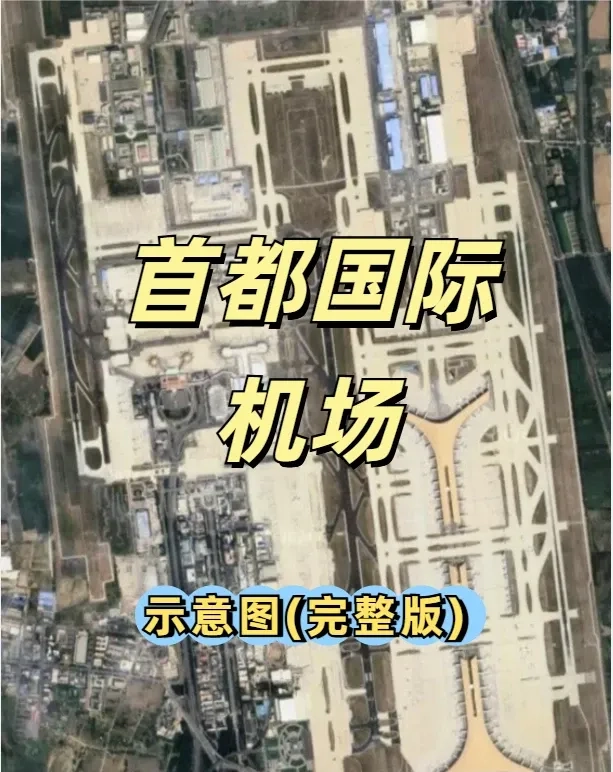

❤️❤️❤️ Beijing Capital International Airport covers 25.69 km². One of the busiest airports in China, it has three runways, 314 aircraft stands and a wide range of cargo and logistics services.

## The terminals

👉👉👉 Capital has three terminals (T1, T2 and T3), though **T1 is currently out of service** ❌.

- ✅ **T1** (❌ closed): domestic, three floors.
- ✅ **T2**: domestic and international, four floors.
- ✅ **T3**, split into three zones:
  - 🟡 **T3C**: five floors, mostly domestic — see Figures 7 to 11.
  - 🟡 **T3D**: four floors, mostly international — see Figures 12 to 15.
  - 🟡 **T3E**: three floors, mostly international — see Figures 16 to 18.

## Floor diagrams

👉👉👉 Detailed floor diagrams follow:

- T2 B1 ➡️ Figure 2
- T2 1F ➡️ Figure 3
- T2 2F ➡️ Figure 4
- T2 3F ➡️ Figure 5
- T3C B1 ➡️ Figure 6
- T3C 1F ➡️ Figure 7
- T3C 2F ➡️ Figure 8
- T3C 3F ➡️ Figure 9
- T3C 4F ➡️ Figure 10
- T3D B1 ➡️ Figure 11
- T3D 1F ➡️ Figure 12
- T3D 2F ➡️ Figure 13
- T3D 3F ➡️ Figure 14
- T3E 1F ➡️ Figure 15
- T3E 2F ➡️ Figure 16
- T3E 3F ➡️ Figure 17

### T2

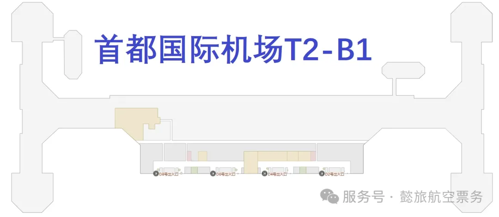

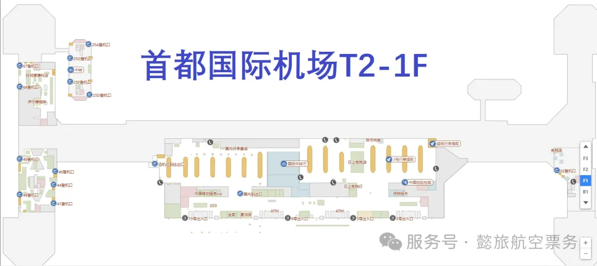

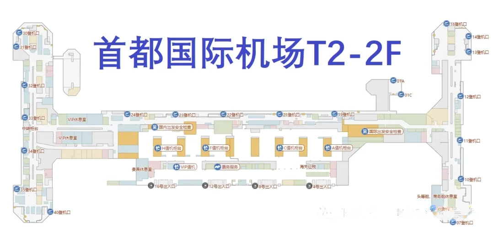

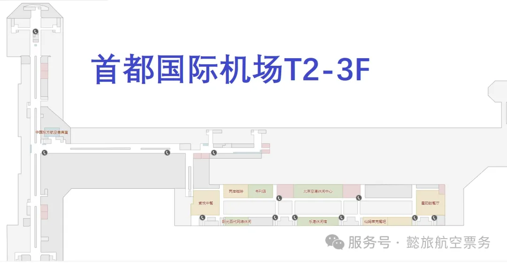

### T3C

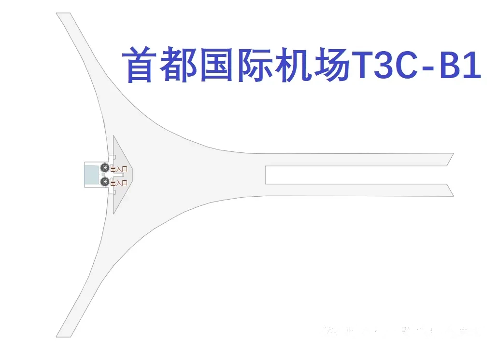

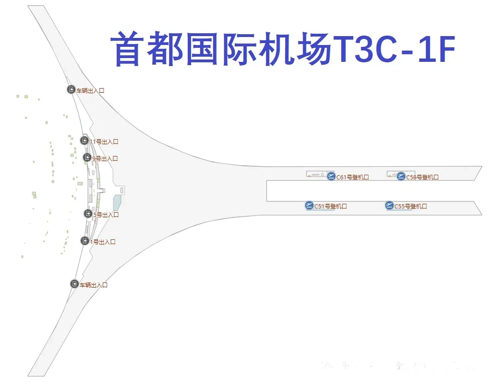

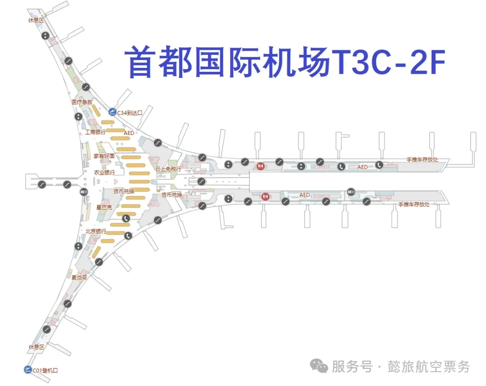

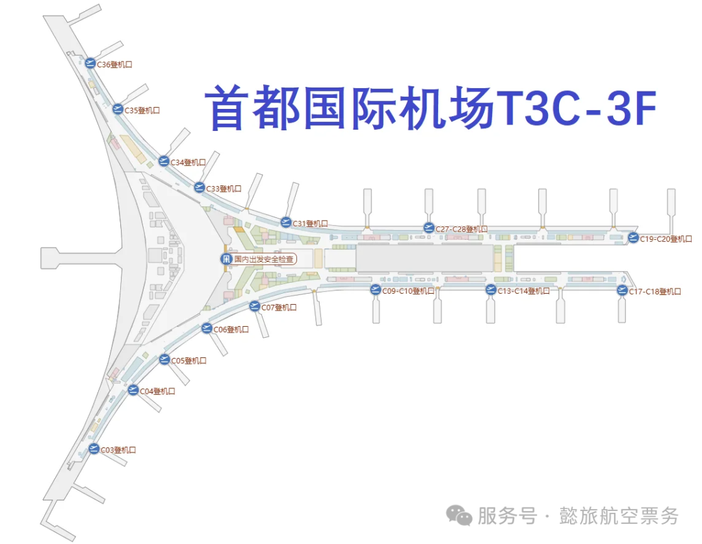

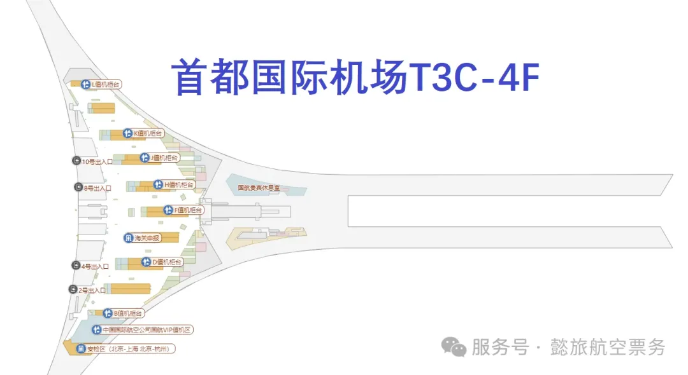

### T3D

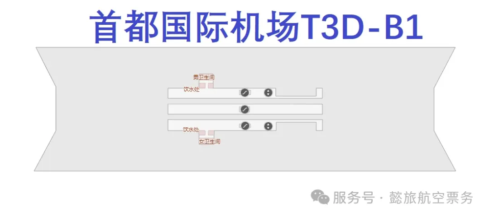

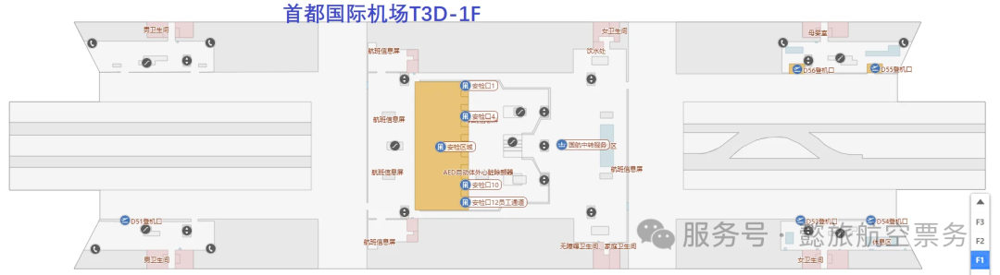

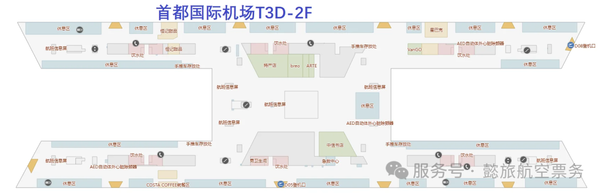

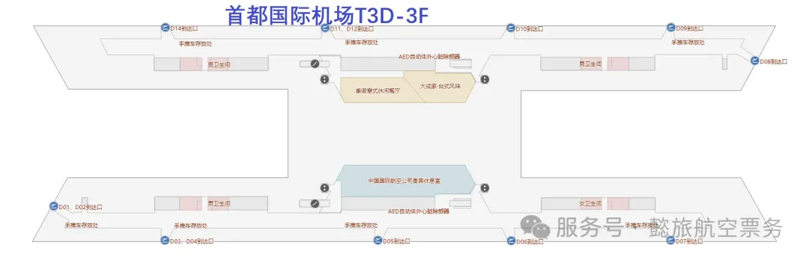

### T3E

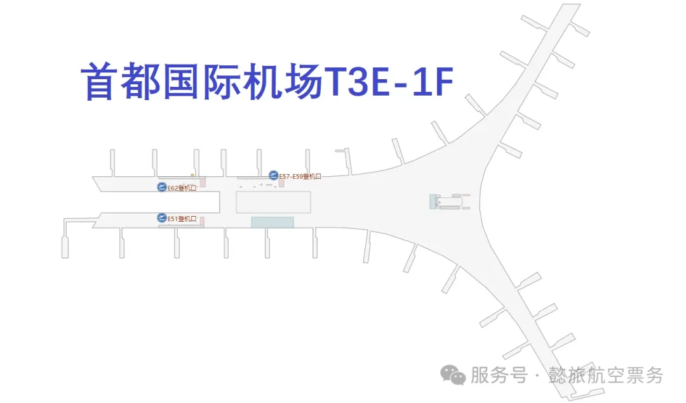

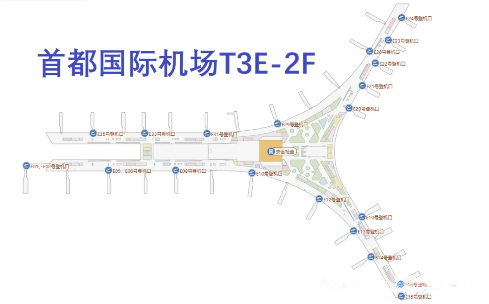

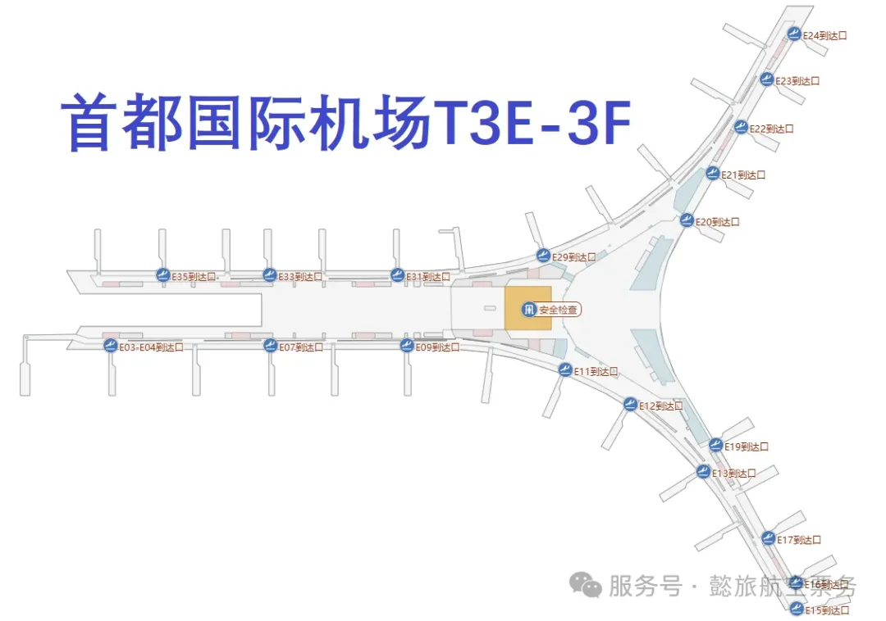
