Welcome to Chicago. After a long flight, here is how to get from O'Hare to where you are staying.

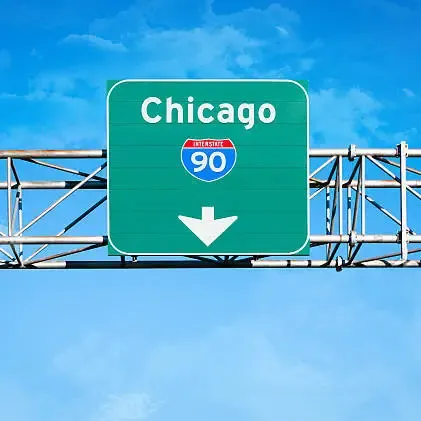

## How O'Hare's terminals fit together

The fourth-busiest airport hub in the United States, Chicago O'Hare International (ORD) has **four terminals: 1, 2, 3 and 5** (T1, T2, T3, T5).

- **T1, T2 and T3** are connected, so you can walk between them.
- **T5** handles international flights — including most flights to and from China — and is joined to the others by the **Airport Transit System (ATS)**.

The ATS is **free** between terminals.

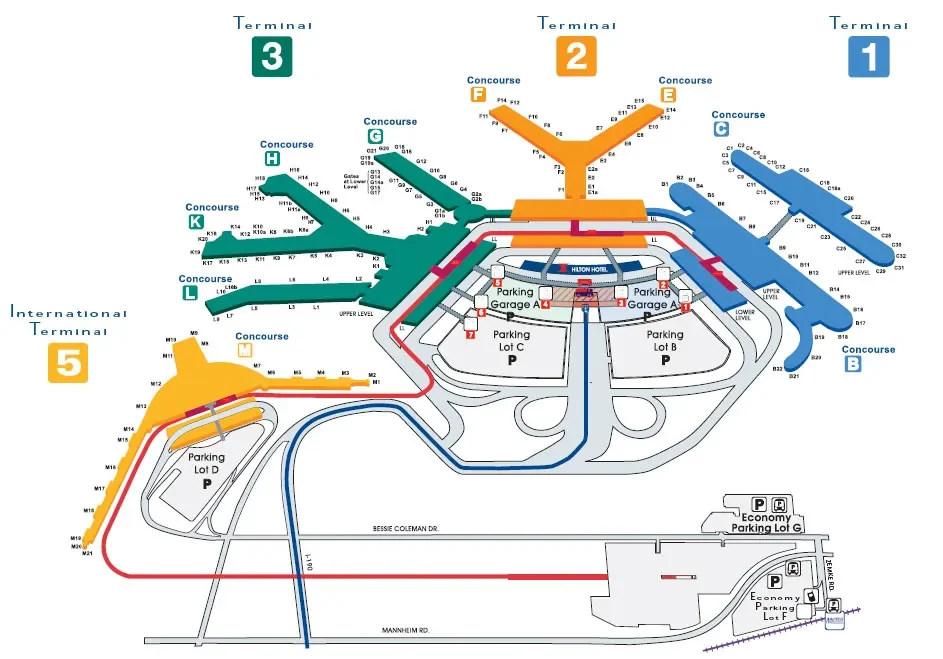

## Arriving in Chicago

### Fill in the customs declaration form on the plane

During the flight the crew hand out the **customs declaration form** (a Chinese version is available). Filling it in **before you land** makes arrival much smoother.

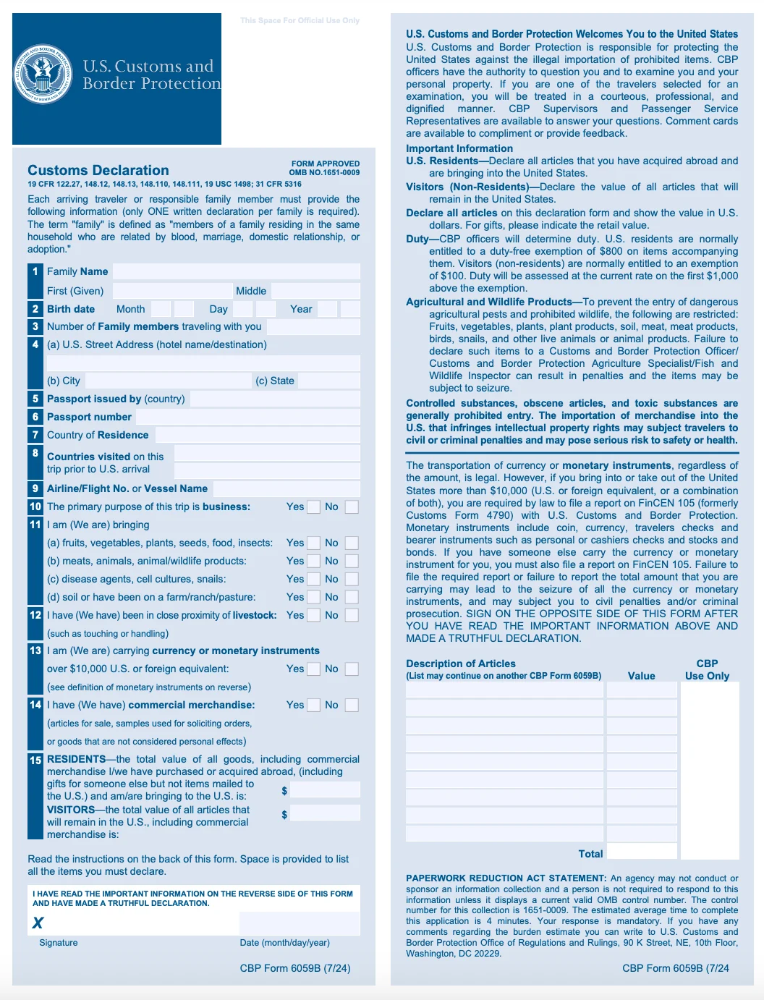

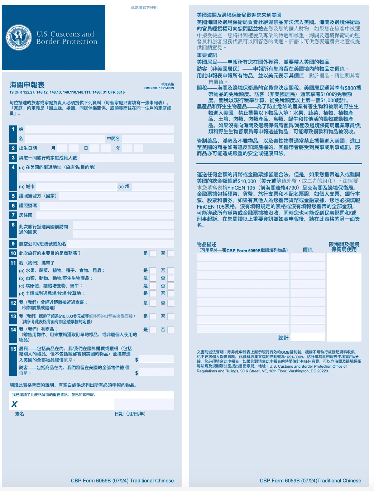

A few things to watch when you fill it in, or you may be sent for extra questioning:

1. If you are travelling with family and staying at the same address, you can share one form.
2. State your **purpose of entry truthfully** — tourism, business, study or anything else.
3. Do not bring in:
   - fruit, vegetables, plants, seeds, food or insects;
   - meat, animals, or animal and wildlife products;
   - disease cultures, cell cultures or snails;
   - soil, or anything that has been on a farm, ranch or feedlot.
4. Do not carry **more than US$10,000 in cash**.

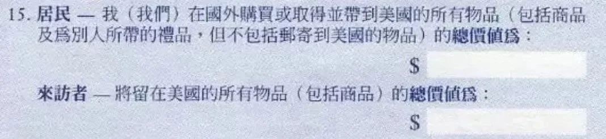

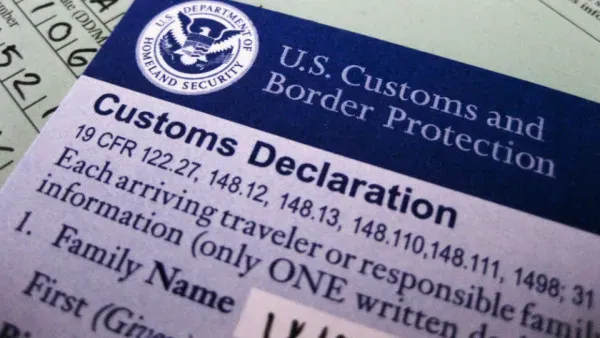

### Going through to immigration

Once the plane is at O'Hare and the crew announce you can get off, stretch your legs, check you have left nothing in the cabin — and follow the crowd **to the immigration area**. If you miss the group because you stopped at the restroom, don't worry: just follow the "Immigration" signs.

At immigration, join the **"Visa" line** (not the "US Citizen" line) and wait your turn. Keep your voice down, and do not use your phone to film the officers.

Have ready your **passport**, **Form I-20**, your **international travel health certificate** (the "little red book"), your **international certificate of vaccination** (the "little yellow book"), and your **admission letter** or **study plan** if you have one.

When the officer asks why you are visiting, **answer truthfully** about your school and programme. They will then photograph you and take your fingerprints, which completes the entry process.

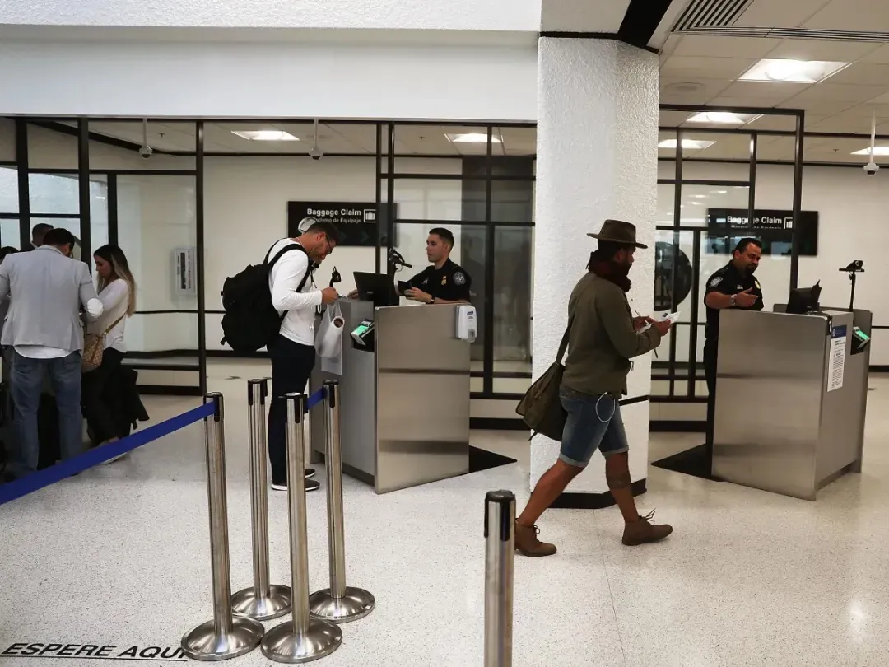

### Baggage and customs

Follow the baggage tag information to the right carousel and **wait for your bags**, checking them against the screens — **the airport screens are authoritative**.

If you have nothing to declare you can usually walk straight out. If you are pulled aside for inspection, stay calm, cooperate with the officers and **do not withhold anything**.

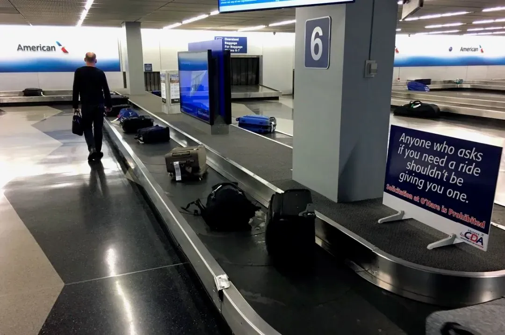

T5's arrivals hall has restaurants of every size, so once you are through you can relax, buy a drink or a snack, and connect to the airport's free Wi-Fi to let your family know you have landed.

## Leaving the airport

If you have arranged a pick-up with your school or another organisation, follow the airport signs to the agreed gate.

Travellers heading to different areas can also follow the signs for each transport option: those going to Champaign, Purdue or other places in the region usually take a charter bus, while those heading into Chicago itself generally take ride-hailing or the CTA.

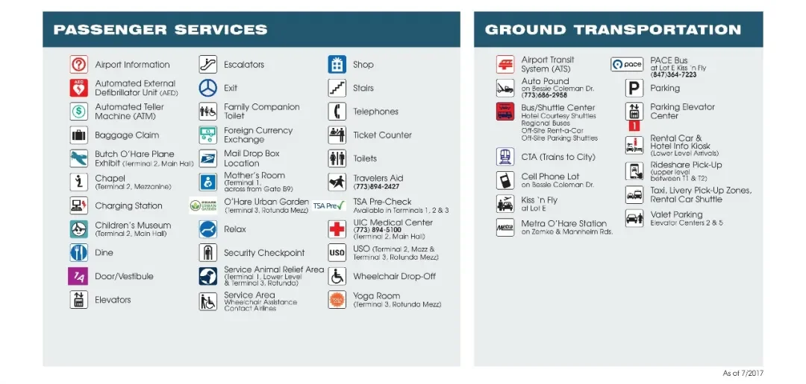

## Getting into the city

### Option 1: the CTA Blue Line

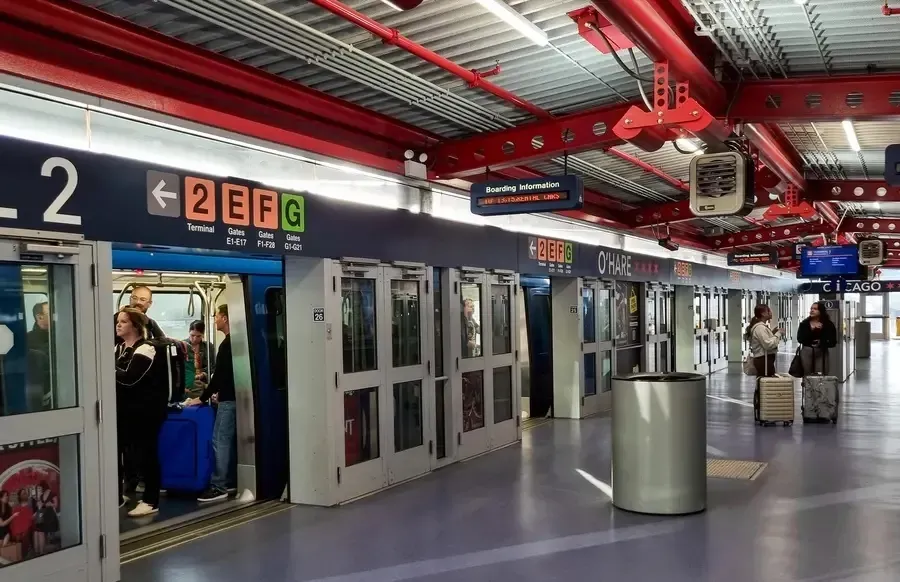

Getting to and from O'Hare on the CTA means taking the **Blue Line**. You first take the **ATS shuttle** to **Terminal 2** and change there — the ATS is **free** between terminals.

The Blue Line runs **24 hours a day, seven days a week**. Every train from the O'Hare station passes through downtown on its way to Forest Park, and the trip downtown usually takes **40–45 minutes**.

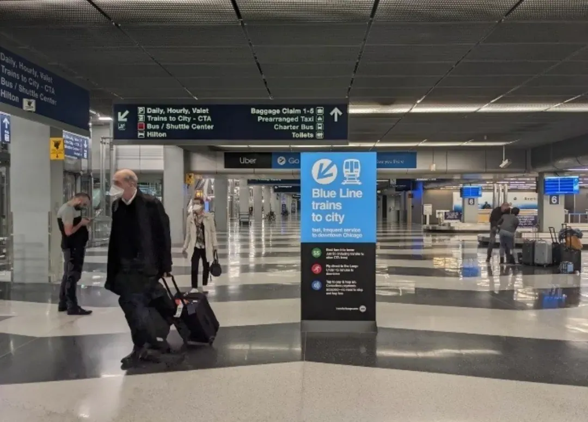

Once you are at **T2**, follow the **blue metro icon** to reach the Blue Line platform. You need to buy a ticket from the machine before entering: the **fare between O'Hare and downtown is $5** (the regular fare is $2.50). Some machines do not give change, so have coins ready, or pay with a Visa or Mastercard credit or debit card.

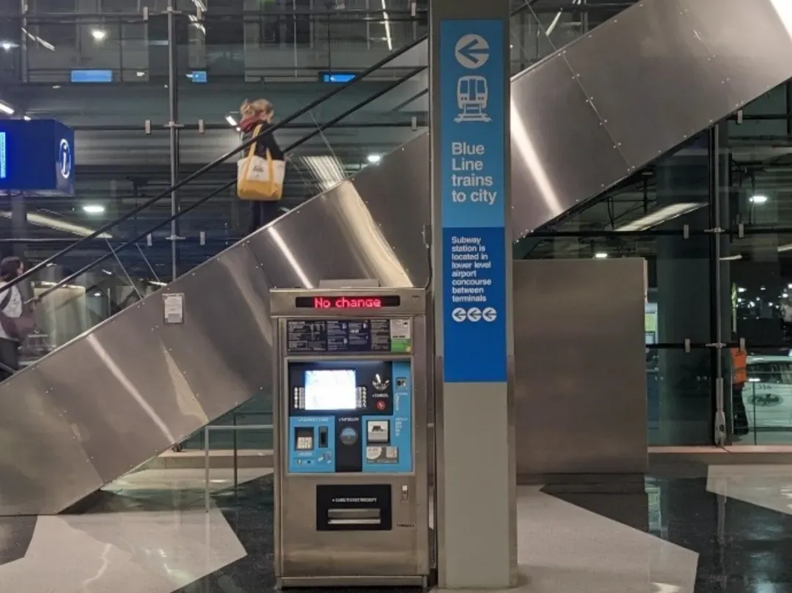

You do not need to tap out on the way out, but **one ticket gives you up to two free transfers to another CTA train or bus within two hours**, so keep hold of it.

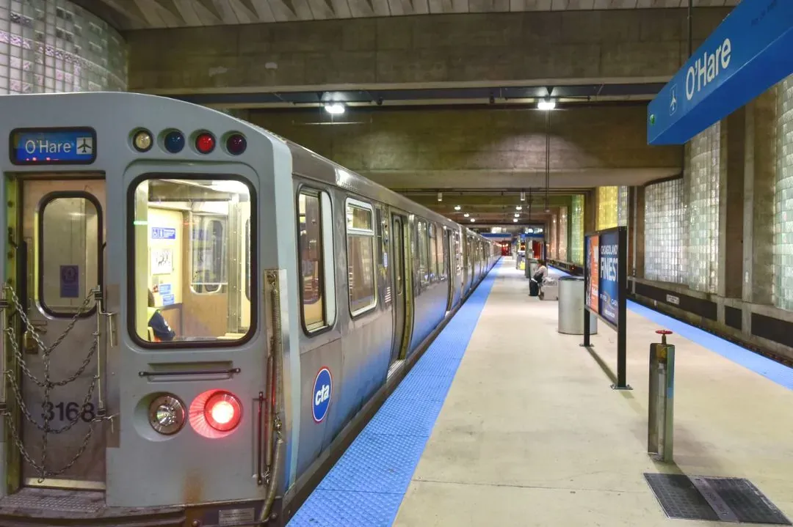

If you are heading to **SAIC**, **DePaul (Loop)**, **Columbia College Chicago** or **UIC**, you do not need to change trains — get off at Monroe, Jackson, LaSalle or UIC-Halsted as appropriate.

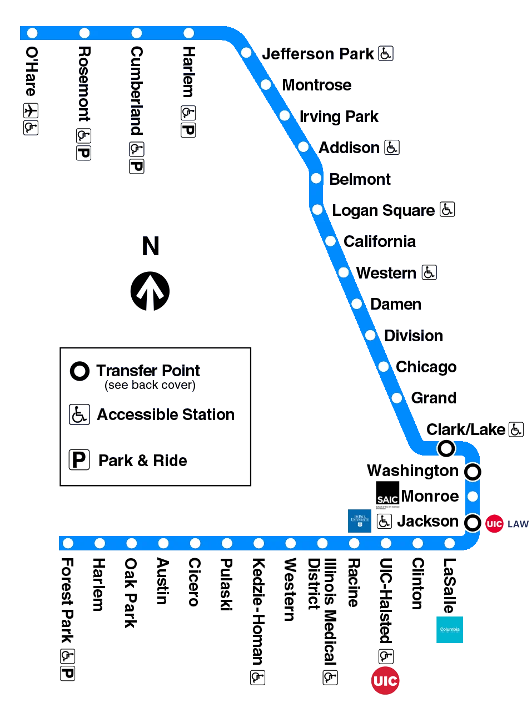

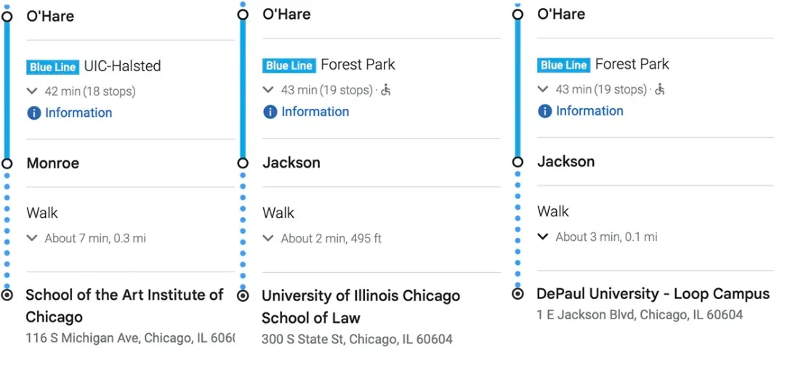

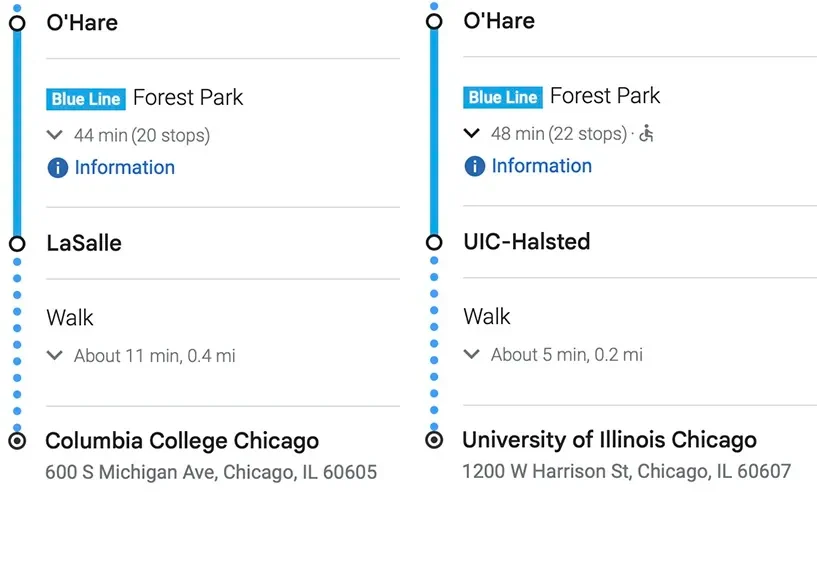

For **DePaul (Lincoln Park)**, **Northwestern (Kellogg)**, the **University of Chicago** or **IIT**, you will need to transfer to a different metro or bus route.

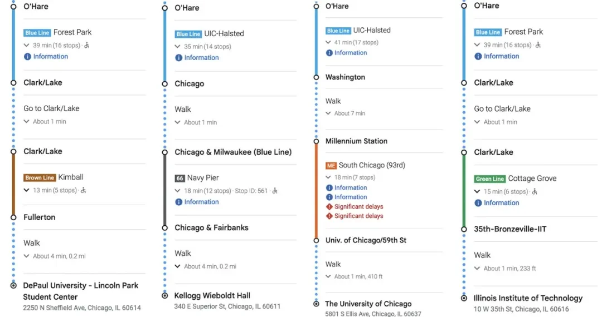

### Option 2: ride-hailing

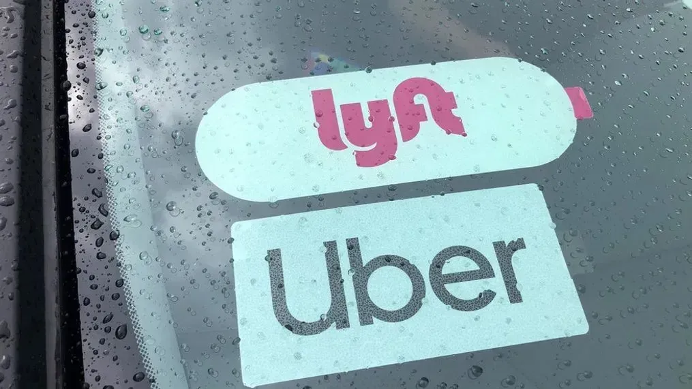

If you want the easiest, quickest and most comfortable option, take a car and skip dragging your luggage around. The only downsides are that it is **expensive** and **can get stuck in traffic at busy times**.

Uber and Lyft are the two apps everyone uses in the United States. Download the international version before you fly and **link a dual-currency credit card** in advance. Once you land and have a connection (the airport Wi-Fi will do), you can call a car.

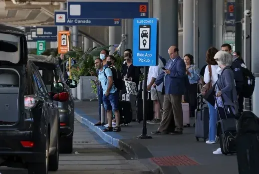

If you land at **T5**, first take the **ATS** to **Terminal 2**, then follow the **Rideshare / Ride App** signs to the pick-up point on the **departures level**.

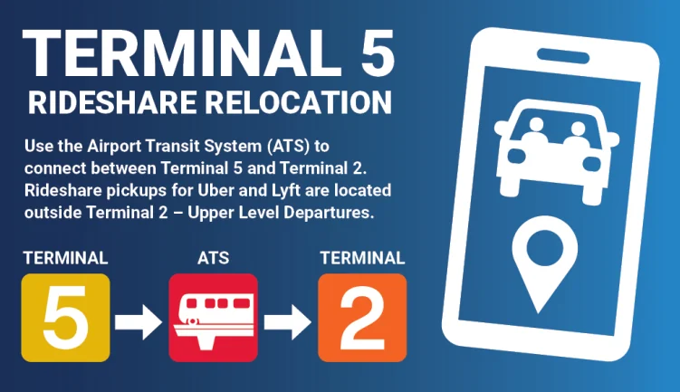

Both Uber and Lyft pick up only here. The meter starts when your driver reaches the pick-up point, and after a short grace period (about five minutes) you are charged extra — so it is best to **order the car once you are at the T2 pick-up point**.

After you register and add a payment method, enter your start point and destination in the app and choose the vehicle type. Once it matches you with the nearest driver it shows their details and rating — **if the rating is low, request a different driver** to be safe.

The same trip is priced slightly differently between the two apps, but the service is essentially the same (most drivers work for both), so it is worth comparing before you confirm.

> Before getting in, check the driver and vehicle details — name, model and plate number. Stay alert during the ride and check in the app that the route is correct.

### Option 3: the Pace bus

**(For Northwestern students in particular)**

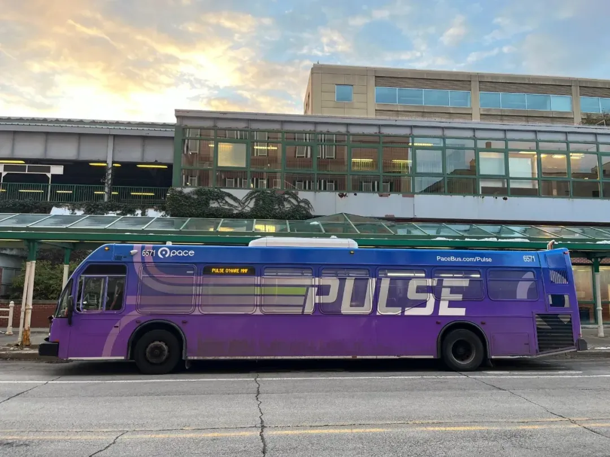

Pace runs the buses in Chicago's suburbs, and its Pulse Dempster line runs **from O'Hare to Evanston**, where Northwestern University is, in about **50 minutes**, every **15–20 minutes** (every 20–30 minutes on weekends and outside peak hours).

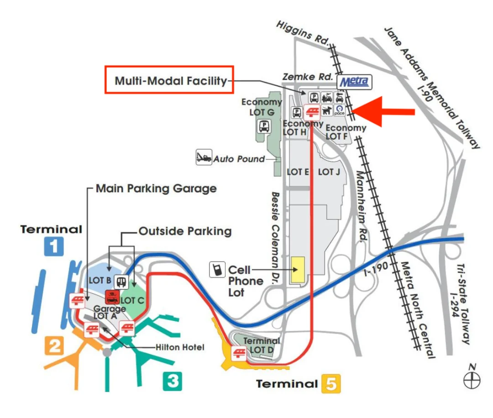

To get from O'Hare to Evanston, **take the ATS to the MMF (Multi-Modal Facility)** and find **Bay 9** for the Pulse bus. You can tap a Ventra card on board or pay cash: the fare is **$2** ($2.25 in cash).

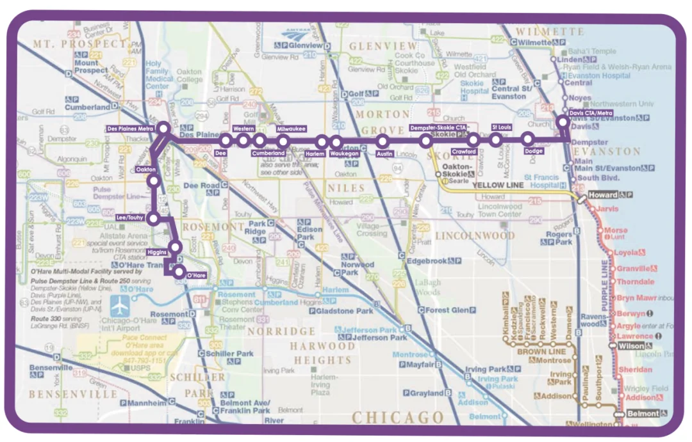

## One last tip

Whichever way you travel, stay aware of your surroundings, and check that you have not left any luggage behind before you get on or off.
