**羽田国际机场，作为日本关东地区的重要门户，不仅是中日之间的直航枢纽，更是游客深入了解东京和关东地区的起点。**

作为日本国内航班的换乘枢纽之一，羽田机场连接着现代都市的繁华与传统文化的底蕴，让日本的独特魅力在这里交织呈现。无论你是从这里启程，还是在此中转，机场内的各类便利设施都能让你的旅途更加轻松愉快。

**今天，就让我们从羽田机场的御翔印开始，带你一同体验这座世界级五星机场的无限魅力吧！**

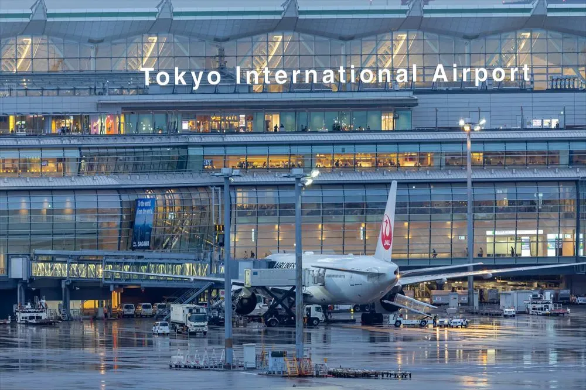

## 御翔印（ごしょういん）

只有在各地机场才能获得的“天空御朱印”，它的诞生源自日本航空的振兴地方城市的设想。目前在日本国内的55个机场可以购入。

- **参考价格**：350日元

其他机场攻略请点击文末链接查看。

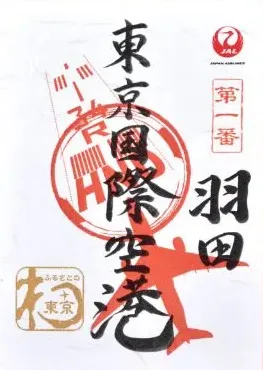

### 御翔印 DATA

- **机场名**：羽田东京国际机场
- **机场代码**：HND
- **第一番朱印**：象征着羽田东京国际机场为日本航空开通日本国内航线的第1个机场
- **机场跑道**：位于机场名称下方的灰色标识，为羽田东京国际机场实际使用的跑道设计
- **红色飞机**：代表羽田东京国际机场内日本航空的主要机型，此处为A350-900
- **中间圆形朱印**：是由机场所在地或机场名称中的一个字旋转而来，此处是将“羽”旋转而成
- **御翔印可入手地点**：T1航站楼JAL PLAZA

## 仅15分钟就能抵达东京都心

羽田国际机场由三座航站楼组成，其中国际航班主要集中在T3航站楼。旅客可通过免费接驳巴士、京急线或单轨列车便捷地往返于三座航站楼之间。**目前，中国多个城市已开通直飞羽田国际机场的航班**，包括北京、天津、青岛、大连、上海、广州和深圳等，为中日间的出行提供了极大便利。

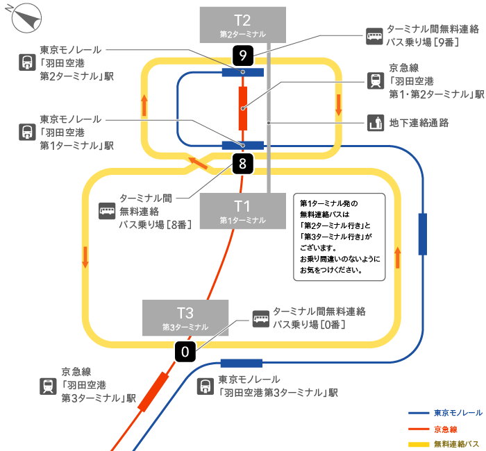

抵达羽田国际机场后，交通选择非常多样且便捷。从T3航站楼站出发，搭乘快速单轨列车约15分钟即可抵达靠近东京塔的“滨松町站”，在此轻松换乘JR山手线；乘坐京急电铁，约12分钟可达品川站，约36分钟直抵浅草站，前往横滨也仅需约25分钟。

如果需前往成田机场，仅需约1小时30分钟。此外，机场还有前往栃木、群马、静冈、山梨、长野、仙台等地的高速大巴，无论是市内观光还是跨区域旅行，都能轻松启程。

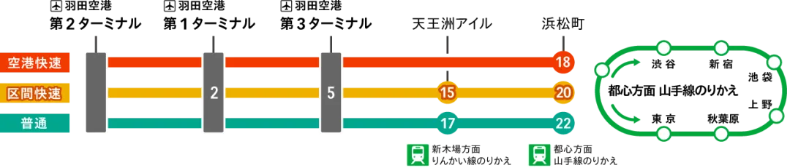

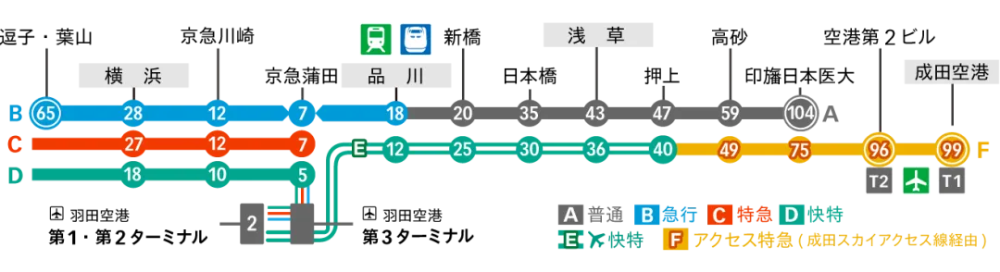

## 羽田国际机场必吃美食

### 必吃之一：人形町今半

- **地点**：T3航站楼4F江户小路15
- **营业时间**：午餐 11:00-15:00 (LO14:30)；晚餐 17:00-22:00 (LO20:30)

这是一家源自东京日本桥人形町的寿喜烧老字号，其机场分店的外观融入了江户建筑的风情，完美展现了本店的典雅气派。店内提供多种寿喜烧选择，包括定食、套餐和御膳，每一道都以精选的黑毛和牛雌牛肉为主角，柔嫩多汁，风味绝佳。特制的寿喜烧酱汁进一步衬托出熟成牛肉的浓郁香气，而精湛的炖煮技艺更将肉质的鲜美牢牢锁住，呈现出极致的美味享受。

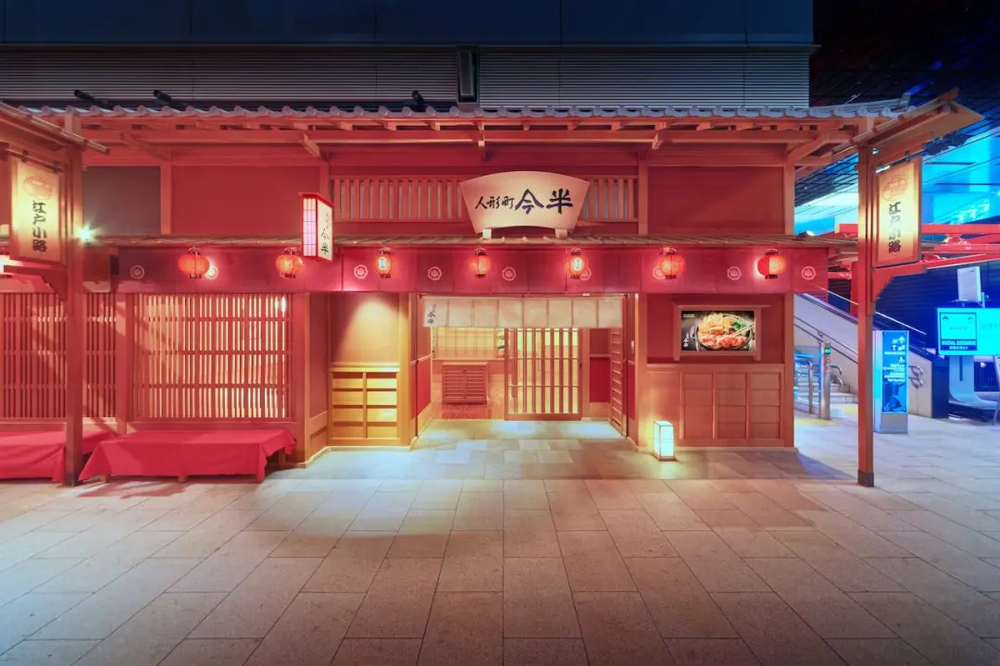

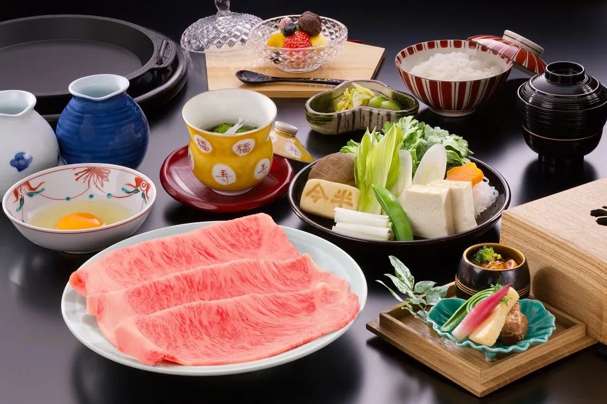

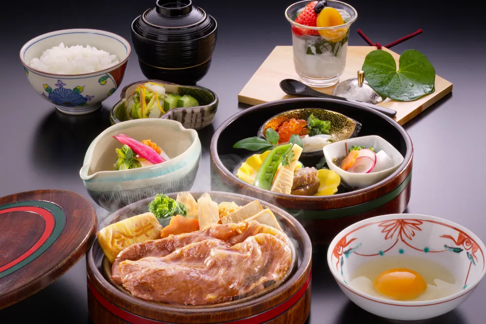

### 必吃之二：鱼河岸日本一

- **地点**：T3航站楼3F 出发后区域 108
- **营业时间**：24小时营业

这家以站立用餐为特色的寿司连锁店，在羽田国际机场出发区域内的分店同样延续了江户前寿司的传统风味。店铺精选筑地市场的新鲜食材，现场为食客捏制寿司，客人可以选择套餐或根据喜好自由选择食材和数量。对于即将启程的旅客或希望在离开日本前再次品味正宗寿司的游客来说，这里无疑是一个方便又美味的选择。

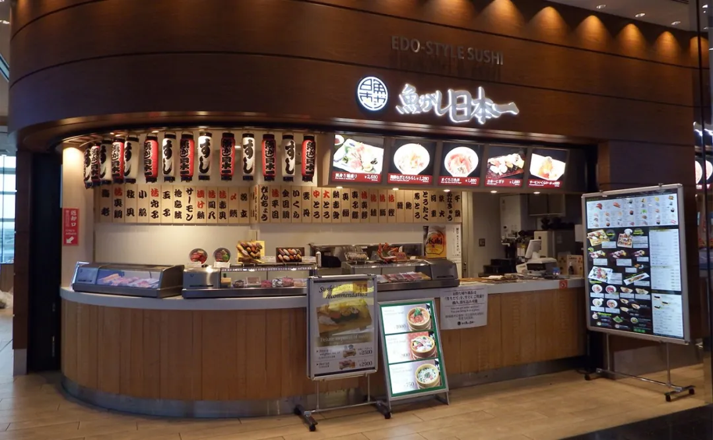

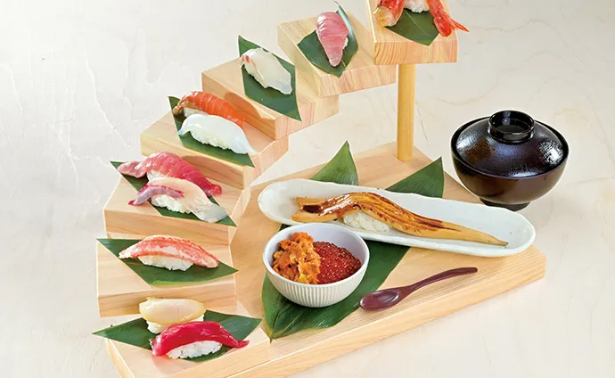

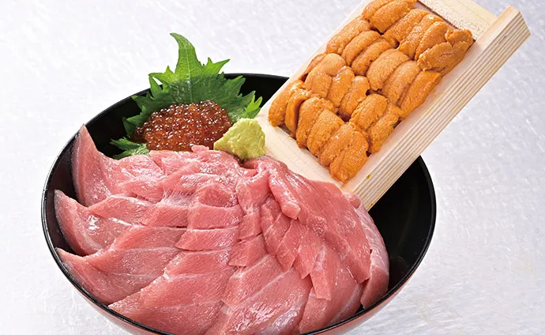

## 羽田国际机场限定伴手礼

### CAFÉ CHOCOLAT WICH

- **地点**：T3航站楼4F江户小路28Edo食宾馆
- **参考价格**：1425日元/6枚

这款羽田机场限定甜点完美融入浓郁的咖啡香气，精选比利时高品质巧克力，搭配香酥可口的饼干夹心，带来层次丰富的口感体验，是咖啡时光的绝佳搭档。巧克力中选用的是横滨老字号咖啡品牌“三本咖啡”的粗研磨咖啡豆，这家创立于1957年的品牌以其卓越品质备受青睐。甜点由起源于东京白金的高级甜点品牌“La Maison白金”匠心制作，将咖啡、巧克力与饼干巧妙融合，既展现高雅品味，又是馈赠亲友的理想伴手礼。

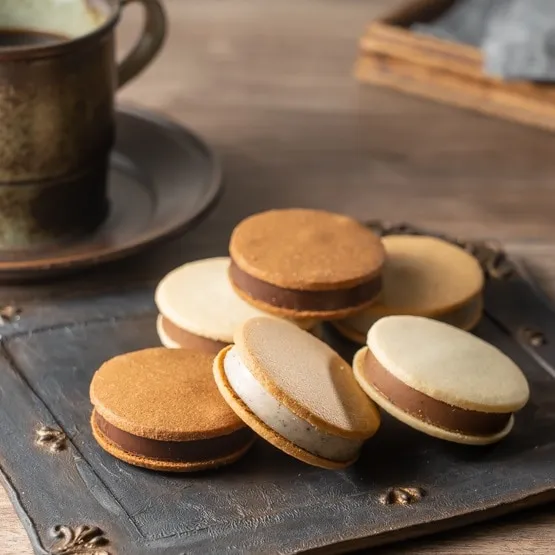

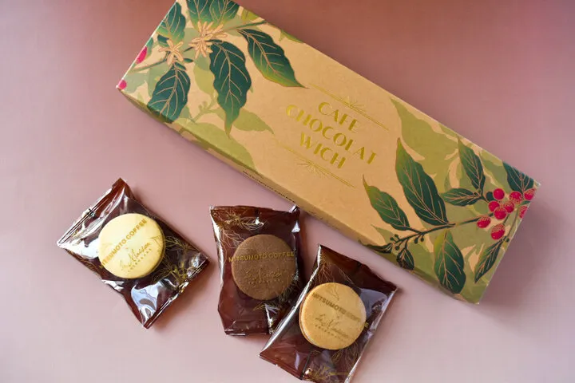

### 伊东屋“AIRPORT NOTEBOOK”

- **地点**：T3航站楼4F江户小路27
- **参考价格**：660日元/本

伊东屋是一家位于东京银座，创立于1904年的文具专门店，以丰富多样的原创文具产品闻名，为文具爱好者带来了无尽的选择与乐趣。羽田国际机场店延续了品牌的原创精神，精选高品质书写工具及其他日本特色文具，深受旅客喜爱。

店内特别推出了一款以“机场”为主题的趣味笔记本，封面和背面连成一幅完整的机场画面，生动描绘了机场工作车辆和待命起飞的飞机等场景，仿佛将机场的繁忙日常搬到了手中。翻开笔记本，还会发现小飞机穿插其中，充满了趣味与惊喜。此外，这里还提供羽田机场限定设计的独特商品，无论是作为伴手礼还是收藏品，都极具特色。

候机之余，不妨来到这里探索一番，感受日本文具的独特魅力吧！

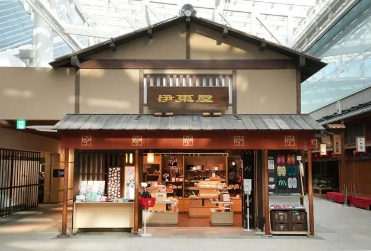

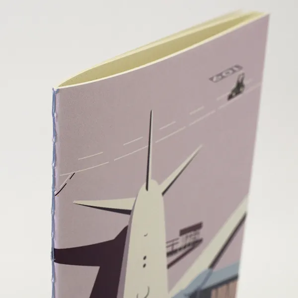

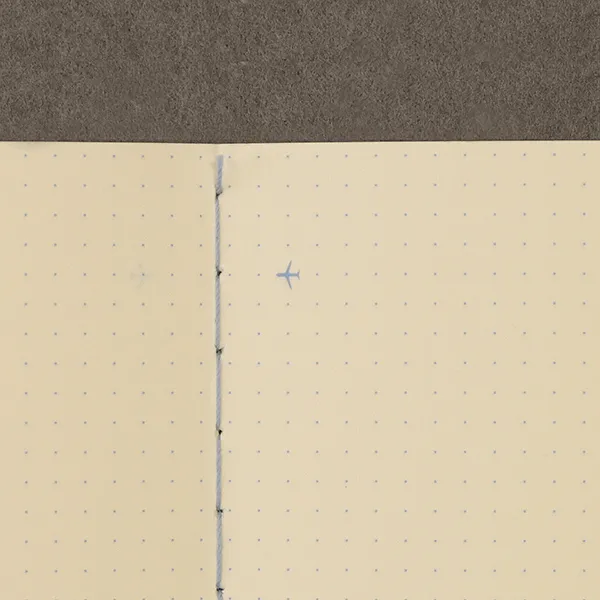

## 机场及周边观光

### PLANETARIUM Starry Cafe

- **地址**：T3航站楼5F TOKYO POPTOWN 50
- **营业时间**：09:00~22:30 (LO 22:00)；天文馆 11:00~（最后入场 21:00）

正如其名，这里是一座可以在其中享受星空投影的咖啡馆。咖啡馆采用了先进的“混合型星空投影系统”，这一系统结合了无缝投影技术，能够将星空影像完美地投射到圆顶的整个天幕上，同时还可以呈现约4000万颗恒星，细腻的银河画面美不胜收。

在候机的空闲时光里，何不来这里享受一场美丽的星空之旅呢？

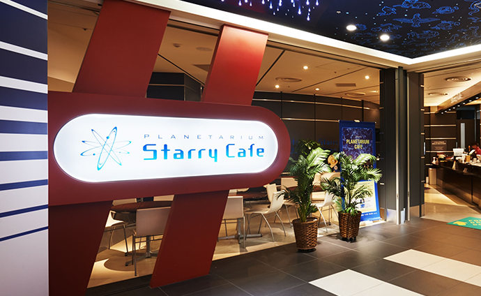

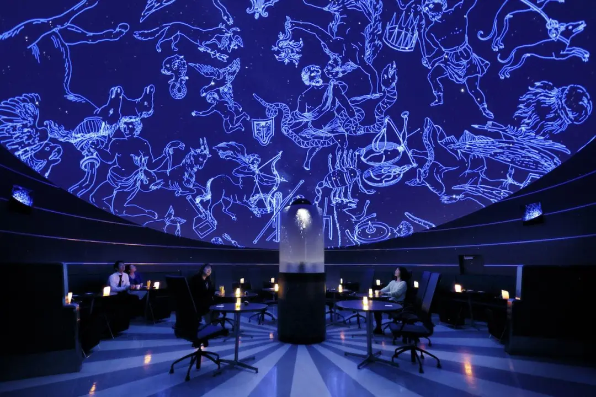

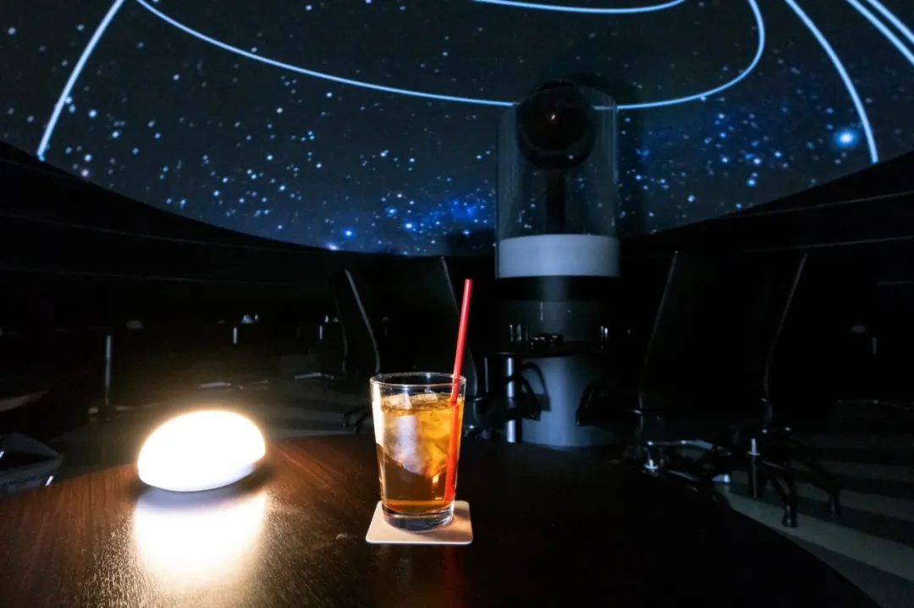

### 羽田机场花园

- **地址**：东京都大田区羽田空港2丁目7-1
- **交通**：从T3航站楼2F连络通道可步行抵达
- **网址**：[www.shopping-sumitomo-rd.com/haneda/shopping/](http://www.shopping-sumitomo-rd.com/haneda/shopping/)

这座于2023年开业的综合商业设施与羽田机场第3航站楼直通，不仅提供购物与美食的乐趣，还有温泉与酒店等配套设施。

其中，“泉天空之汤羽田空港”带来独特的开阔舒适感，晴天时还能远眺富士山。设施包括男女露天浴池、岩盘浴、餐饮区等，是理想的日间温泉度假胜地。在露天浴池中泡澡时，还能一边享受飞机起降的美丽景致，别有一番风味。

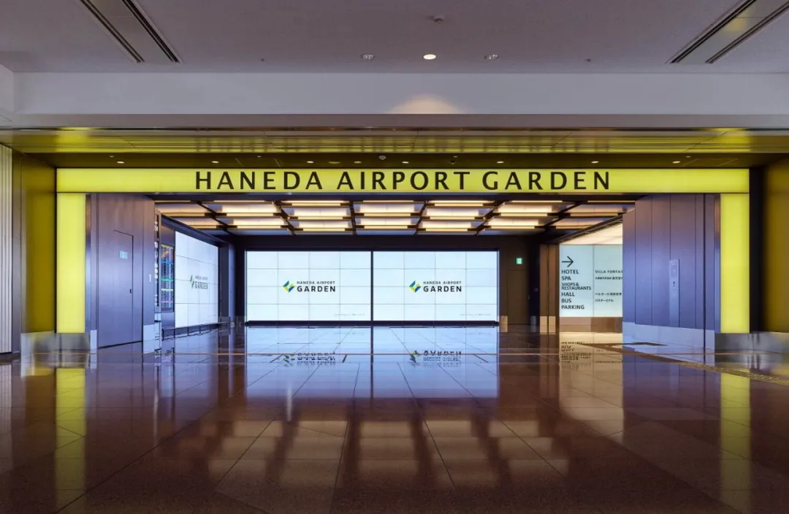

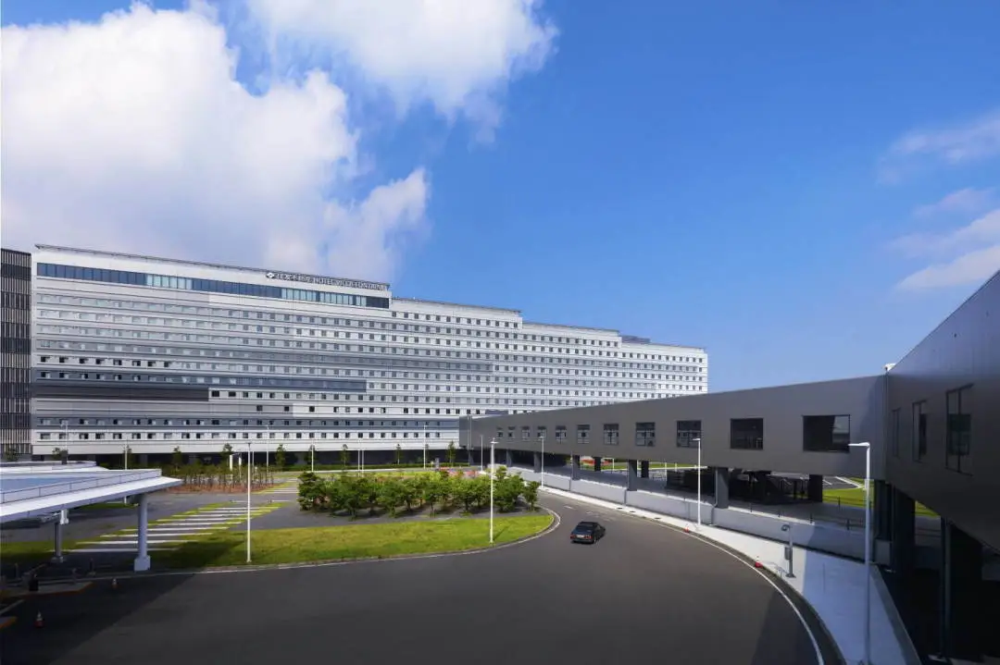

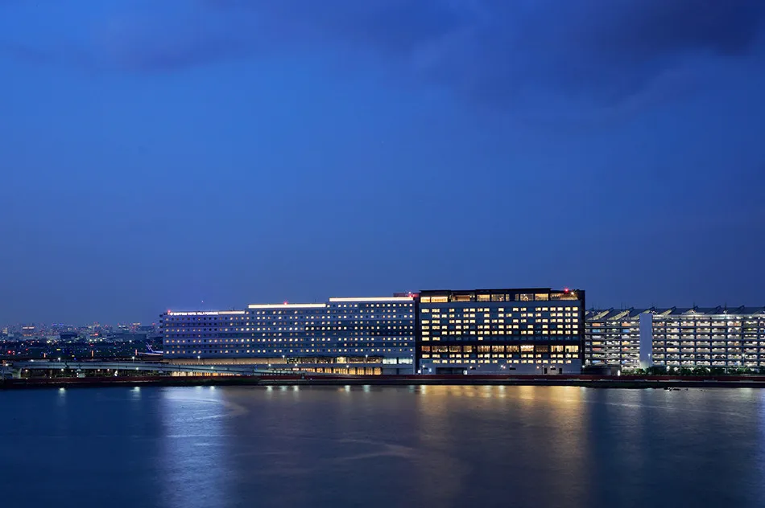

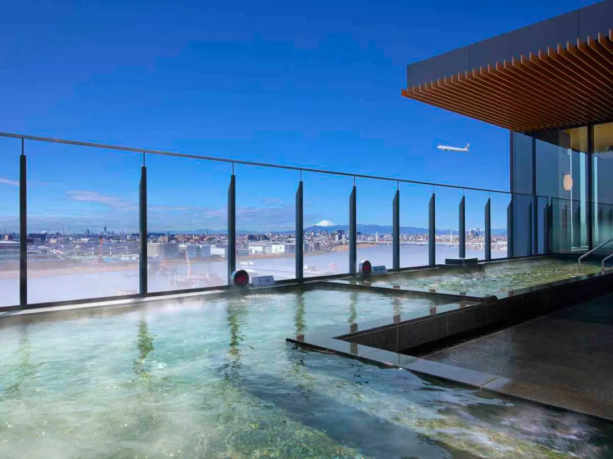

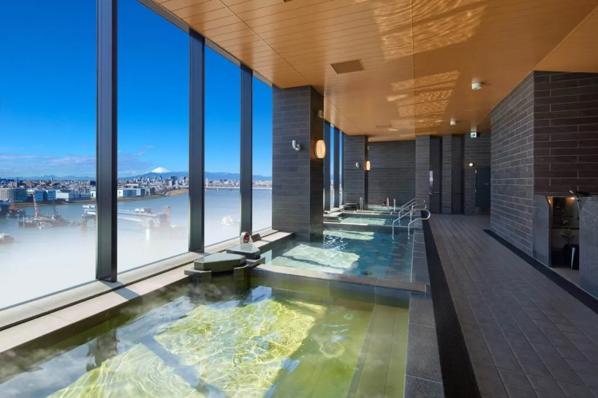

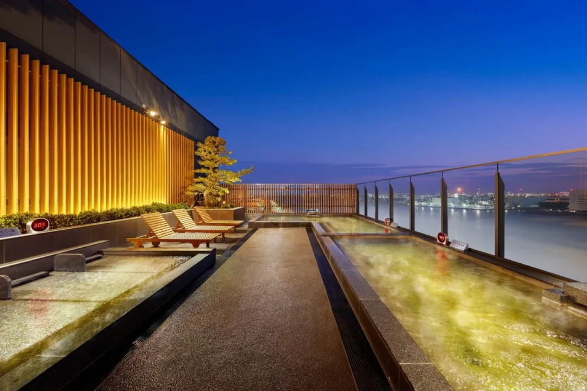

下次经过羽田时，记得给自己留些时间，全方位体验这座设施的魅力，享受一段不一样的旅程吧！

## 其他机场攻略

- [东京成田国际机场攻略](https://mp.weixin.qq.com/s?__biz=MzA3MjI1NDQxNA==&mid=2652373314&idx=1&sn=2cc9b26e9041d8fba85a695fc9570a82&scene=21#wechat_redirect)
- [北海道新千岁国际机场攻略](https://mp.weixin.qq.com/s?__biz=MzA3MjI1NDQxNA==&mid=2652374162&idx=1&sn=c685409867a453fc351c35787a205e56&scene=21#wechat_redirect)
- [福冈国际机场攻略](https://mp.weixin.qq.com/s?__biz=MzA3MjI1NDQxNA==&mid=2652375055&idx=1&sn=0ab140b1895ababafe7a1e8991341d7a&scene=21#wechat_redirect)
- [中部国际机场攻略](https://mp.weixin.qq.com/s?__biz=MzA3MjI1NDQxNA==&mid=2652376462&idx=1&sn=b90e4b8fcfc7c0934be09f9f2658c036&scene=21#wechat_redirect)
- [广岛机场攻略](https://mp.weixin.qq.com/s?__biz=MzA3MjI1NDQxNA==&mid=2652377958&idx=1&sn=8957ec2da9779d9a76aa2488b831e08b&scene=21#wechat_redirect)
- [关西国际机场攻略](https://mp.weixin.qq.com/s?__biz=MzA3MjI1NDQxNA==&mid=2652378218&idx=1&sn=e6b0ad7e1a509efac79fbcc6a99d9913&scene=21#wechat_redirect)
- [那霸机场攻略](https://mp.weixin.qq.com/s?__biz=MzA3MjI1NDQxNA==&mid=2652378849&idx=1&sn=a43e621ae60abc174f72c5808aeccfc1&scene=21#wechat_redirect)

## 图片来源

部分图片来自以下网站：

- https://att-japan.net/ja/haneda-tokyo/
- https://ec.jal.co.jp/img//0002/img/pages/soranogoshoin/haneda-2.jpg
- https://restaurant.imahan.com/hanedaairport-3t/
- https://tokyo-haneda.com/
- https://haneda-shopping.jp/shop/g/gZ001088047/
- https://www.threads.net/@yama7260/post/DBIdqyZP61z
- https://co-trip.jp/article/611985
- https://www.ito-ya.co.jp/category/3001/45826215220871.html
- https://thegate12.com/jp/article/750#content-8
- https://www.gotokyo.org/jp/new-and-now/new-and-trending/221205/topics.html
- https://www.sankei.com/article/20221006-7S2A3FJ42FIMPMLBJU5QXCXC6E/photo/XGGOBJJ5F5MBVBLLXJAQNCXTKQ/
- https://www.fashion-press.net/news/56398

**END**

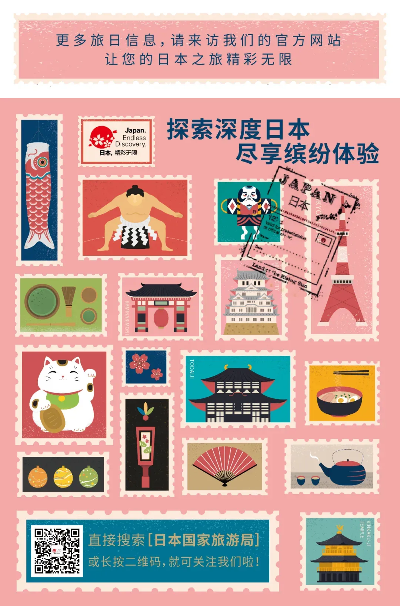
