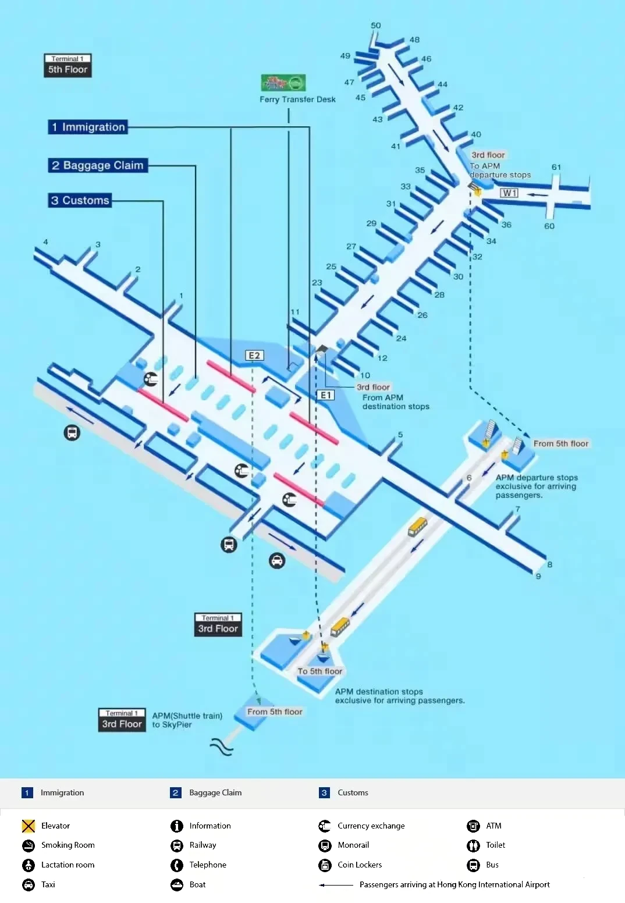

Hong Kong International Airport — Chek Lap Kok — opened on 6 July 1998, replacing Kai Tak. Built on reclaimed land off Lantau, it serves more than 150 destinations across Asia, Europe, North America and Oceania.

Almost everything happens in **Terminal 1 (T1)**: check-in, security, departures and arrivals, with the remote gates handled by the Midfield and North Satellite Concourses. **Terminal 2** is being expanded and reopened; the airport's own announcements are definitive on when.

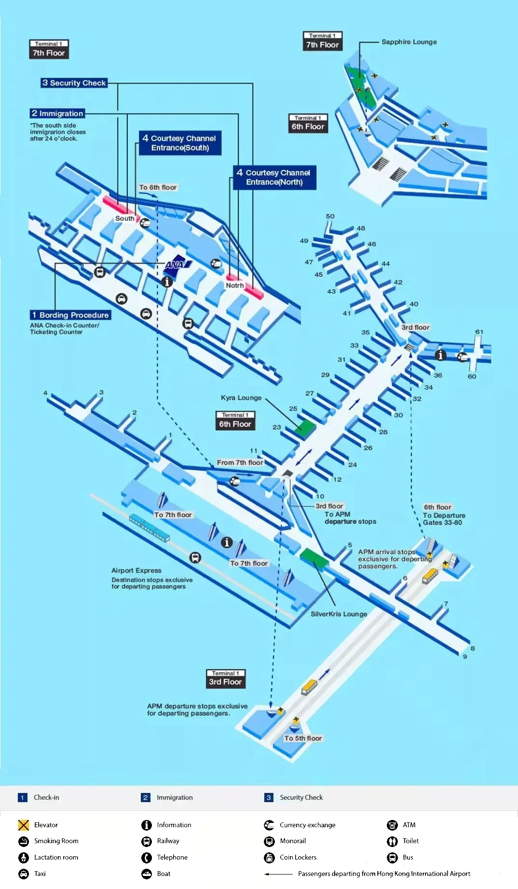

## Transfers

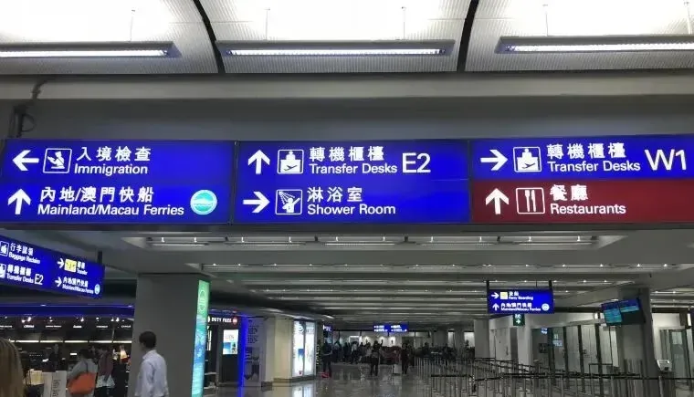

Here is the basic transfer process after you land at Hong Kong.

### Step 1: confirm your onward boarding pass

- **If you already have one:** just follow the clear "Transfers / Transit" signs.
- **If you do not:** go to the transfer counters on level 5 (L5), show your passport and e-ticket to the airline staff, and collect your boarding pass.

### Step 2: security screening

Every transferring passenger goes through security screening again.

### Step 3: to the departures level and your gate

After security you come out on level 7 (L7), the departure level, lined with shops and restaurants. Check the departure screens for your onward gate number and boarding time.

**Where the gates are**

| Gates | Location |
| --- | --- |
| 1–80 | Terminal 1 itself |
| 201–230 | Midfield Concourse, west of the main building; reached by the Automated People Mover |
| 501–510 | North Satellite Concourse, reached via the Sky Bridge or the Automated People Mover |

**Getting between them:** if your gate is a long way off, use the Automated People Mover (the driverless train) inside the terminal.

> Allow at least **2 hours** for a transfer, to absorb a delayed inbound flight, a gate change or a long queue.

## Left luggage

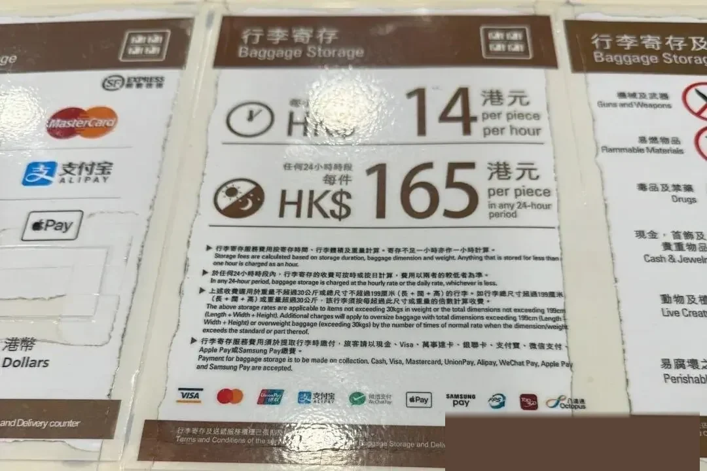

If your layover is long and you want to head into town unencumbered, the airport has a left luggage service.

- **Where:** Terminal 1, level 5 arrivals hall, zone A (landside — open to all passengers)
- **Hours:** daily, 05:30–01:30
- **Price:** HK$14 per hour; a maximum of HK$165 per item per day (nothing above that within 24 hours)

## Getting into town

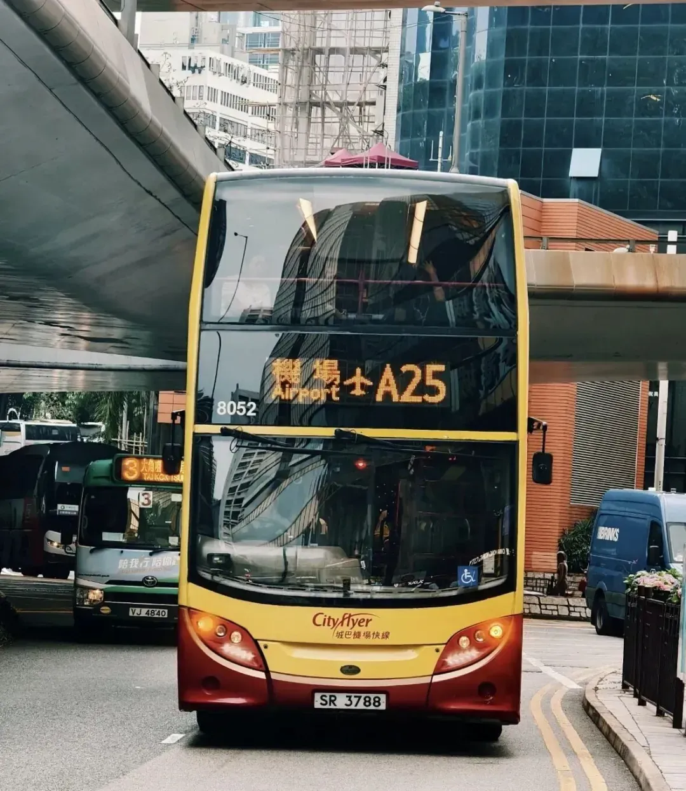

The airport offers several ways into the city, so pick the one that suits you:

- **Airport Express:** the fastest option — about 24 minutes to Central (Hong Kong Station), stopping at Kowloon and Tsing Yi. HK$115 one way; best for business travellers or anyone short of time.
- **Airport buses:** the cheapest option, with wide coverage and overnight services. Fares are HK$30–40; best if you have time and want to save money.
- **Airport transfers:** book a private pick-up in advance and be met by a driver — best with a lot of luggage or for families.
- **Taxis:** quick and convenient, and the pick for anyone with heavy bags or who prefers privacy.

## Two sights worth the walk

### The Sky Bridge

Linking the main terminal with the North Satellite Concourse, the Sky Bridge is a 200-metre footbridge — the longest airside footbridge in the world — 28 metres above the ground, with a glass floor that lets you watch aircraft taxiing beneath your feet.

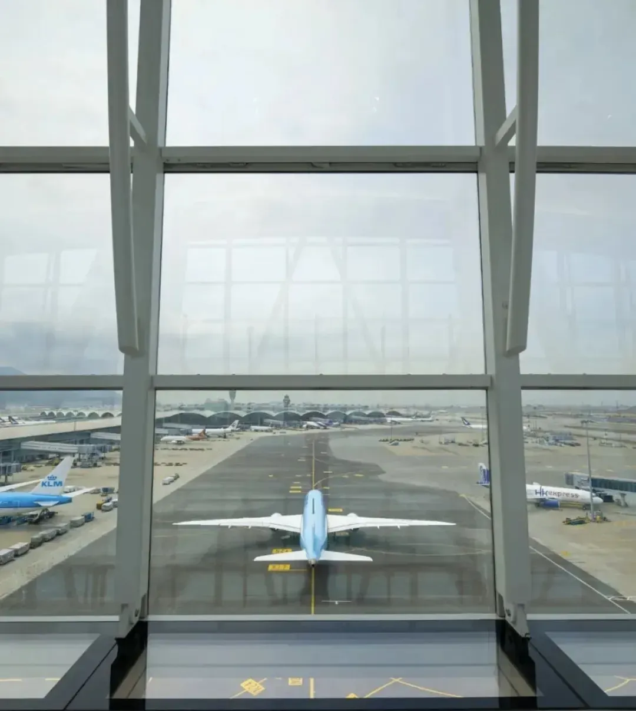

**Where:** gates 13–22

### The play dome

The play dome is a play facility built for children aged 6 to 12. It is a giant eggshell structure with climbing nets, a slide and curved mesh tunnels, with brightly coloured ribbons overhead.

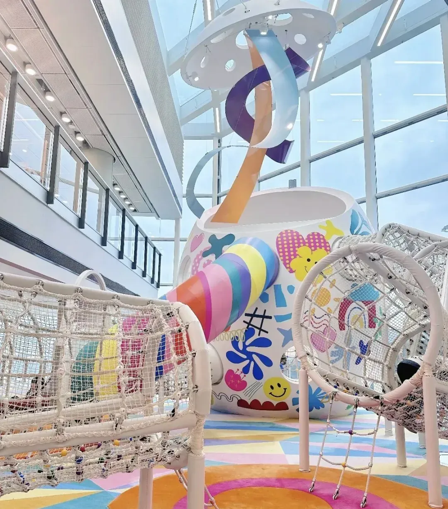

**Where:** Terminal 1, departures level (L6), East Hall, near gate 11

## Where to eat

### 阿鸿小吃 (Ah Hung Snacks)

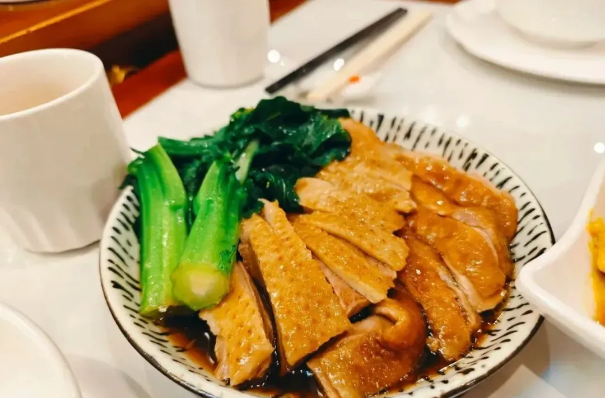

Named by CNN as the world's best airport restaurant, Ah Hung Snacks is known for its braised dishes and roast meats — braised goose slices, a braised mixed platter and its signature braised beef shank. The flavours are rich without being heavy, and plenty of travellers make a point of eating here before boarding.

**Where:** Terminal 1, arrivals level, level 5 (landside)

### 何洪记 (Ho Hung Kee)

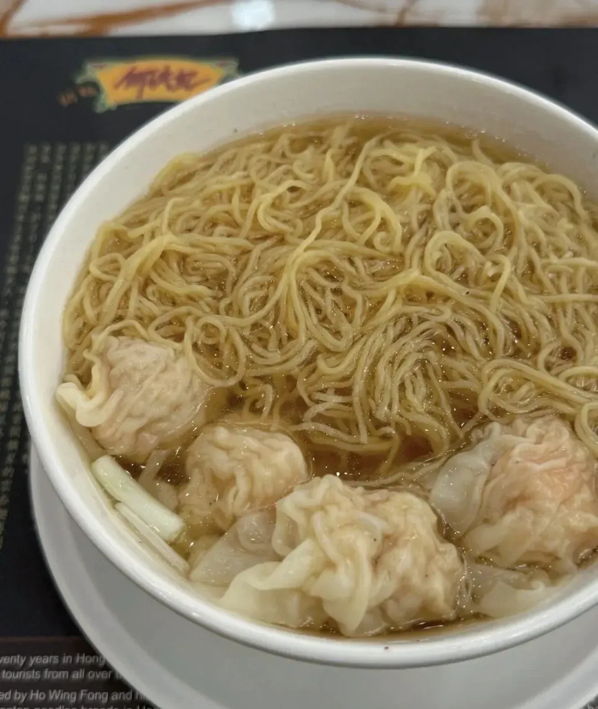

Ho Hung Kee is a long-established local restaurant known for its wonton noodles and congee, and has held a Michelin recommendation. The wontons are thin-skinned and generously filled with springy prawn, and the sampan congee has its own following — a good bowl of hot Cantonese noodles while you wait.

**Where:** Terminal 1, arrivals level, level 5 (landside)

### 都爹利会馆 (Duddell's)

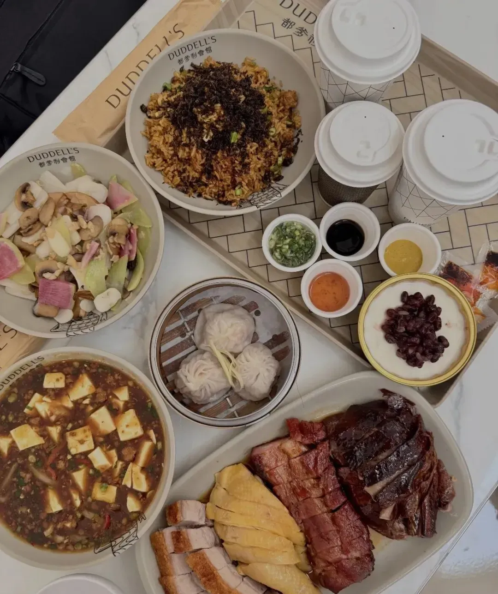

Duddell's, a Michelin-starred Cantonese restaurant, has an outlet in the food court inside the Terminal 1 departures restricted area, serving high-quality Cantonese cooking — dim sum, double-boiled soups, roast meats and stir-fries, with plenty of vegetarian options on the menu.

**Where:** Terminal 1, departures level, East Hall, level 7, shop 7E161 (airside)

### Gordon Ramsay Plane Food To Go

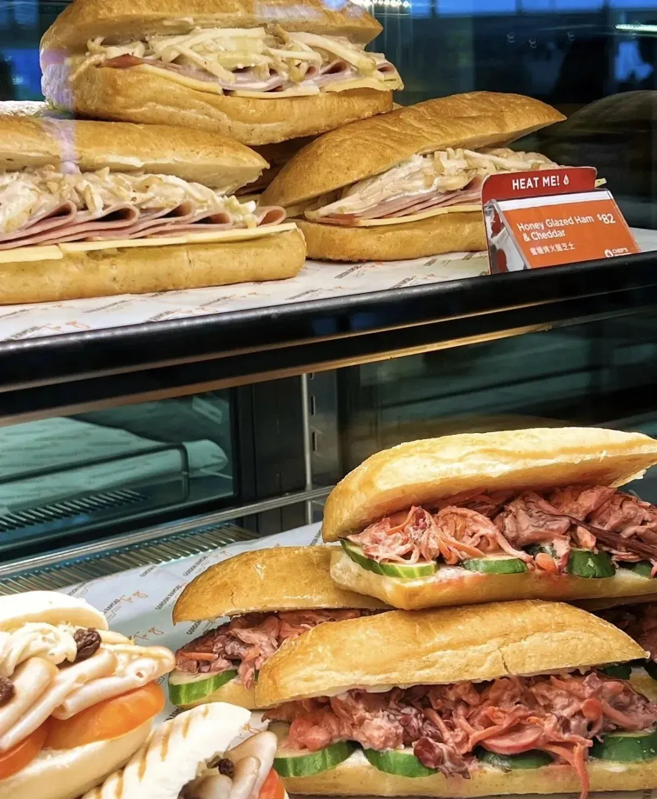

Gordon Ramsay brought the first Gordon Ramsay Plane Food To Go in Asia to Hong Kong International Airport, with a menu of British dishes alongside Hong Kong specialities created for the airport. The food is fresh and balanced — Western light bites including sandwiches, salads and pasta — and suits travellers who want something quick but good.

**Where:** Terminal 1, departures level, East Hall, level 7 (airside)

## Shopping

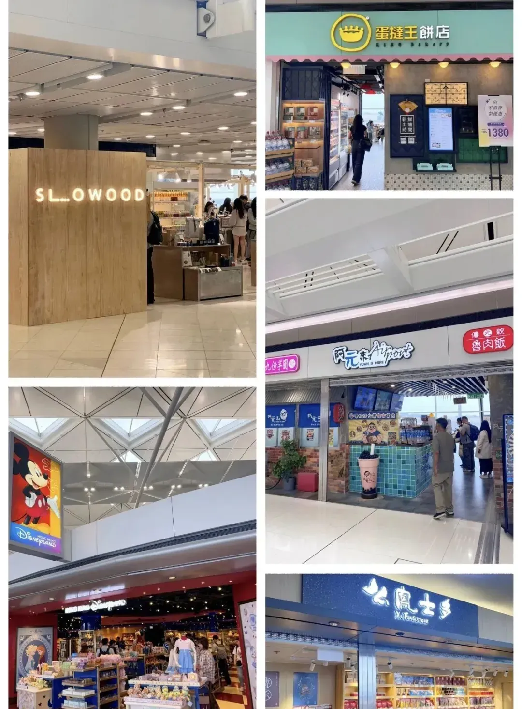

- **Before security:** Cookies Quartet, POP MART, the M+ museum shop, Micro Film and Sanrio.
- **After security:** souvenir shops (Kee Wah Bakery, Sweet Dreams and others), luxury brands (Louis Vuitton, Hermès), jewellery (Cartier, Bulgari), beauty (SK-II, Lancôme) and designer toys and gifts (the Hong Kong Disneyland shop, the Hong Kong Design Gallery). There are a great many brands, and you get duty-free pricing on top of the exchange rate.

## Lounges

### Hong Kong Airlines — 遨堂 (Club Autus)

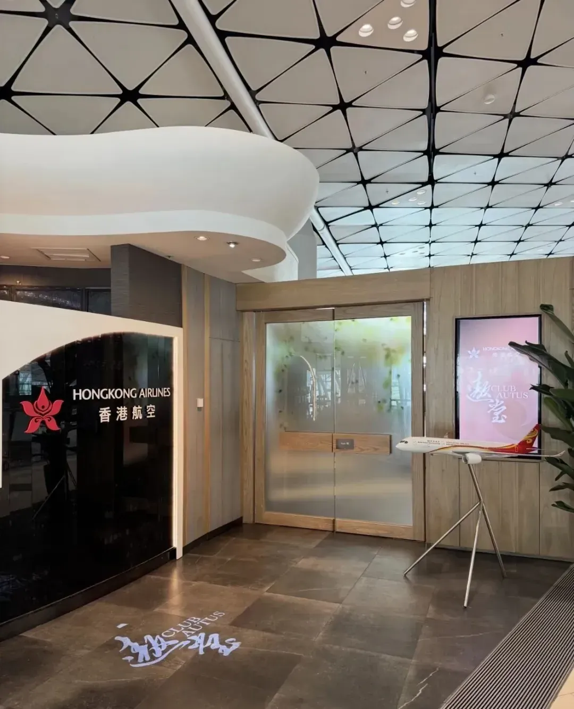

Club Autus leans into Hong Kong flavours, with made-to-order wonton noodles, egg waffles, cart noodles, tofu pudding, silk-stocking milk tea and claypot rice, plus cocktails from world champion bartender Leo Ko.

**Where:** Midfield Concourse, level 7

### Plaza Premium Lounge

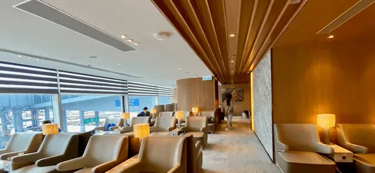

Independent of any airline, Plaza Premium lounges are open to anyone who pays — you only need a valid boarding pass. Alongside beer, coffee and soft drinks they serve hot food cooked to order, such as fish-ball noodle soup, roast meat rice and hand-made toast, and every seat has a power socket.

**Where:** near gates 1, 35 and 60

### Cathay Pacific lounges

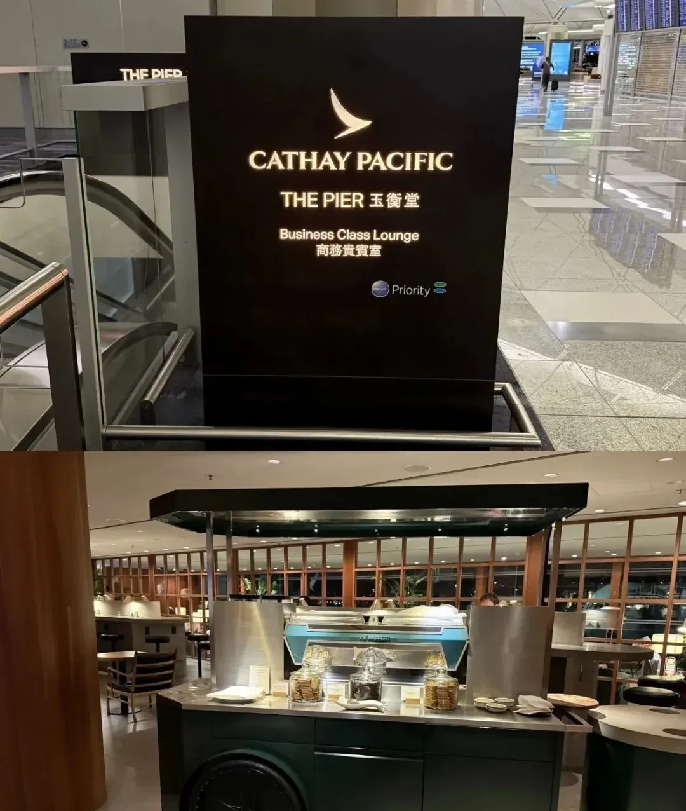

Hong Kong is Cathay Pacific's home base, so the airline has several lounges here, and they are the best equipped of the airport's lounges. The Pier, for example, serves freshly cooked dan dan and wonton noodles with a full range of drinks and hot dishes, and has a tea house where you can order a pot of hot tea to cut through the richness.

**Where:** near gates 35, 6, 63–65, 1–4 and 5

## Free services

- **Free Wi-Fi:** turn off mobile data → choose the network "HKAirport Free WiFi" → open a browser and enter any valid URL → read the terms and conditions → tap "Agree and Continue".
- **Free charging:** more than 9,100 power sockets across the terminal, with USB ports and UK three-pin sockets at seating areas near almost every gate and in the transfer zone.
- **Free showers:** public showers at Terminal 1, gate 12. Show your boarding pass to collect a fresh towel and toiletries at no charge.
- **Children's play areas:** at Terminal 1 gates 1, 15, 41 and 60, to help families transferring with children pass the time.

## One thing to note: the departure tax has gone up

Hong Kong's Civil Aviation Department has announced that for tickets issued on or after 1 October 2025, the **Air Passenger Departure Tax on flights departing Hong Kong rises from HK$120 to HK$200** (transiting passengers on the same day are excluded). Under the new rules, travellers who stay in Hong Kong for no more than 48 hours can apply for a full refund of the tax.

## Related links

- **On this site**: [Hong Kong International Airport (HKG)](/airport/HKG)
- **Wikipedia**: [Hong Kong International Airport](https://en.wikipedia.org/wiki/Hong_Kong_International_Airport)
- **Baidu Baike**: [Hong Kong International Airport](https://baike.baidu.com/item/%E9%A6%99%E6%B8%AF%E5%9B%BD%E9%99%85%E6%9C%BA%E5%9C%BA)

## Related links

- **On this site**: [Hong Kong International Airport (HKG)](/airport/HKG)
- **Wikipedia**: [Hong Kong International Airport](https://en.wikipedia.org/wiki/Hong_Kong_International_Airport)
- **Baidu Baike**: [Hong Kong International Airport](https://baike.baidu.com/item/%E9%A6%99%E6%B8%AF%E5%9B%BD%E9%99%85%E6%9C%BA%E5%9C%BA)
