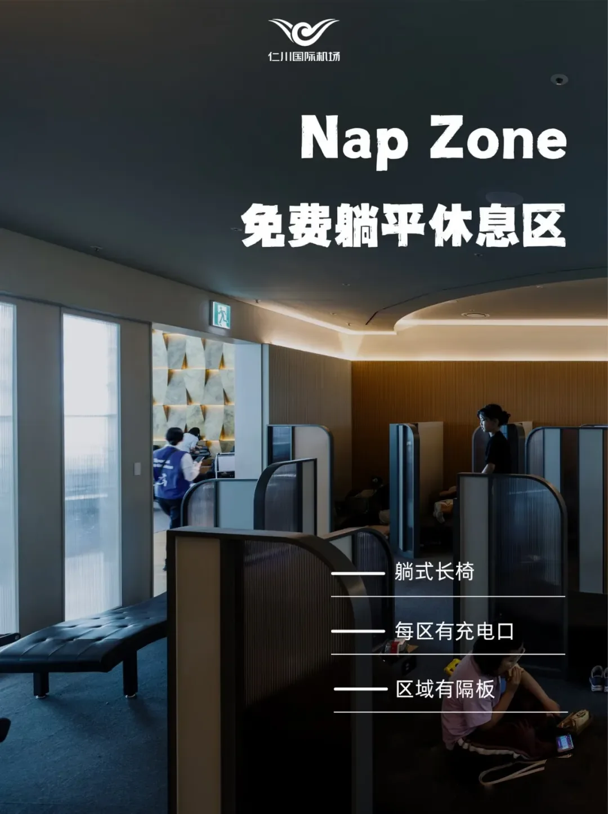
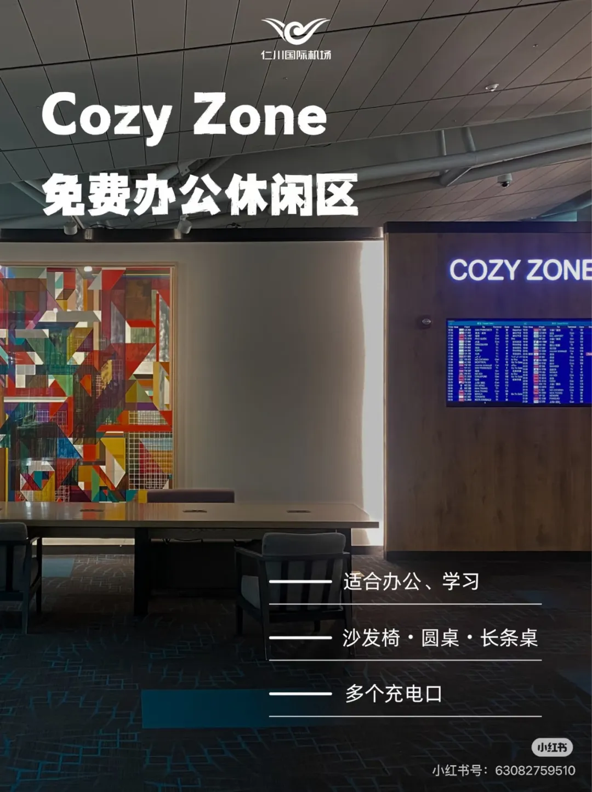
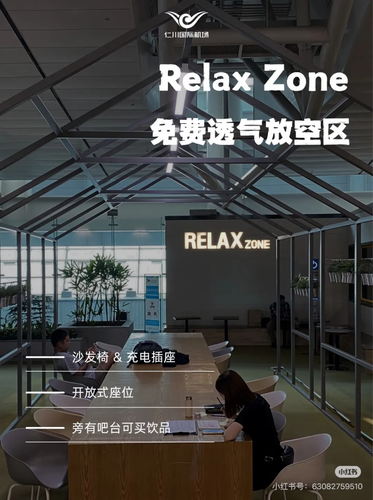
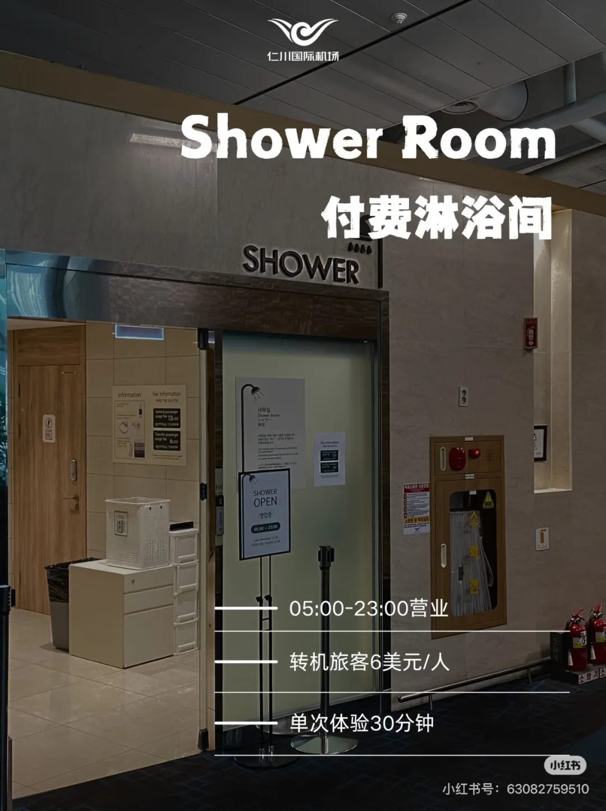

**24H免費休憩指南**

_REST&RELEX_

在仁川機場中轉時，不用花錢，也能輕鬆找到一個舒適的角落，躺平休息。不論是只有幾個小時的短轉機，還是要在這裡過夜的長中轉，T1、T2 都有免費開放的休息區可用；想洗個澡再上飛機，機場也準備了付費淋浴間。

這份指南把三個免費休息區（Nap Zone、Cozy Zone、Relax Zone）和一個付費淋浴間（Shower Room）的位置、設施與開放時間一次講清，建議先收藏再看。

## 一分鐘看懂：三個免費區怎麼選

三個區域都在 4 樓（4F），彼此步行幾分鐘就能到，區別只在於你想幹什麼：

| 區域 | 位置 | 適合 |
| --- | --- | --- |
| Nap Zone | T1 4F 東側 25 號登機口附近；T2 4F 東側 268 號登機口附近、西側 231 號登機口附近 | 想躺平睡一覺 |
| Cozy Zone | T1 4F 東側轉機休息區 | 辦公、寫作業 |
| Relax Zone | T1 4F 西側 43 號登機口附近、東側 11 號登機口附近 | 透氣放空、喝點東西 |

## 01 Nap Zone：最適合睡覺的躺平區

超長轉機想躺平睡一覺？機場免費的 Nap Zone 就是為這件事準備的：躺式長椅，區域之間還有小隔板遮擋，私密性超好。

📍 T1 航站樓 4F 東側，25 號登機口附近

📍 T2 航站樓 4F 東側，268 號登機口附近

📍 T2 航站樓 4F 西側，231 號登機口附近

👉 **沉浸式體驗**：配備躺式長椅，區域還有小隔板遮擋，私密性超好

💡 **貼心設施**：每個區域都配備充電插座（電源插座多為韓式圓孔，需自備轉換頭）

💡 **保暖提醒**：入睡前記得蓋上厚外套或毛毯，以免著涼

## 02 Cozy Zone：位置超多的辦公休閒區

需要辦公、寫作業的轉機旅客，來這裡最合適。Cozy Zone 是開放式區域，有沙發椅和圓桌，也有帶充電口的長條桌，位置相對充足，24 小時免費開放。

📍 **地點**：T1 航站樓 4F 東側轉機休息區

✨ 開放式區域，有沙發椅 + 圓桌，以及帶充電口的長條桌。

✨ 位置相對充足，24 小時免費開放~

## 03 Relax Zone：透氣放空的沙發區

同樣是免費的 24 小時開放式區域，配有沙發椅和充電插座，空氣流通性超好；旁邊吧檯還可以購買飲品。想從座位上站起來走走、透透氣，這裡比候機座椅舒服得多。

📍 地點：T1 航站樓 4F 西側，43 號登機口附近

📍 地點：T1 航站樓 4F 東側，11 號登機口附近

## 04 Shower Room：付費洗浴，不是 24 小時

轉機時間長，想洗個澡放鬆一下？兩個航站樓的 Nap Zone 旁邊都配有**付費 Shower Room**，一場 30 分鐘。要注意它不是 24 小時營業，入場截至 22:30。

⭐ **具體位置**

📍 T1 航站樓 4F 東側，25 號登機口附近

📍 T1 航站樓 4F 西側，29 號登機口附近

📍 T2 航站樓 4F 東側，268 號登機口附近

📍 T2 航站樓 4F 西側，231 號登機口附近

💰 **價格**：轉機旅客 6 美元/人（刷卡或現金都可支付），30 分鐘洗浴（超時要加錢）

⏰ **開放時間**：05:00–23:00（注意 Shower Room 不是 24 小時營業，入場截至時間為 22:30）

🧴 **提供備品**：沐浴露、洗髮護髮用品、牙刷牙膏、吹風機

## 轉機小貼士

- 先確認自己在哪個航站樓：三個免費區和淋浴間在 T1、T2 都有分佈，但具體登機口不同。
- 電源插座多為韓式圓孔，轉換插頭記得隨身帶，充電和吹頭髮都用得上。
- 打算睡一覺的話，厚外套或毛毯放在隨手能拿到的位置，免得半夜著涼。
- 想洗澡就提前排一下時間，Shower Room 22:30 停止入場；轉機時間緊的話，先洗再休息更穩妥。

_💡溫馨提示：轉機時間較長的話，建議提前規劃好休息和洗浴時間，帶好轉換插頭，祝大家轉機愉快！_

圖片來源：仁川機場小紅書官方賬號
