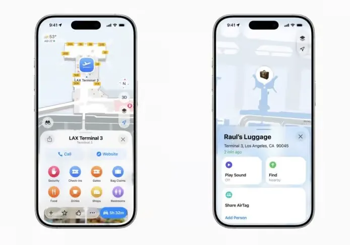
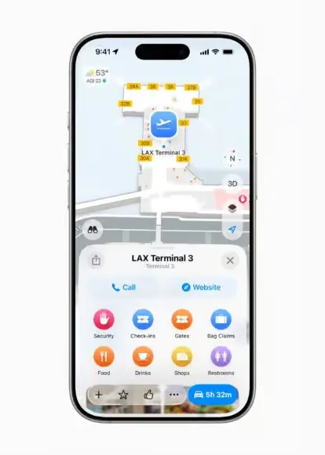
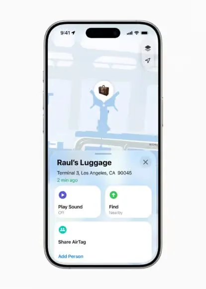
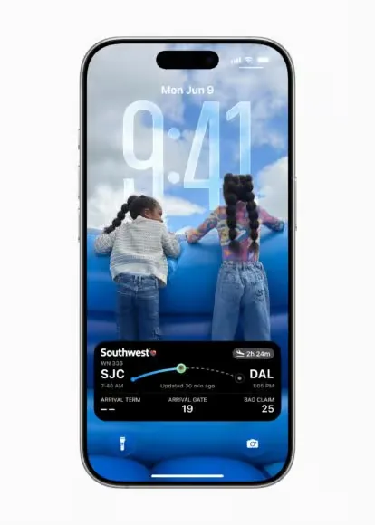

刚下完单就切到邮件里翻物流单号；赶飞机时，登机牌、行李追踪、机场地图各开一个 App 来回切换；结账时从包里掏卡，半天找不到卡号。这些零碎的糟心事，iOS 26 的钱包（Wallet）这次全串起来了——订单自动追踪、登机牌集成行李查找、信用卡系统级自动填充，终于不用再当「App 切换选手」。

这是钱包近年力度最大的一次升级，覆盖购物追踪、出行体验、支付便利与身份认证等多个维度。以下是核心新功能一览。

## 1. 订单追踪：Apple Intelligence 驱动的「快递管家」

钱包新增**订单追踪**功能，在一个地方就能看完所有网购的物流状态：

- **无需商家接入**：系统借助 Apple Intelligence，自动从「邮件」App 中识别订单号和物流信息，再同步至钱包；
- **覆盖所有订单**：不仅限于 Apple Pay 完成的购买，其他支付方式的订单邮件同样能识别；
- **查看方式**：钱包右上角「…」→「订单」，即可查看物流状态。

> 注意：需搭载支持 Apple Intelligence 的设备，且部分订单可能需手动标记完成。

## 2. 登机牌升级：机场地图与行李追踪

登机牌从「一张二维码」变成了完整的旅行助手，这也是对坐飞机最有用的一项：

- **实时活动**：航班动态实时显示在锁屏和灵动岛，不用打开 App 就能看到登机口、登机时间与行李转盘；
- **机场地图**：登机牌内直接集成机场导航地图，快速定位登机口、休息室、安检口、行李提取与洗手间；
- **行李追踪**：与「查找」（Find My）应用联动，支持追踪挂着 AirTag 的行李位置；
- **遗失行李**：行李丢失可直接在钱包内报告；
- **航班共享**：把航班信息一键分享给亲友，方便接机或跟踪航班。

已支持的航司包括美联航、加拿大航空、达美航空等；美国航空、汉莎、澳洲航空等也承诺后续支持。

## 3. 信用卡自动填充：从 Safari 扩展到系统级

iOS 26 把信用卡的自动填充功能从 Safari 扩展到了整个系统：

- **随处可用**：在任何 App 或网站的文本框中，轻点 →「自动填充」→「信用卡」即可快速填入；
- **集中管理**：钱包内新增「自动填充」菜单，可查看、添加、管理所有已保存的信用卡；
- **添加卡片**：支持摄像头扫描卡片或手动输入，Face ID / Touch ID 验证后即可使用。

## 4. 数字身份证（美国护照）：无纸化通行

- 支持将美国护照添加至钱包，存储在 iPhone 或 Apple Watch 中；
- 适用于美国境内部分 TSA 安检通道，符合 Real ID 标准；
- 也可用于零售店、App 及网站内的年龄验证场景。

> 限制：不适用于国际旅行或边境通关，仍需出示实体护照。

## 5. 分期付款：Apple Pay 支付更灵活

在商店内使用 Apple Pay 付款时，可选择银行或卡片提供商提供的分期付款选项。信用卡和借记卡消费均适用，让大额支付更灵活。

## 6. 广告控制：终于能关掉促销通知

苹果回应了用户的长期不满，新增了关闭「优惠与推广」的开关：

- **路径**：钱包 App → 右上角「…」→「通知」→ 关闭「优惠与推广」；
- 关闭后不再收到来自钱包的促销推送通知（如 F1 赛事推荐等）；
- 默认开启，需手动关闭。

赶紧试试 GET 到的新技巧吧。
