十一黄金周将至，

跨国旅行热度升温，

随着**中国公民赴土耳其免签**政策持续实施，

以及**中土之间的直飞航线**不断便利，

土耳其也成为秋季出境游的热门目的地之一。

作为横跨欧亚的超级核心枢纽，

iGA伊斯坦布尔机场深耕旅客出行体验，

把贴心、便利、舒适全部拉满！

无论是短暂中转、长时间候机，

还是抵达伊斯坦布尔开启土耳其之旅，

一份实用的机场攻略，

带你快速了解航站楼内的中文服务、休闲设施、家庭友好配套及出行便利设施。

## 01 中文出行 畅行机场

跨国出行，最怕语言不通、看不懂指引？ 在伊斯坦布尔机场，中国旅客可以全程安心出行！

### 全场景中文可视化指引

从海关通道、退税区域、咨询台，到登机口、换乘通道及航班信息大屏，机场多个关键出行环节均设有**中文标识**，让信息获取更加直观便捷。

无需费力翻译、不用盲目找路，抬头就能找到方向，换乘、退税、登机一目了然。

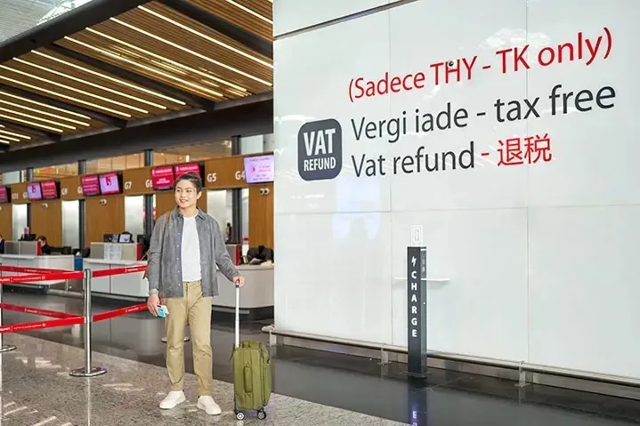

### 智能视频咨询终端

**（Digital Kiosk）**

航站楼内设有**智能视频咨询终端及自助服务设备**，均支持中文服务，可通过视频连线获得工作人员协助，查询航班、机场设施等信息。

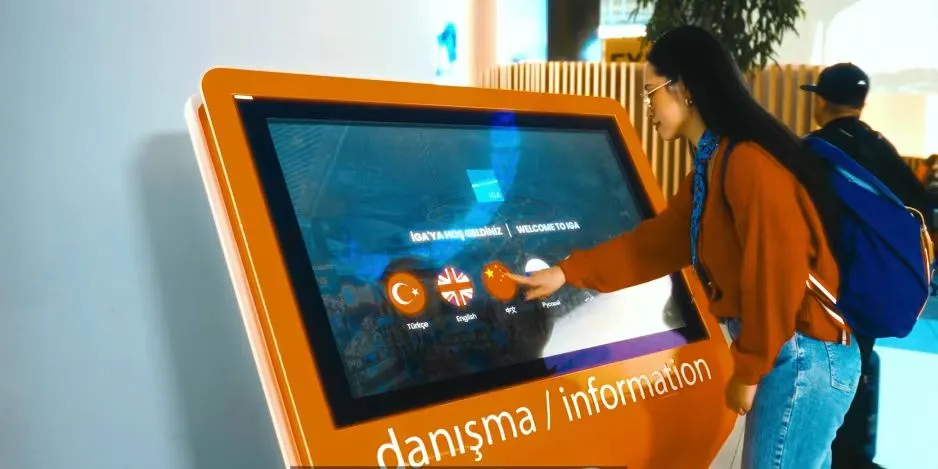

### 中文引导员 提供现场协助

## 02 多元舒适候机体验

机场配备超多休闲、购物、美食、休憩空间，把候机时光变得轻松又治愈。

### 多处电视休闲观景区

伊斯坦布尔机场在多处热门候机区域设置了**公共电视观看区**，候机时可以看新闻、浏览资讯，轻松打发等待时间，告别无聊候机。

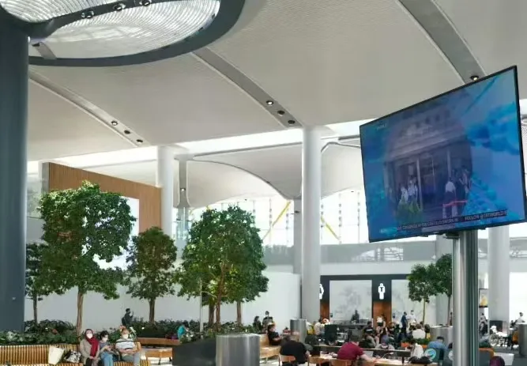

### 免税购物+环球美食一站满足

机场航站楼拥有**超大型免税商圈**，品类覆盖全球美妆、大牌奢侈品、土耳其本土特产、伴手礼，价格选择丰富，非常适合旅途采购。

餐饮上，**各式风味餐厅**全覆盖，传统土耳其咖啡、本土特色美食、国际连锁餐饮应有尽有。无论想吃热食、简餐、甜品、饮品，都能轻松满足。

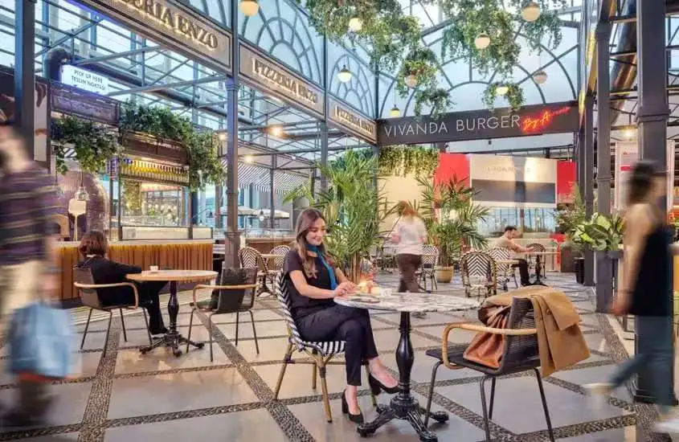

### iGA Lounge贵宾休息室

遇到长时间中转候机，想要找一处安静的空间稍作休整、舒缓旅途疲惫，**iGA Lounge贵宾休息室**会是不错的去处。

这里配置完善，提供全天候开放式自助餐与冷热酒水，配备淋浴间、户外观景露台、免费高速WiFi以及航班信息显示屏；空间内还设置了儿童游玩区、礼拜室、商务办公区和行李寄存柜。即便是全家一同出行，也能在这里拥有松弛舒适的候机体验。

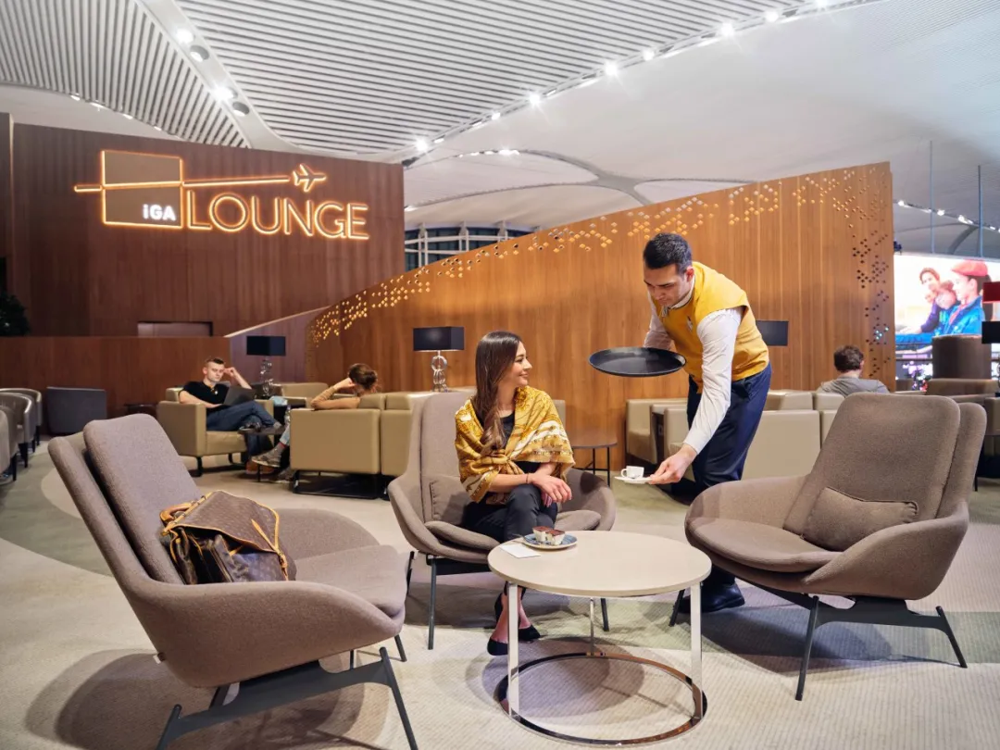

## 03 家庭友好配套

对于家庭旅客而言，机场内完善的亲子设施，可以让出发、中转与候机过程更加轻松。

### 儿童乐园

机场设有**700㎡的主题儿童乐园**，分布在多个登机口与值机区域，让孩子自由玩耍，释放活力。

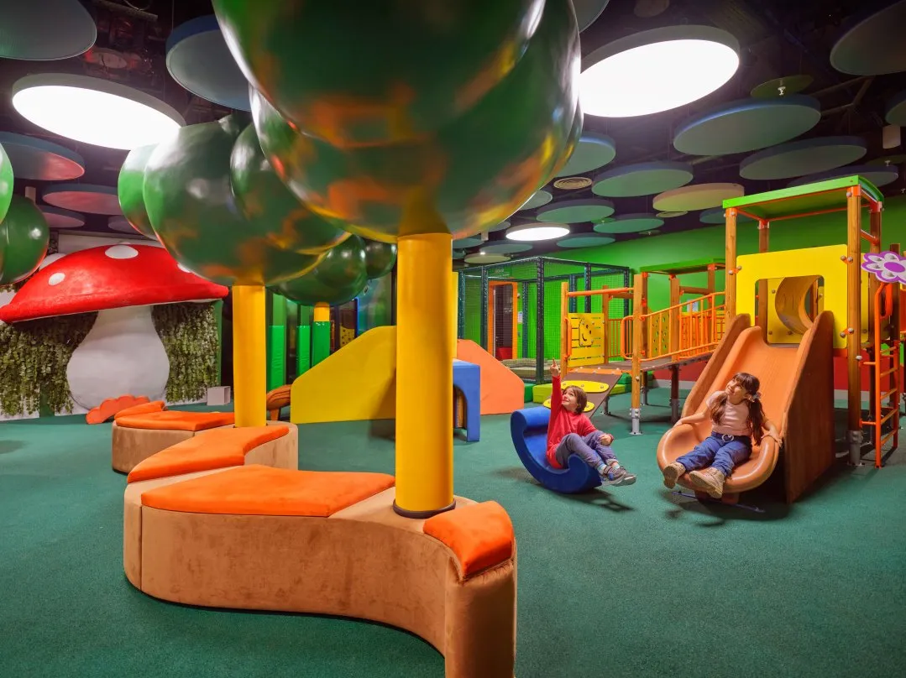

### 母婴设施

全航站楼分布多处**母婴室**，同时提供**婴儿车租借服务**，满足不同阶段的亲子出行需求。

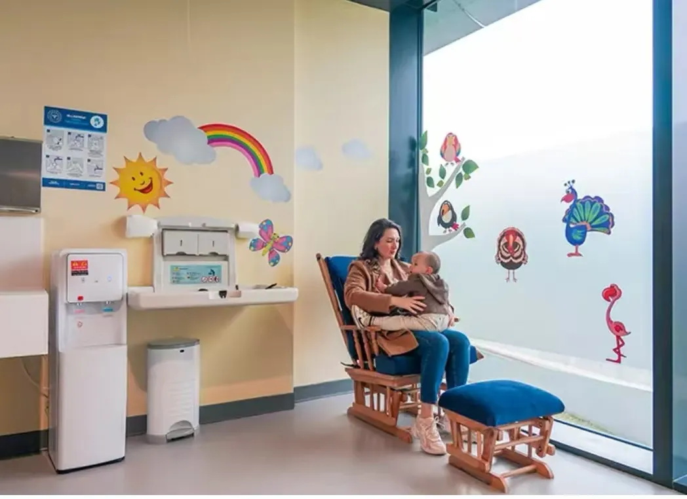

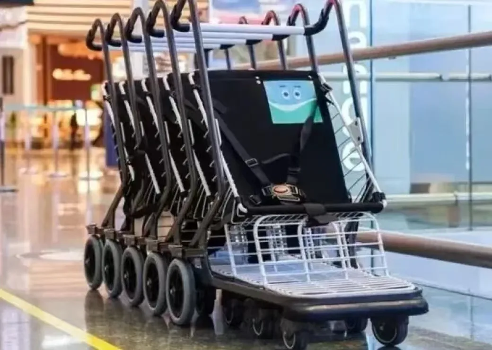

### 家庭出行便利

专属**家庭停车位+家庭优先安检通道**，大幅减少排队时长，让家庭出行，丝滑无忧。

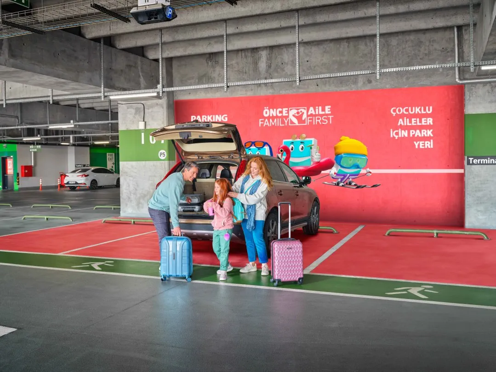

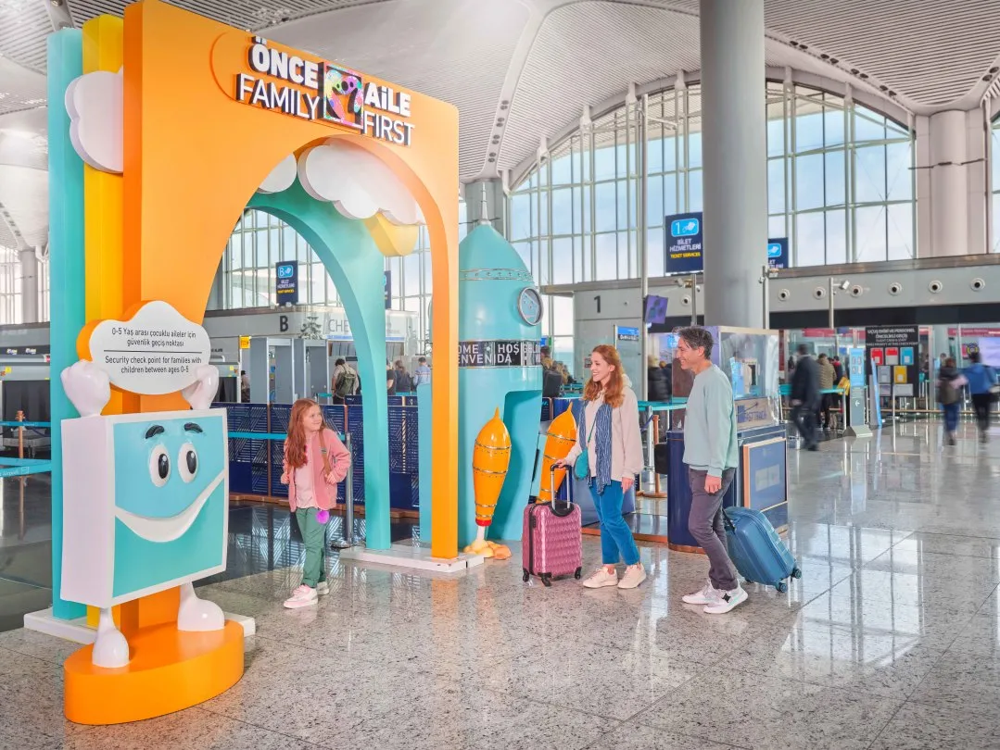

## 04 中国旅客专属实用小贴士

为了让大家十一出行更顺畅，小伊还整理了超实用细节：

· 场内配备多处**热水点位**，适配中国旅客的生活习惯。 **行李手推车**随处可取，大件行李、行李箱轻松搬运，减轻出行负担。

· 全航站楼**高速WiFi全覆盖**，落地即可连接， 随时查航班、联系家人、更新行程。

· 伊斯坦布尔机场**全天候运营**，为深夜抵达、凌晨出发及长时间中转的旅客提供更灵活的出行安排。

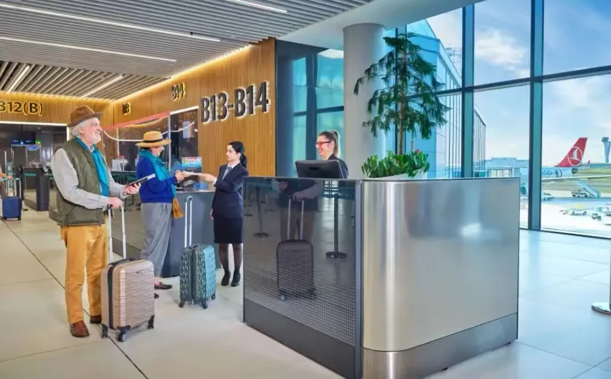

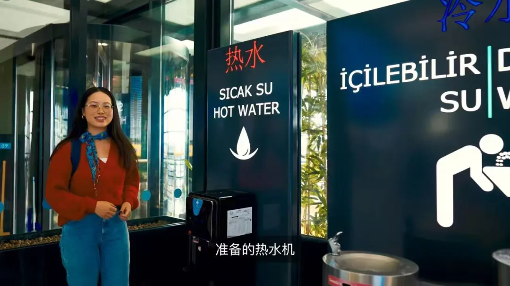

✈️✈️✈️

横跨欧亚，连接每一段旅程。

这个十一黄金周，

无论是经由伊斯坦布尔机场开启下一段旅程，

还是抵达这里探索土耳其，

丰富的中文服务、家庭友好设施与多元化机场体验，都让旅途更加从容。

**iGA伊斯坦布尔机场，**

**期待与每一段旅程相遇**。

图片来源： [istairport.com](http://istairport.com)
