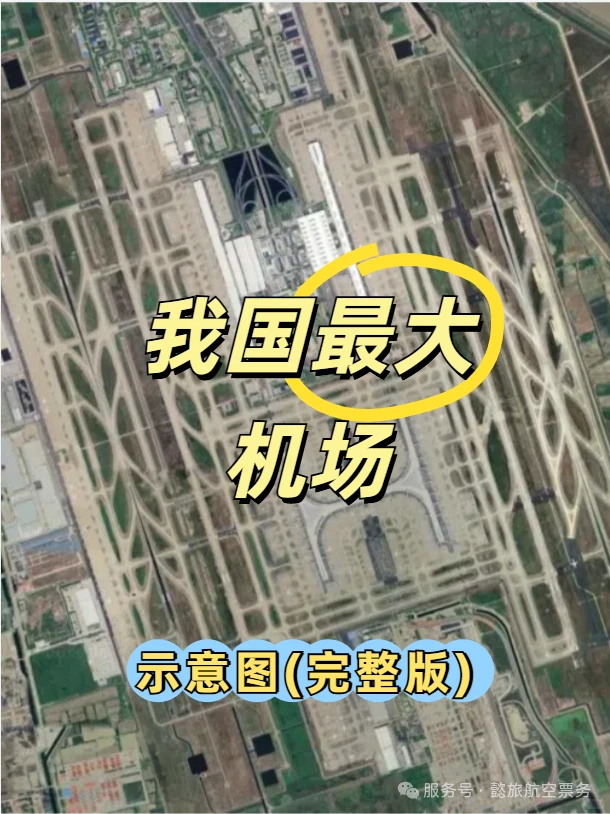

❤️❤️❤️ Shanghai Pudong International Airport is the largest airport in China by area. It covers 57 km² — more than the entire land area of Macau — and has five runways and more than 50 million passengers a year.

## Terminals and satellite halls

👉👉👉 Pudong has two terminals (T1 and T2) and two satellite halls (S1 and S2).

- ✅ **T1**: domestic and international, three floors — arrivals on 1F and 2F, departures on 3F.
- ✅ **S1 satellite hall**: domestic and international, four floors — arrivals on 1F and MF, a mixed arrivals-and-departures floor on 2F, departures on 3F.
- ✅ **T2**: domestic and international, four floors — arrivals on 1F, 2F and MF, departures on 3F.
- ✅ **S2 satellite hall**: domestic and international, four floors — arrivals on 1F and MF, a mixed floor on 2F, departures on 3F.

⚠️⚠️⚠️ Note: a glass partition separates S1 from S2 — you cannot move between the two.

## Floor diagrams

👉👉👉 Detailed floor diagrams follow:

- T1-1F ➡️ Figure 2
- T1-2F ➡️ Figure 3
- T1-3F ➡️ Figure 4
- S1-1F ➡️ Figure 5
- S1-MF ➡️ Figure 6
- S1-2F ➡️ Figure 7
- S1-3F ➡️ Figure 8
- T2-1F ➡️ Figure 9
- T2-2F ➡️ Figure 10
- T2-MF ➡️ Figure 11
- T2-3F ➡️ Figure 12
- S2-1F ➡️ Figure 13
- S2-MF ➡️ Figure 14
- S2-2F ➡️ Figure 15
- S2-3F ➡️ Figure 16

### T1

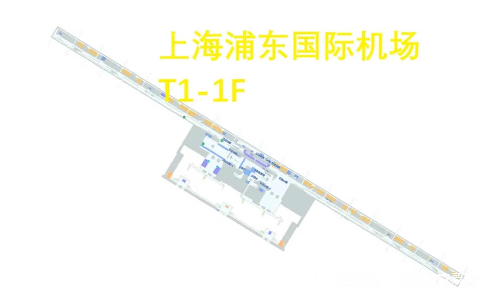

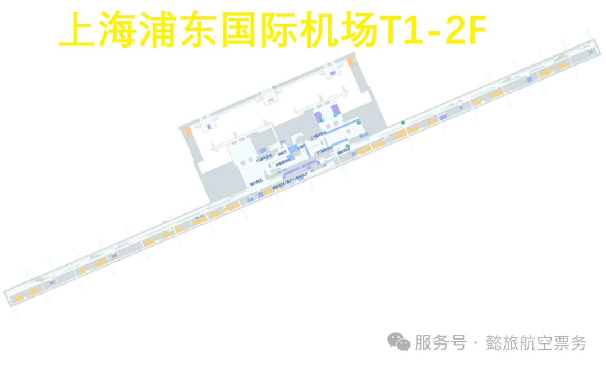

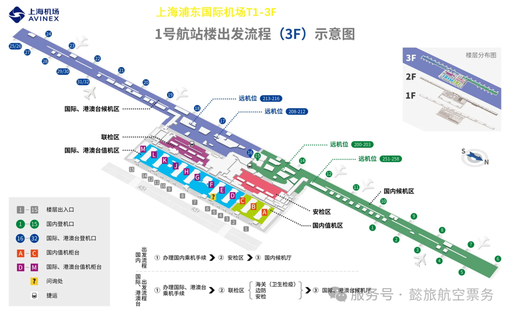

### S1

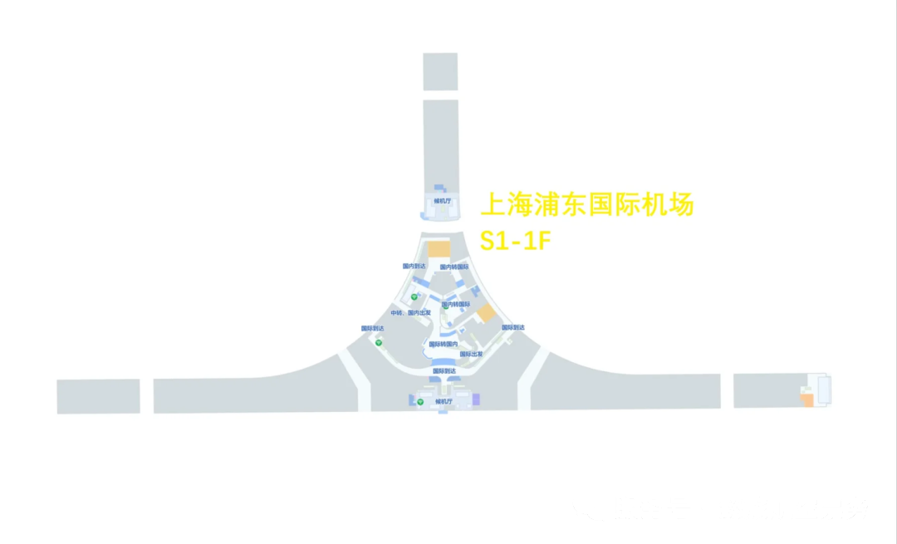

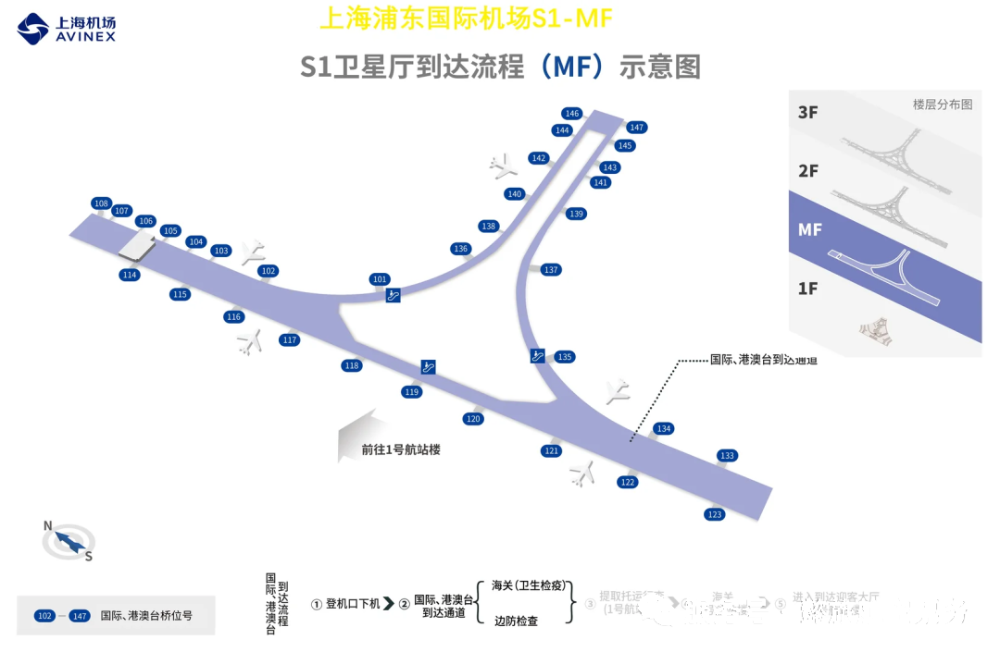

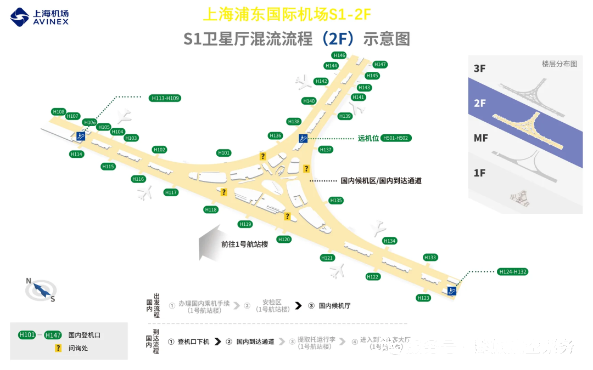

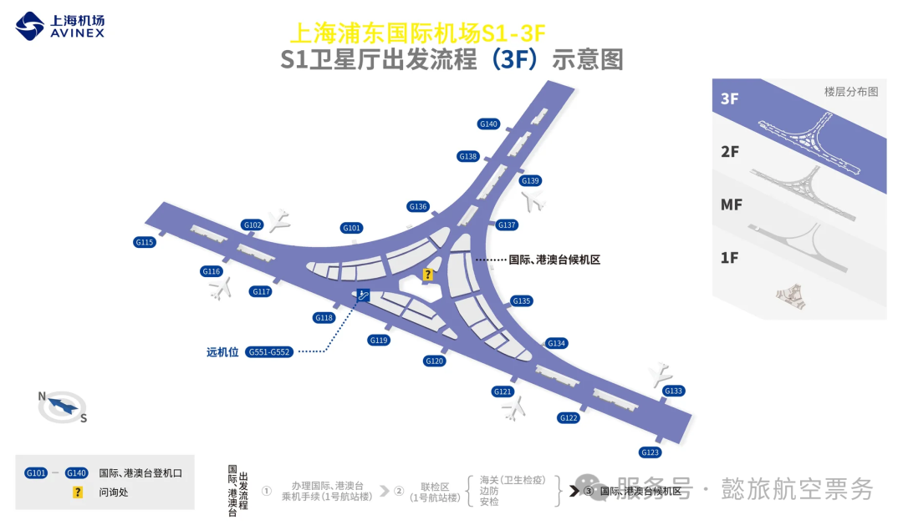

### T2

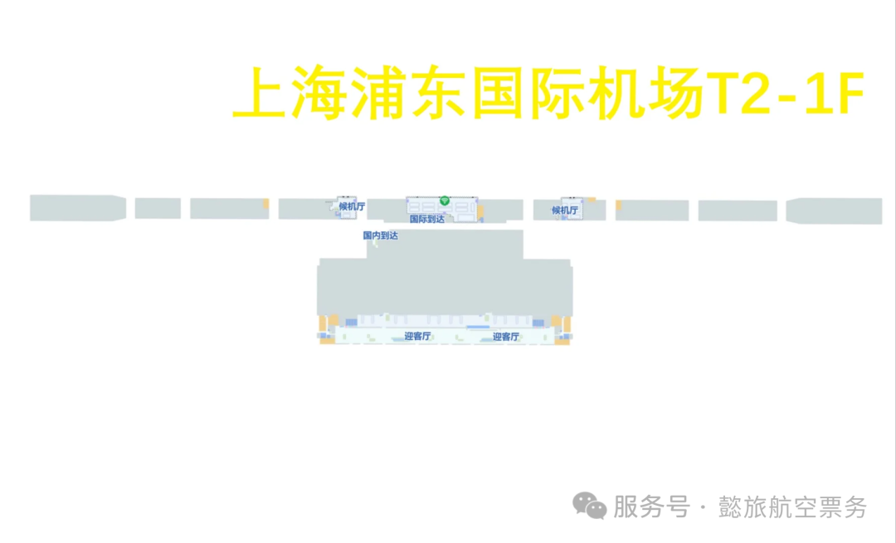

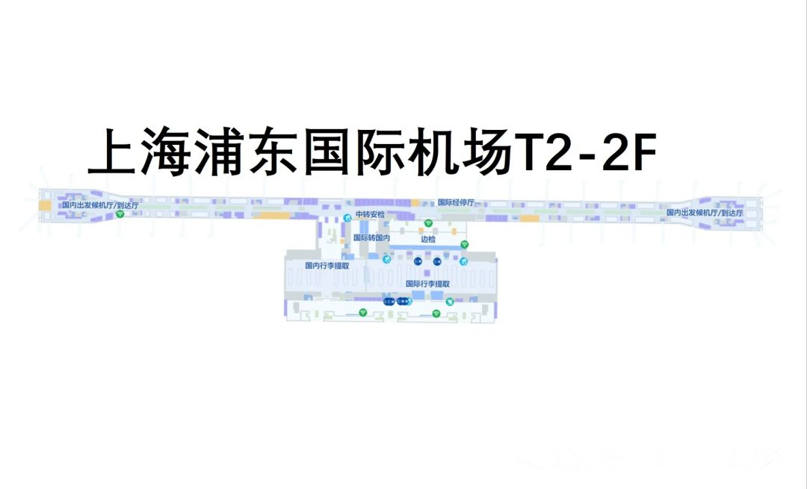

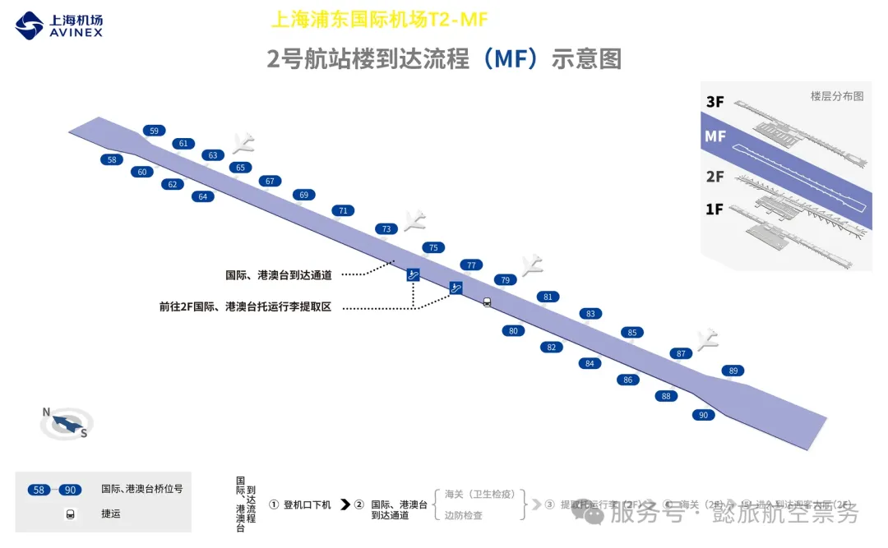

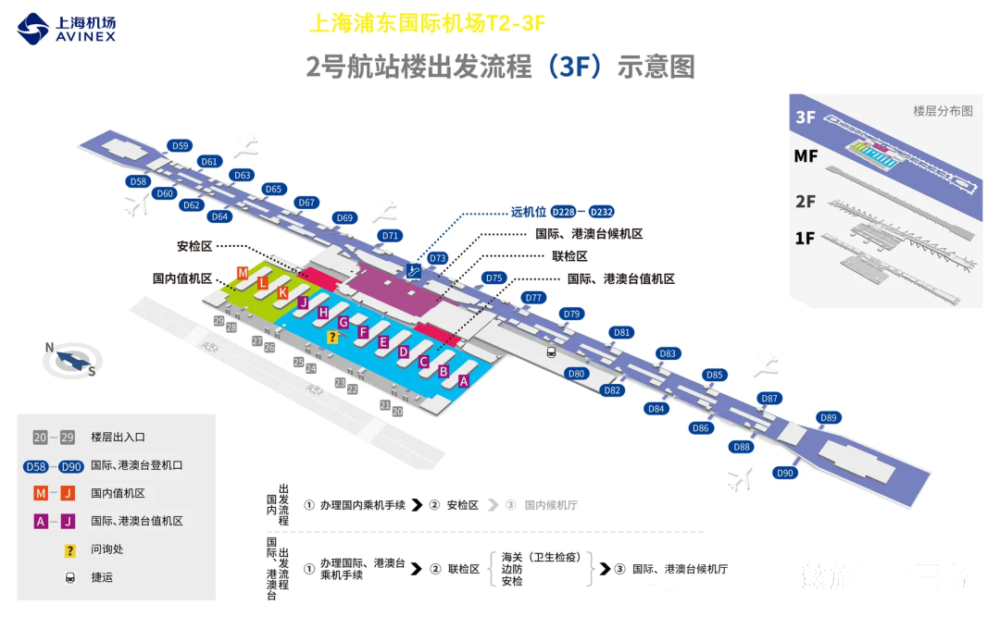

### S2

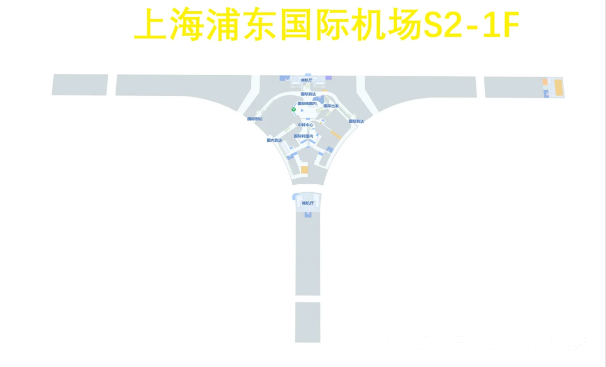

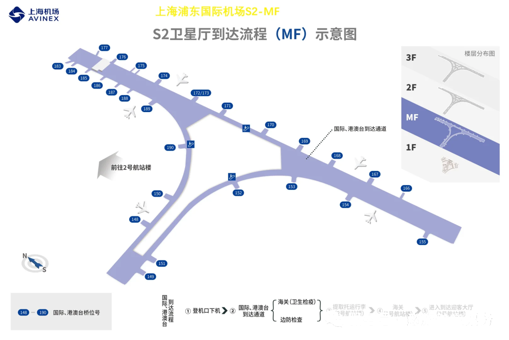

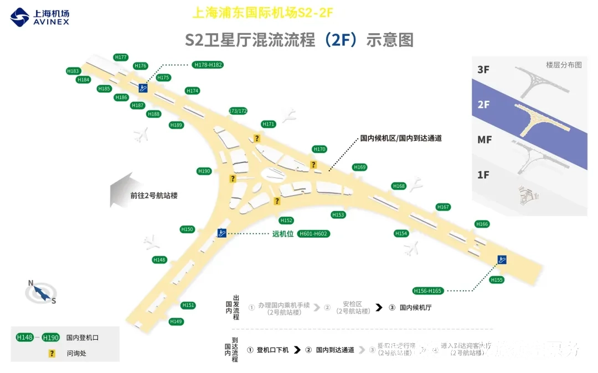

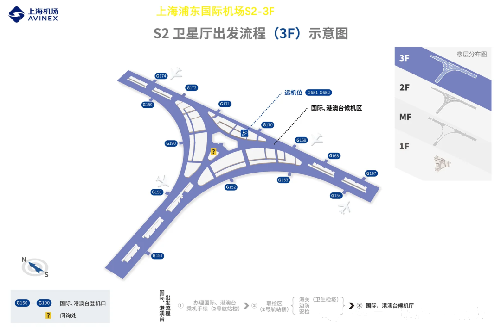
