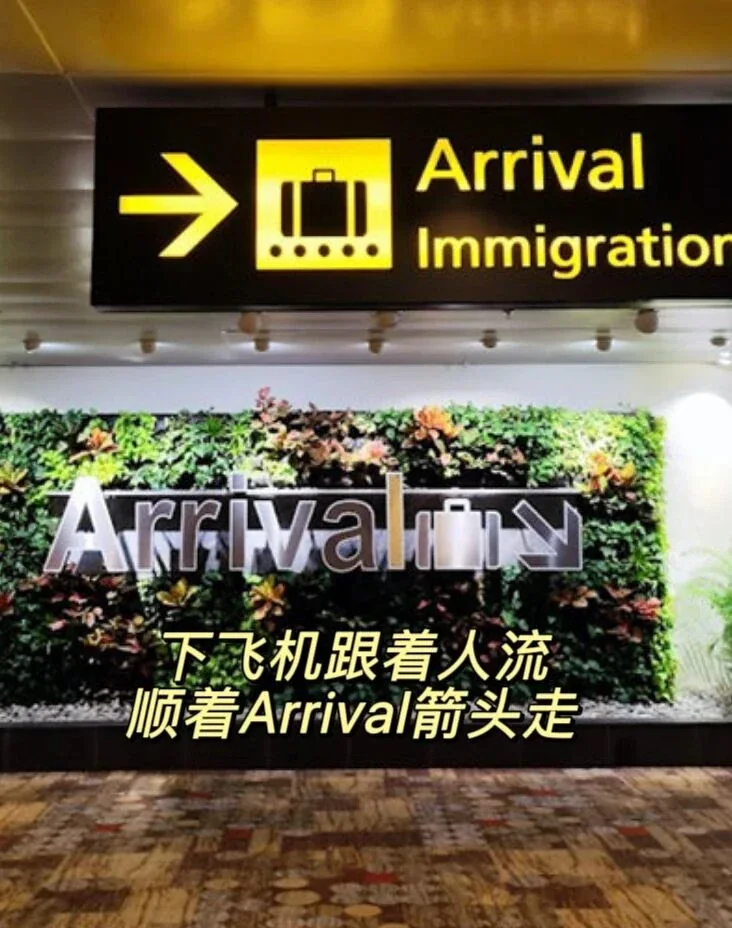
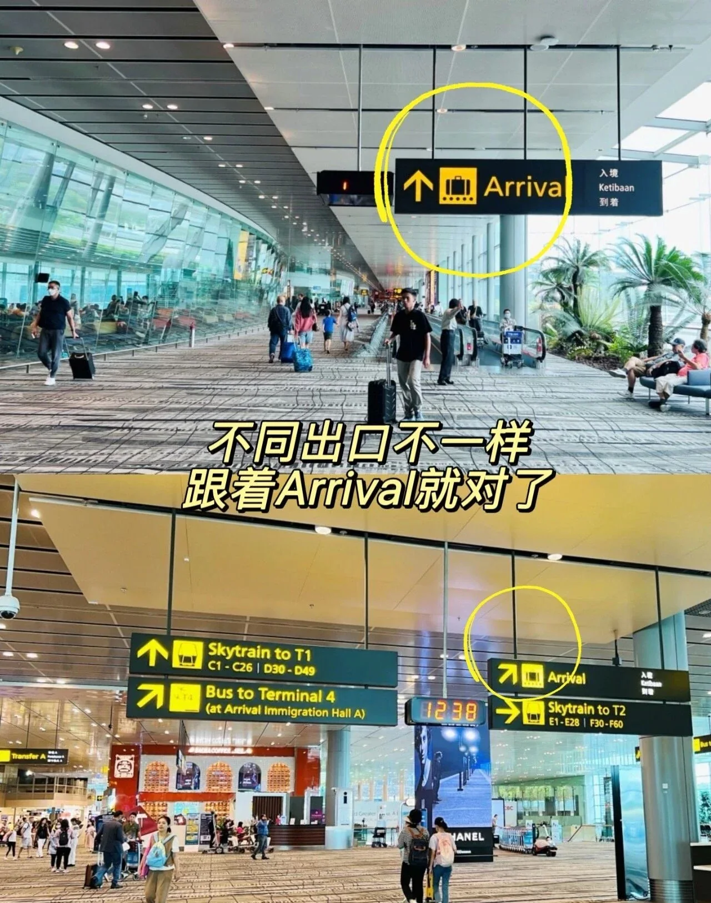
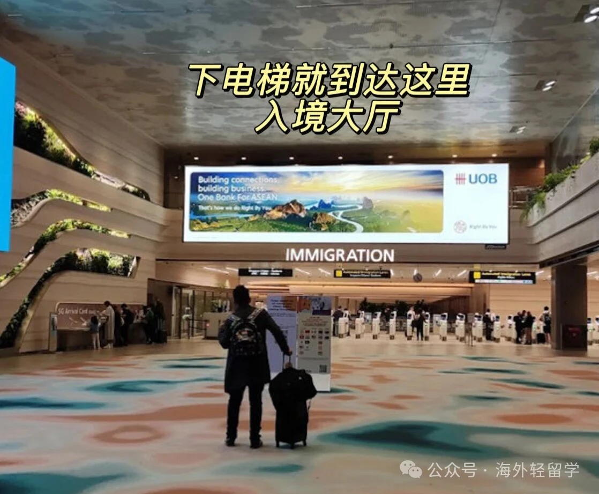
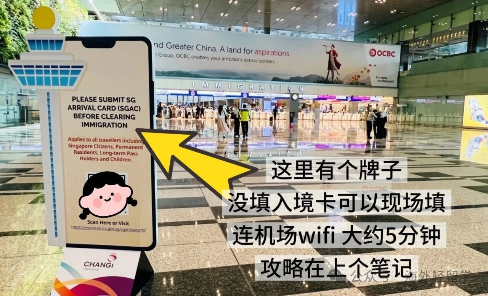
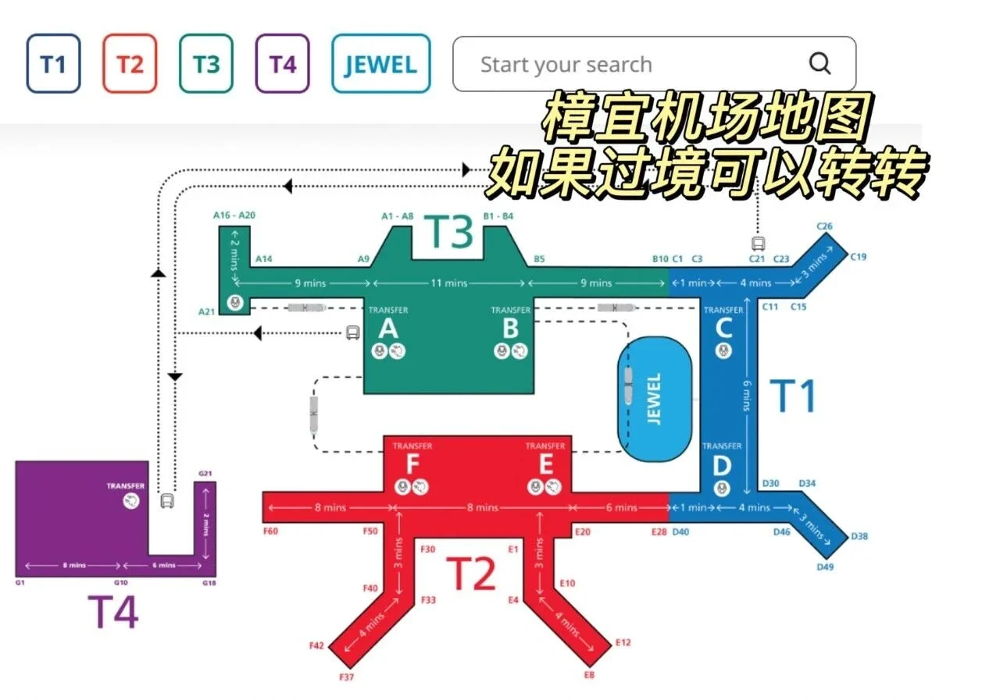
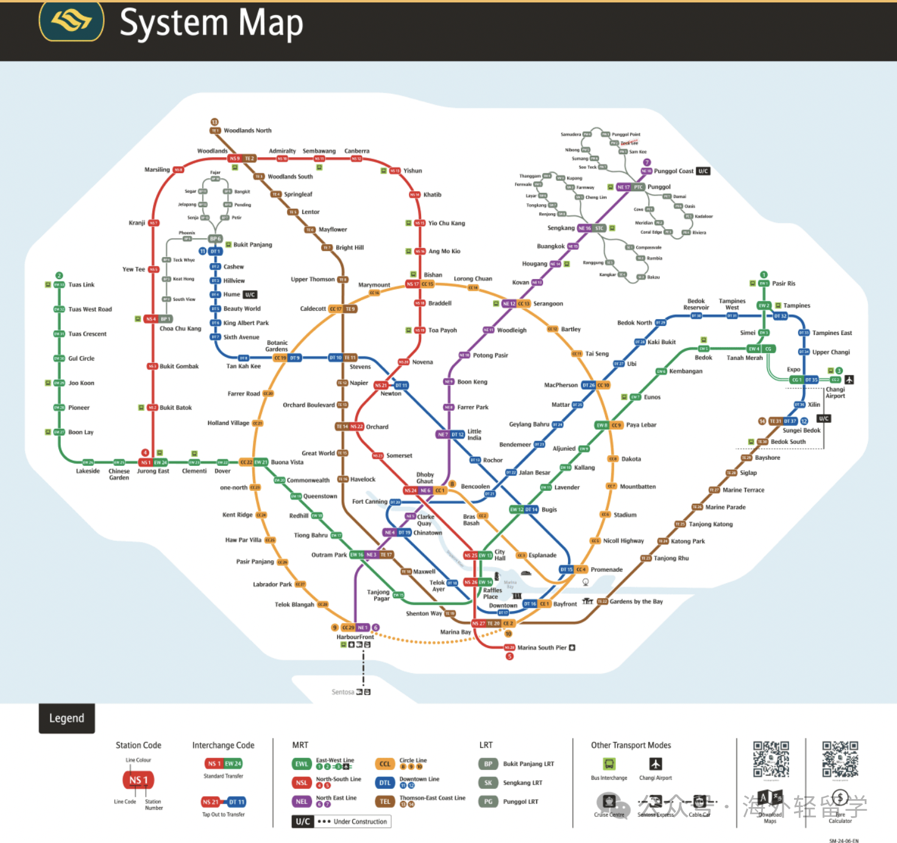

十一去新加坡 ✈️ 落地通關全流程：跟著人流走，就能順利入境。

## Step 1：跟著人流和 Arrival（到達）走

先去 Immigration Hall（入境大廳）。下飛機後跟著人流、順著 Arrival 箭頭走即可；不同出口的走法不一樣，認準 Arrival 就對了。

## Step 2：下樓前往入境大廳

順著指示牌的方向，乘坐電梯向下走，即可直接到達海關入境大廳。

## Step 3：第一道閘口（掃描護照）

走到自助通關機器前，將護照的照片頁朝下放置在掃描區，讀取成功後第一道閘門就會開啟。

## Step 4：第二道閘口（生物識別）

進入後，按照螢幕提示直視攝像頭錄入人臉，並按指示錄入指紋。驗證成功後閘門開啟，入境手續就全部完成啦！

## ⚠️ 通關指南：先填入境卡

沒填入境卡無法出關。電子入境卡填寫後會直接與你的護照綁定，通關全程不需要單獨出示任何憑證。

現場設有提示牌，也可以連上機場 WiFi 現場填寫，大約 5 分鐘；還不知道怎麼填寫的，可以看看上一篇手把手教程。

## 附：樟宜機場地圖

如果只是過境，也可以順便轉轉，看看各航廈之間的位置關係。

## 附：新加坡地鐵路線圖

## 相關連結

- **本站頁面**：[新加坡樟宜機場（SIN）](/tw/airport/SIN)、[新加坡（SG）](/tw/country/SG)
- **維基百科**：[新加坡樟宜機場](https://zh.wikipedia.org/wiki/%E6%96%B0%E5%8A%A0%E5%9D%A1%E6%A8%9F%E5%AE%9C%E6%9C%BA%E5%9C%BA)

## 相關連結

- **本站頁面**：[新加坡樟宜機場（SIN）](/tw/airport/SIN)、[新加坡（SG）](/tw/country/SG)
- **維基百科**：[新加坡樟宜機場](https://zh.wikipedia.org/wiki/%E6%96%B0%E5%8A%A0%E5%9D%A1%E6%A8%9F%E5%AE%9C%E6%9C%BA%E5%9C%BA)
