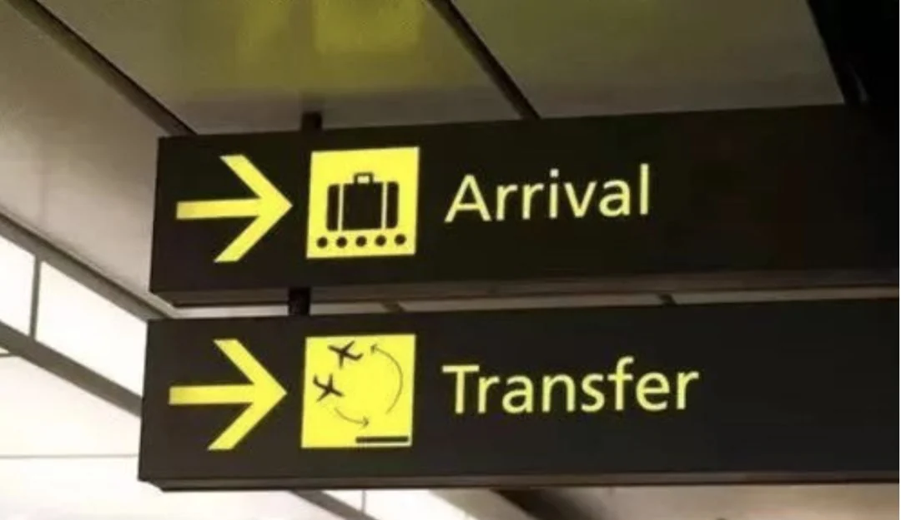

美国没有「国际中转免入境」这回事：不管你的终点是不是落地的那座城市，所有入境美国的旅客都要在**第一个落地的机场**办完入境手续、提取托运行李、通过海关，再重新交运行李、再走一遍国内安检，才能接上下一段航班。对第一次去美国旅游、工作或留学的人来说，这段流程比飞行本身更容易出岔子。

美国可以入境的机场很多——洛杉矶、旧金山、西雅图、纽约、芝加哥、亚特兰大、华盛顿、底特律等。这份攻略按**通用流程**与**七座最常作为入境门户的机场**两部分整理：洛杉矶（LAX）、旧金山（SFO）、亚特兰大（ATL）、芝加哥（ORD）、纽约纽瓦克（EWR）、西雅图（SEA）和底特律（DTW），把每个机场该坐什么车、走哪条通道讲清楚。

## 一、入境美国后转机的通用流程

不管在哪个机场落地，入境后的转机都要依次走过这五步：**入境检查 → 提取行李 → 通过海关 → 重新交运行李 → 换航站楼并再次安检**。

### 1. 入境检查（Immigration）

下飞机后跟着人群或 Immigration、Arrival 的标识走到入境检查大厅，持签证或 ESTA 的旅客在访客通道排队，回答简单的行程问题；被工作人员引导到二次检查的旅客需要到单独的柜台说明情况。**入境等候区禁止拍照，也禁止使用手机等电子产品**，排队前先把手机收起来。

### 2. 提取行李（Baggage Claim）

通过入境检查后先到行李转盘取托运的行李。要注意：**即使下一段是美国国内航班，行李也不会自动转运**，必须由旅客本人在入境机场提取出来，带着它走出海关这道门。

### 3. 通过海关（Customs）

拿着在飞机上填好的申报单（蓝色的表格，也可以在入境大厅领取）过海关。有需要申报的物品就如实填写并走申报通道，没有则直接走无申报通道。过完这道门，才算正式进入美国。

### 4. 重新交运行李（Re-check）

过完海关不要直接走出机场——先找**转机柜台**（Connecting Flights／Transit Counter）重新交运行李。国际到达厅里通常设有主要航司的转机柜台，例如芝加哥奥黑尔 5 号航站楼的国际到达厅就分设联合航空与美国航空的转机柜台；如果所乘航司在你落地的航站楼没有转机柜台，就要把行李带到下一段航班所在的航站楼再托运。

### 5. 换航站楼并再次安检（Terminal Transfer）

重新交运后按登机牌上的航站楼与廊厅找路。美国的机场规模普遍很大，航站楼之间靠机场内部的列车或摆渡车连接；**进入国内候机区之前必须再过一次安检**，流程和最初出发时一样。七座机场的内部换乘工具如下，具体名称与车站位置在下文各机场一节展开：

| 机场 | 内部换乘工具 | 一句话提醒 |
| --- | --- | --- |
| LAX 洛杉矶 | 航站楼间免费摆渡车、部分步行通道 | 九个航站楼彼此独立，步行跨楼很耗时 |
| SFO 旧金山 | AirTrain 机场列车（红线／蓝线） | 国际到达在 International Terminal |
| ATL 亚特兰大 | Plane Train 地下自动列车 | 别把机场列车和进城的 MARTA 地铁搞混 |
| ORD 芝加哥 | ATS 机场内部列车 | 国际到达在 5 号航站楼，先坐 ATS 换楼 |
| EWR 纽瓦克 | AirTrain 机场列车（A–B–C 三站） | 国际到达主要在 B 航站楼 |
| SEA 西雅图 | 主航站楼内步行为主 | 登机口字母就是廊厅，跟着人流走即可 |
| DTW 底特律 | 航站楼内小火车、航站楼间摆渡车 | 达美在麦克纳马拉航站楼，其他航司在北航站楼 |

### 6. 转机时间怎么留

原资料对几座大型机场都给出了明确的提醒，转机时间宁多勿少：

| 机场 | 建议预留 | 原因 |
| --- | --- | --- |
| ORD 芝加哥 | 2 小时以上 | 国际到达在 5 号航站楼，要乘 ATS 换楼再重新安检 |
| DTW 底特律 | 2 小时以上 | 1.5 小时的转机相当紧张，换航站楼还要坐摆渡车 |
| LAX 洛杉矶 | 换航站楼步行至少要 40 分钟 | 九个航站楼彼此独立，摆渡车单向循环 |
| 其他机场 | 1.5–2 小时 | 入境、取行李、清关与再次安检都要排队 |

旺季、节假日和晚间到达高峰，再往上加 30–60 分钟更稳妥。

## 二、七座机场的转机要点

### 1. LAX 洛杉矶国际机场

洛杉矶机场一共 **9 个航站楼**（1–8 号航站楼加上汤姆·布拉德利国际航站楼 TBIT，也叫 B 航站楼），**每个航站楼都是独立的建筑**，彼此之间只能靠道路、摆渡车或部分步行通道连接。目前 TBIT 是主要的国际航班到达地，中国几家主要航空公司的航班大多在 TBIT 降落。

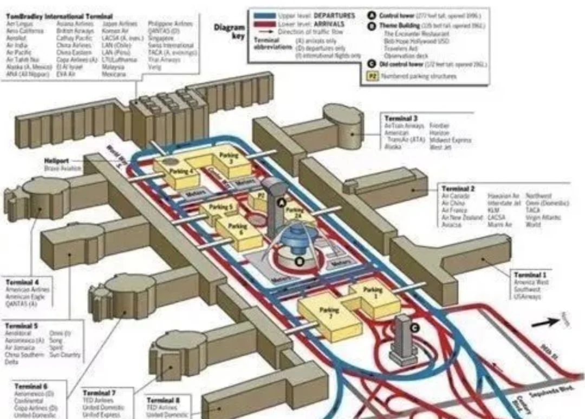

如果在 LAX 需要转换航站楼，务必留意两点：

- **只坐航站楼间的那趟摆渡车（原资料称为 Shuttle Bus A）**。机场里同时运行着去停车场、租车中心和地铁站的多种巴士，上错车会把你带到机场之外。
- **摆渡车是单向循环的**，绕一圈可能要花掉大把时间；从 TBIT 出来还要走到航站楼两端才能看到车站，中间路段的路标并不明显。相邻航站楼之间也有步行通道，但从 TBIT 走到美联航所在的航站楼区域，纯步行至少要 40 分钟——时间紧张就别硬走。

行李方面，每个航站楼都有入境处，入境方式与其他机场相同：先入境、再取行李、过海关。过完海关要注意，**并不是每家航司都会在你落地的航站楼设转机托运柜台**，必要时得把行李推到下一段航班所在的航站楼再托运。

### 2. SFO 旧金山国际机场

旧金山国际机场是联合航空的主要枢纽，也是阿拉斯加航空的重点机场之一，因此乘坐美联航的旅客很可能在这里转机。机场共有 **4 座航站楼**：1、2、3 号航站楼服务国内航班，**所有国际航班都在国际航站楼（International Terminal）到达**，国际航站楼又分成 A、G 两个登机区。

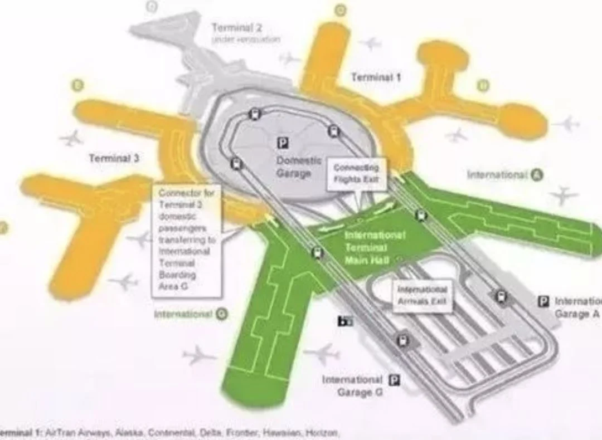

入境、取行李之后往前走：需要申报的旅客填表申报，不需要申报的直接通过海关。此时要转机的旅客请看清标识——**Arrival Lobby（到达大厅）和 Connecting Flights Exit（转机出口）分别在大厅的两头**，方向完全不同，走错了要多绕一大圈。

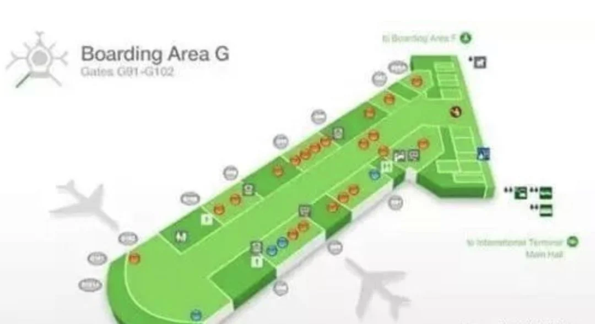

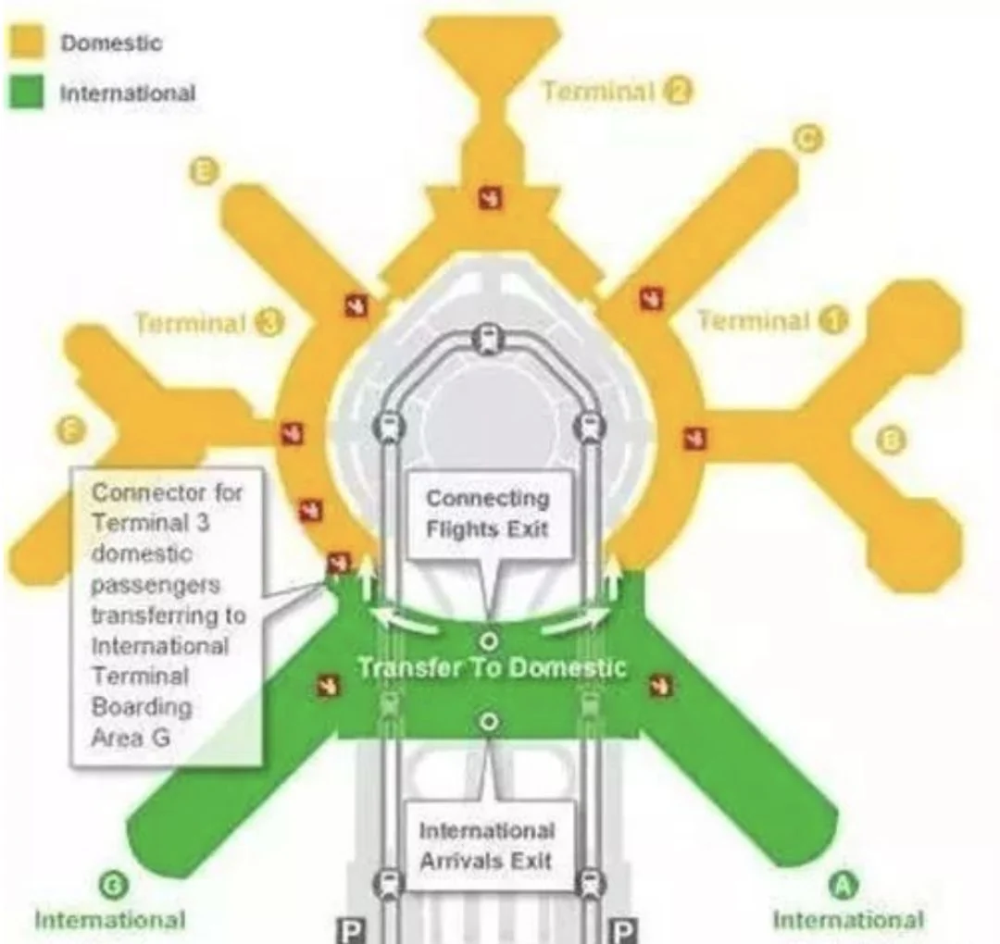

一路跟着指示牌，就能找到你所乘航司的转机行李托运处；交运行李后，机场内部的 **AirTrain 列车**负责在不同航站楼之间运送旅客。

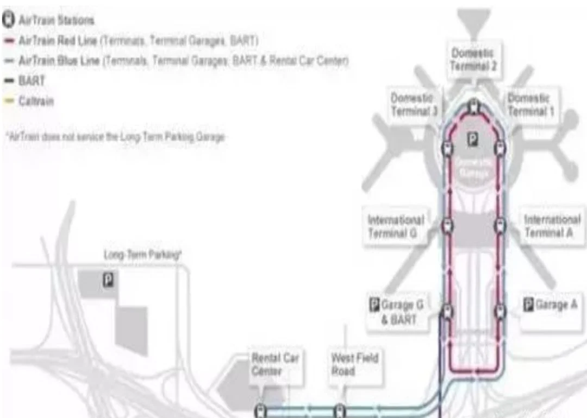

AirTrain 分两条线：**红线**停靠各航站楼、航站楼停车楼与 BART 车站；**蓝线**在此基础上延伸到租车中心。进入下一个航站楼之前，你依旧需要过一次安检，流程和在国内出发时一样。另外，原资料提到 SFO 的行李推车是免费的。

### 3. ATL 亚特兰大哈茨菲尔德-杰克逊国际机场

亚特兰大机场是**达美航空最大的枢纽**，从上海乘坐达美航班赴美，很可能在这里转机。机场由**一座国内航站楼**（分 North、South 两侧）与**国际航站楼**（Concourse F）组成，旅客实际接触的是 **7 个廊厅：T、A、B、C、D、E、F**，每个航班的航站楼与登机口位置基本固定。

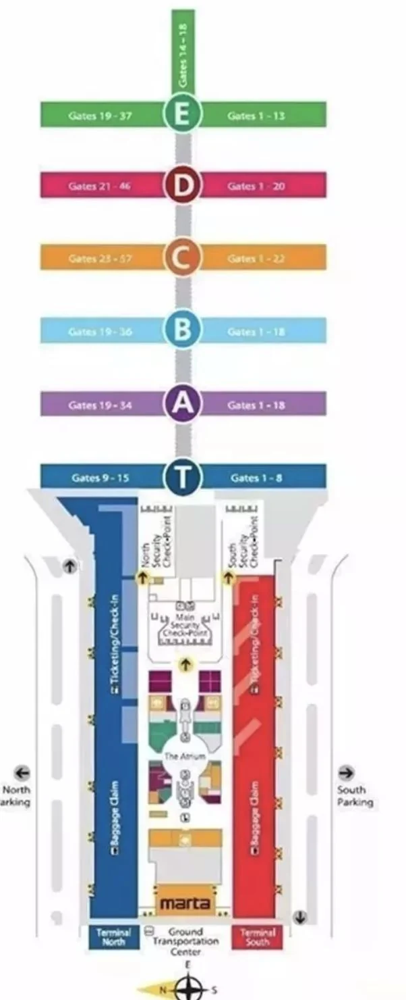

廊厅之间靠**地下的 Plane Train 自动列车**连接，班次很密，从 T 到最远的 F 也就十几分钟——原资料把这条机场内部的列车称作「地铁」，容易和**进城的 MARTA 城市地铁**混在一起：MARTA 车站设在**国内航站楼**一侧，是去亚特兰大市区的城市轨道，转机并不需要它。入境检查出来之后，认准 Plane Train 的标识就是下一段航班的方向。

原资料给出的几点提醒：

- 亚特兰大机场的**行李推车收费**，可以用信用卡刷卡付款。
- **机场 Wi-Fi 收费**，别指望落地就能连上网络。
- 夏令时期间亚特兰大与中国的时差是 12 小时，冬令时 13 小时。上飞机后就把手表调到当地时间，方便估算航班何时到达、转机时间够不够。
- 从上海直飞亚特兰大，全程大约 14 小时。

### 4. ORD 芝加哥奥黑尔国际机场

芝加哥奥黑尔机场是北美客流量最大的机场之一，也是不少旅客飞往美国各大城市的必经之路。机场共有 **186 个登机口**，分布在 **4 座航站楼**（1、2、3、5 号）与 **9 个大堂**（B、C、E、F、G、H、K、L、M）中，**所有国际航班都停靠 5 号航站楼**。

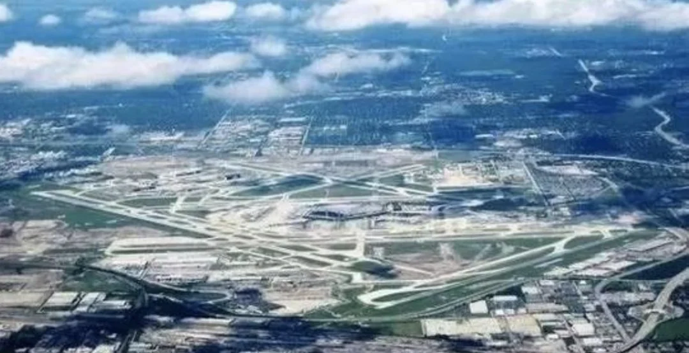

下飞机后只需拿着申报单跟着人群前往海关（「跟着人群走」在这里很好用）。**入境等候区严禁拍照和使用手机等电子产品**，排队时请收好设备。过海关、取行李之后，**不要兴奋过头直接走出机场大门**——你需要乘两侧的电梯到小火车候车室。

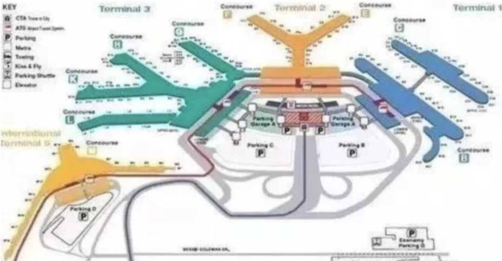

这条机场内部列车叫 **ATS（Airport Transit System）**，停靠顺序是：三座国内航站楼 → 国际航站楼 → 停车场 → 地铁站（CTA）→ 公交站。**上车之前务必先看清下一班飞机在几号航站楼**；如果迷路了，可以询问任何一位地面工作人员 Transfer Shuttle 在哪里。航站楼的航司分布大致是：1 号航站楼以联合航空为主，3 号航站楼以美国航空为主，2 号航站楼由多家国内航司共用。

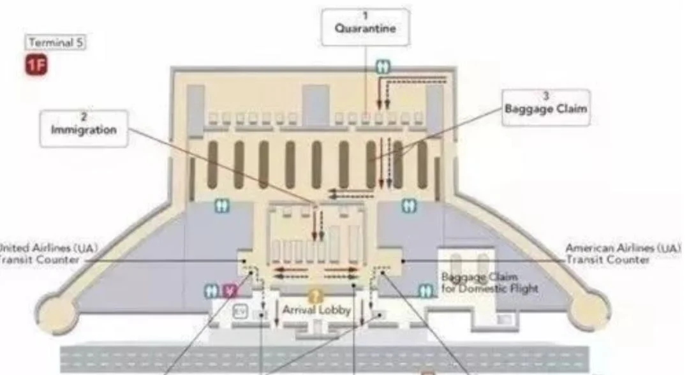

坐上 ATS 到达相应的国内航站楼之后，**需要再次通过美国国内航班的安检**，过完安检进入候机楼，找到下一班航班的登机口等候登机即可。原资料还提醒：芝加哥机场的 Wi-Fi 是收费的，价钱也不便宜，最好提前做好在机场「失联」的准备；转机时间建议预留 **2 小时以上**。

### 5. EWR 纽约纽瓦克自由国际机场

纽瓦克机场距曼哈顿约 16 英里，是纽约都会区三大机场之一——另外两座是肯尼迪国际机场（JFK）和拉瓜迪亚机场（LGA），其中 LGA 离曼哈顿更近，纯去纽约市区游玩的人常选它。纽瓦克机场是全美最繁忙的机场之一，也是**联合航空的枢纽**（原资料中的「美国大陆航空」已于 2012 年并入联合航空），联合航空主要使用 C 航站楼与部分 A 航站楼。

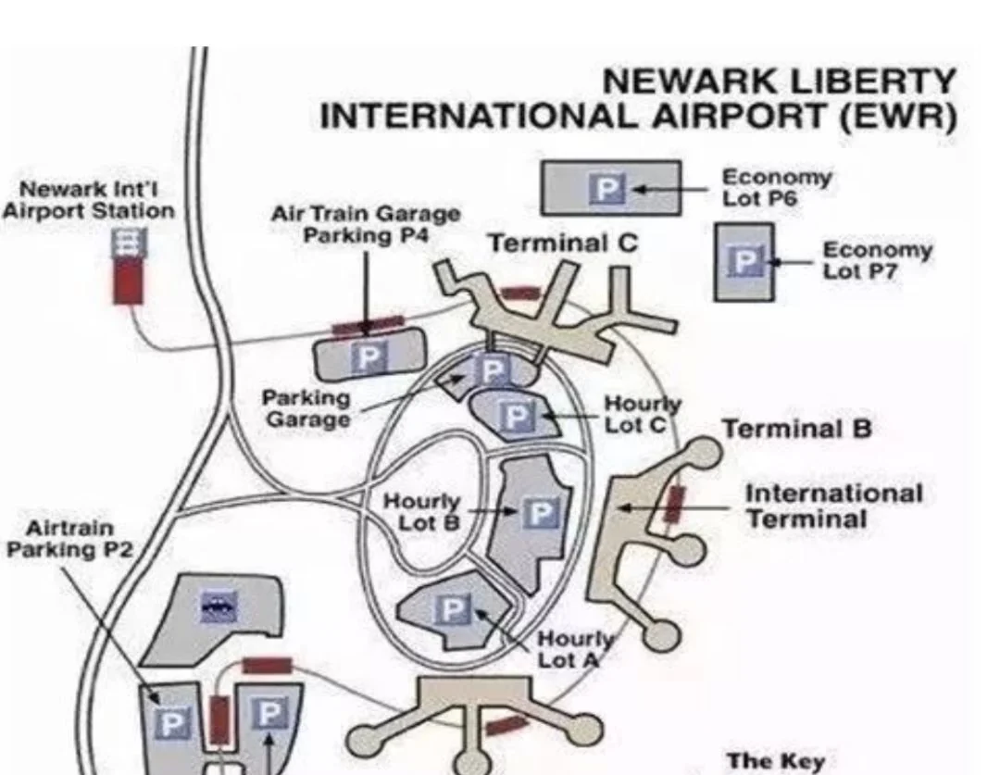

纽瓦克机场共有 **3 座航站楼**：A、B、C，其中 **B 航站楼是主要的国际航站楼**，不过从中国出发的航班也可能直接在 C 航站楼降落。下飞机后跟着人流或 Immigration 指示牌办理入境手续（C 航站楼的入境点位于下图所示位置）。

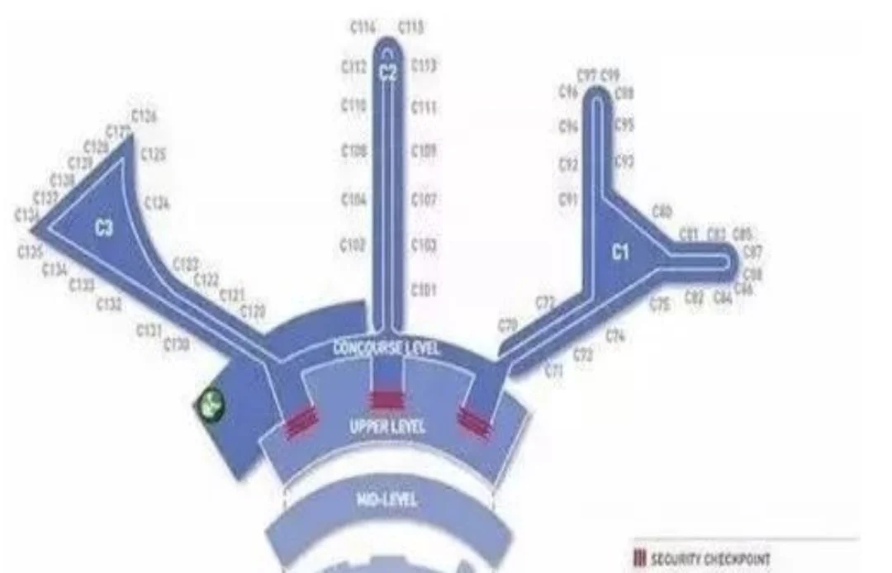

入境之后领取行李，这里要提醒的是：**EWR 的行李推车需要支付 5 美元**，请提前准备好纸币或硬币。拿完行李过海关，不需要申报的直接出门找转机柜台，把行李重新托运。

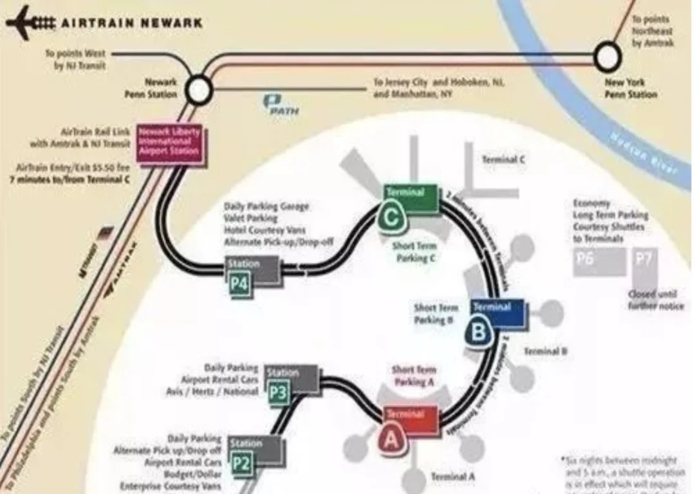

托运完行李，再找下一段航班所在的航站楼。机场内部的 **AirTrain** 就在 A、B、C 三座航站楼之间运行，**非繁忙时段约 15 分钟一班，繁忙时段约 3 分钟一班**；它同时连接 P2、P3、P4 停车楼与 NJ Transit／Amtrak 火车站，可以直达纽约宾州车站（New York Penn Station）。

### 6. SEA 西雅图-塔科马国际机场

西雅图机场的转机流程相对简单：下飞机后跟着机上的旅客一起走就会来到海关，入境、取行李（Baggage Claim）、过海关，然后重新交运行李、再过一次安检即可。看得懂英文，或者跟着大流走，基本不会出错。

值机柜台集中在**主航站楼**，各航司的飞机停靠在不同的廊厅（这里叫 Concourse）。机场有 **A、B、C、D 四个廊厅**，分别用浅绿、橙黄、深绿、土黄四种颜色标识。在中国的值机柜台拿到登机牌时就能提前判断下一段航班的登机位置：**西雅图机场的登机门由一个字母加两个数字组成，字母就代表廊厅**——是 C 就去廊厅 C，是 D 就去廊厅 D。

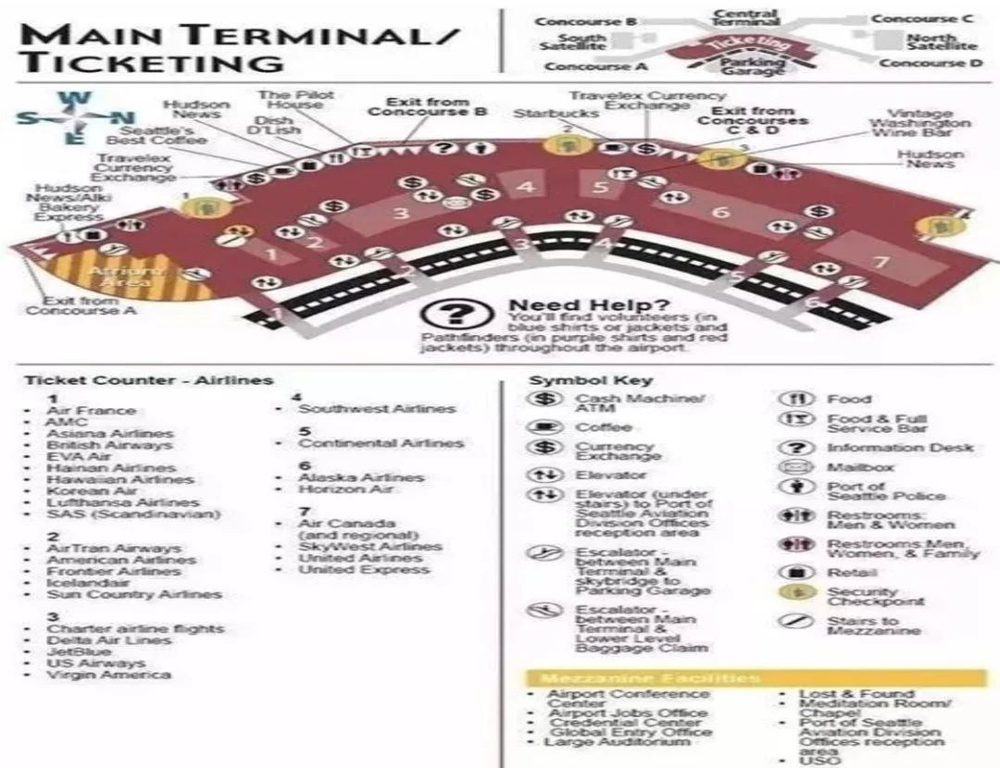

### 7. DTW 底特律都会韦恩县机场

底特律机场是**达美航空的枢纽机场**，也是全美最现代化的机场之一，堪称新机场的模范生。机场有**两座航站楼**：麦克纳马拉航站楼（McNamara Terminal）和北航站楼（North Terminal）。**达美航空及其所在的天合联盟使用麦克纳马拉航站楼**，其他航空公司则使用北航站楼。

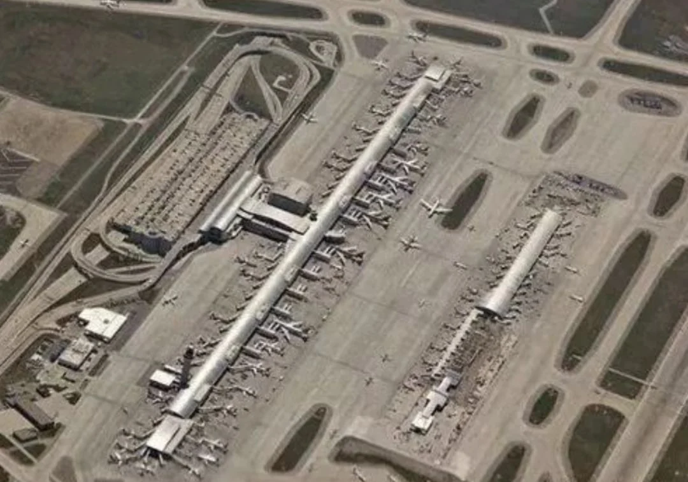

麦克纳马拉航站楼的国际到达在**绿色那一层**（Lower Level）：过海关之后在同一层领取行李，需要重新托运的旅客也在这层办理。办完之后上楼到**蓝色的 Level 2 层**——达美的大部分航班在 **Concourse A**，需要去 Concourse B 或 C 的旅客，可以走一段著名的炫彩通道（Light Tunnel），也可以乘坐航站楼内部的小火车（Express Tram）。

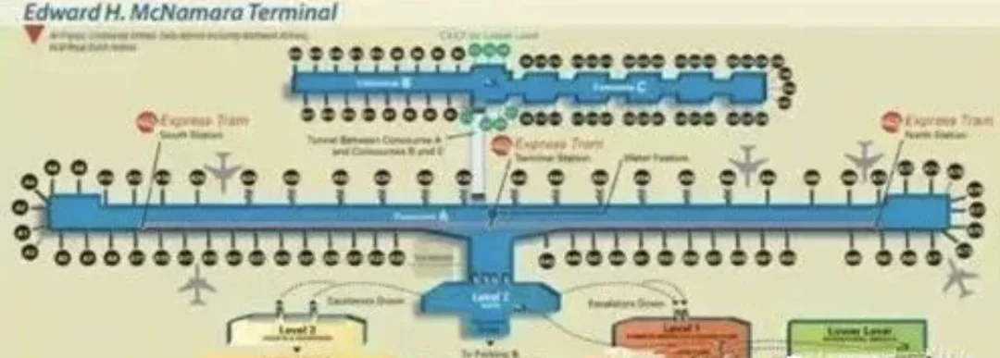

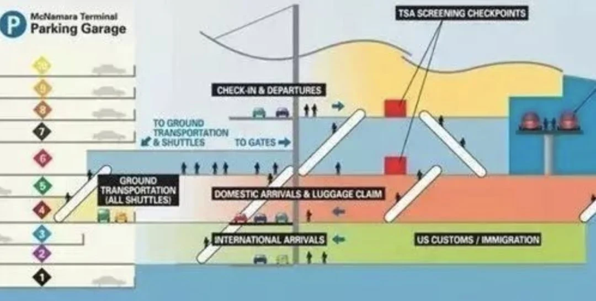

如果需要去**北航站楼**，就得坐机场内部的航站楼间摆渡车（Terminal–Westin–Terminal Shuttle）：**每 10 分钟一班**，从麦克纳马拉航站楼到北航站楼约 7 分钟，中途经停 Westin 酒店。北航站楼的结构相当简单，但**在进入航站楼之前需要再次安检**。

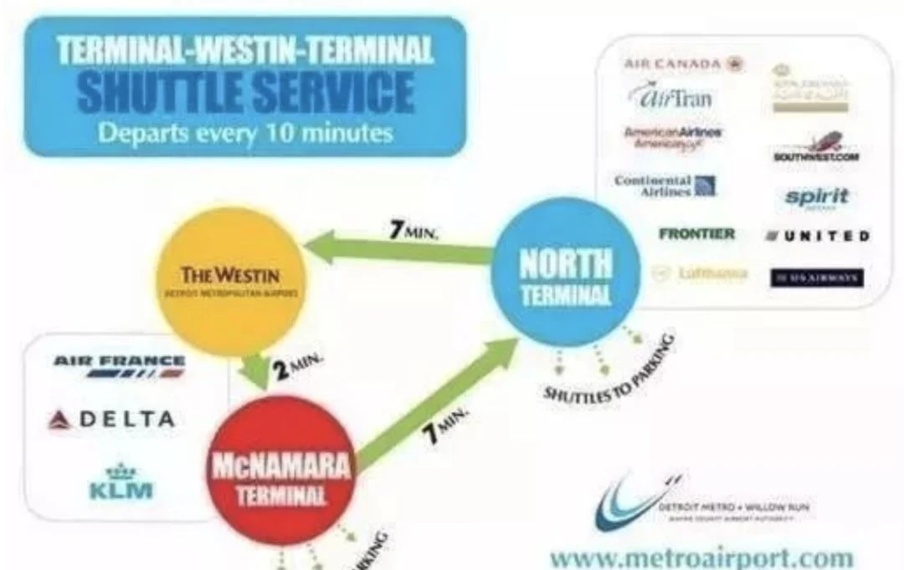

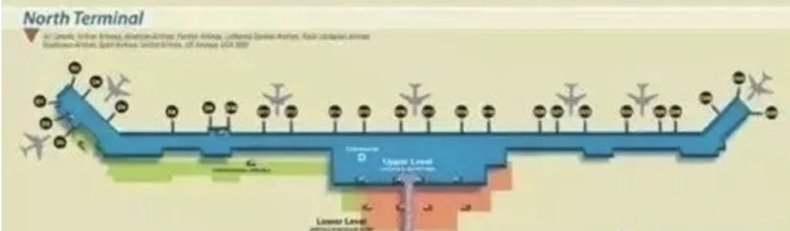

底特律机场虽然现代化，但需要转机时同样要留足时间：**尽量安排 2 小时以上，1 个半小时的转机会相当紧张**，订票时就要注意。

## 三、几个容易被忽略的细节

- **行李推车**：原资料提到 SFO 免费、ATL 收费（可刷卡）、EWR 需要 5 美元——出国前备一些零钱和一张能刷的信用卡都不亏。
- **机场 Wi-Fi**：ATL 与 ORD 的机场 Wi-Fi 收费，落地后未必能马上联网，重要的联系方式建议提前存成离线可查的形式。
- **时差换算**：亚特兰大夏令时与中国相差 12 小时、冬令时 13 小时；上飞机后就把手表调到当地时间，估算到达与转机时间会直观得多。
- **手机与拍照**：入境和海关等候区禁止使用手机等电子设备，更不要拍照。
- **行李必须自己提**：无论机票是不是联程，入境美国后的行李都要由旅客本人提取、过海关、再重新交运，行李不会「自动跟到」下一段航班。

文中的机场示意图来自原资料，机场改造与航司调整频繁——原资料里出现的美国大陆航空已并入联合航空、US Airways 已并入美国航空、西北航空已并入达美航空。出发前请以机场与航司当日公布的信息为准。

## 相关链接

- **本站页面**：[洛杉矶 LAX](/zh/airport/LAX)、[旧金山 SFO](/zh/airport/SFO)、[亚特兰大 ATL](/zh/airport/ATL)、[芝加哥 ORD](/zh/airport/ORD)、[纽瓦克 EWR](/zh/airport/EWR)、[西雅图 SEA](/zh/airport/SEA)、[美国（US）](/zh/country/US)
- **维基百科**：[洛杉矶 LAX](https://zh.wikipedia.org/wiki/%E6%B4%9B%E6%9D%89%E7%9F%B6%E5%9B%BD%E9%99%85%E6%9C%BA%E5%9C%BA)、[旧金山 SFO](https://zh.wikipedia.org/wiki/%E6%97%A7%E9%87%91%E5%B1%B1%E5%9B%BD%E9%99%85%E6%9C%BA%E5%9C%BA)、[亚特兰大 ATL](https://zh.wikipedia.org/wiki/%E5%93%88%E8%8C%A8%E8%8F%B2%E5%B0%94%E5%BE%B7-%E6%9D%B0%E5%85%8B%E9%80%8A%E4%BA%9A%E7%89%B9%E5%85%B0%E5%A4%A7%E5%9B%BD%E9%99%85%E6%9C%BA%E5%9C%BA)、[芝加哥 ORD](https://zh.wikipedia.org/wiki/%E5%A5%A5%E9%BB%91%E5%B0%94%E5%9B%BD%E9%99%85%E6%9C%BA%E5%9C%BA)、[纽瓦克 EWR](https://zh.wikipedia.org/wiki/%E7%BA%BD%E7%93%A6%E5%85%8B%E8%87%AA%E7%94%B1%E5%9B%BD%E9%99%85%E6%9C%BA%E5%9C%BA)、[西雅图 SEA](https://zh.wikipedia.org/wiki/%E8%A5%BF%E9%9B%85%E5%9B%BE-%E5%A1%94%E7%A7%91%E9%A9%AC%E5%9B%BD%E9%99%85%E6%9C%BA%E5%9C%BA)、[底特律 DTW](https://zh.wikipedia.org/wiki/%E5%BA%95%E7%89%B9%E5%BE%8B%E9%83%BD%E4%BC%9A%E9%9F%A6%E6%81%A9%E5%8E%BF%E6%9C%BA%E5%9C%BA)
- **百度百科**：[洛杉矶 LAX](https://baike.baidu.com/item/%E6%B4%9B%E6%9D%89%E7%9F%B6%E5%9B%BD%E9%99%85%E6%9C%BA%E5%9C%BA)、[旧金山 SFO](https://baike.baidu.com/item/%E6%97%A7%E9%87%91%E5%B1%B1%E5%9B%BD%E9%99%85%E6%9C%BA%E5%9C%BA)、[亚特兰大 ATL](https://baike.baidu.com/item/%E5%93%88%E8%8C%A8%E8%8F%B2%E5%B0%94%E5%BE%B7-%E6%9D%B0%E5%85%8B%E9%80%8A%E4%BA%9A%E7%89%B9%E5%85%B0%E5%A4%A7%E5%9B%BD%E9%99%85%E6%9C%BA%E5%9C%BA)、[芝加哥 ORD](https://baike.baidu.com/item/%E5%A5%A5%E9%BB%91%E5%B0%94%E5%9B%BD%E9%99%85%E6%9C%BA%E5%9C%BA)、[纽瓦克 EWR](https://baike.baidu.com/item/%E7%BA%BD%E7%93%A6%E5%85%8B%E8%87%AA%E7%94%B1%E5%9B%BD%E9%99%85%E6%9C%BA%E5%9C%BA)、[西雅图 SEA](https://baike.baidu.com/item/%E8%A5%BF%E9%9B%85%E5%9B%BE-%E5%A1%94%E7%A7%91%E9%A9%AC%E5%9B%BD%E9%99%85%E6%9C%BA%E5%9C%BA)、[底特律 DTW](https://baike.baidu.com/item/%E5%BA%95%E7%89%B9%E5%BE%8B%E9%83%BD%E4%BC%9A%E9%9F%A6%E6%81%A9%E5%8E%BF%E6%9C%BA%E5%9C%BA)
