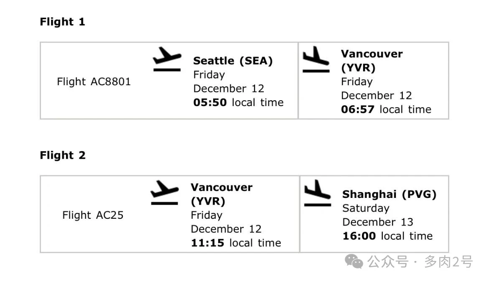
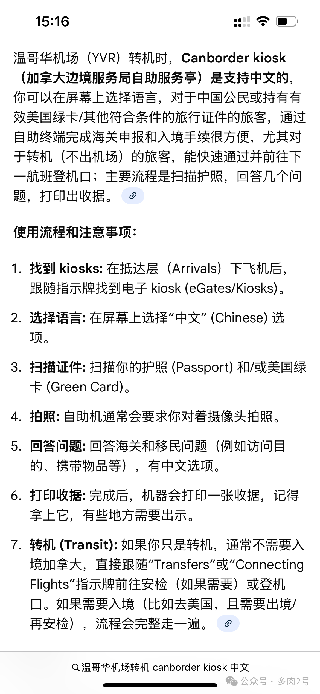
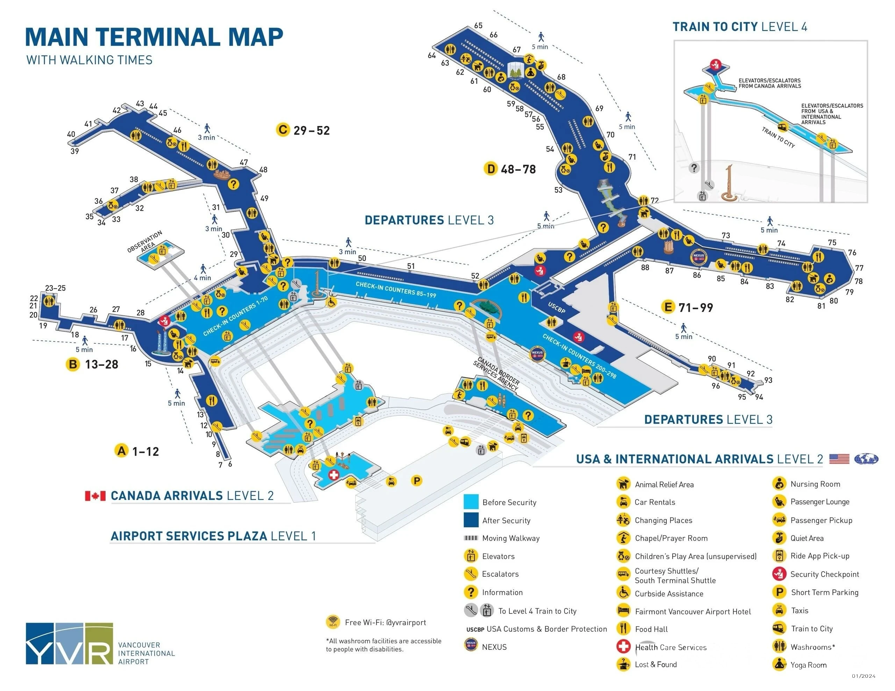
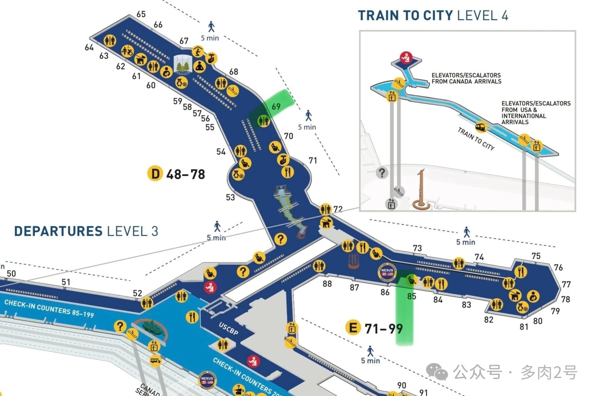

加航 Air Canada 西雅图—温哥华（AC8801）、温哥华—上海（AC25）联程票。在温哥华转机时：

1. 不取行李
2. 不过安检
3. 需经过加拿大海关

温哥华机场（代号 YVR）平面图见附图，这两个航班的到达／出发口离得不远（用绿色标识，但在不同层）。

## 温哥华转机步骤

请按照天花板的指示标识行进 → Welcome to Vancouver（欢迎来到温哥华）。

### 1. 准备好所有旅行文件

Have all documentation in hand and ensure all applicable forms have been completed.
（手持全部证件，确保所有需填写的表格均已填写完毕。）

### 2. 跟随“国际转机”指示牌

Follow the International Connections sign and enter the Satellite Primary Inspection line.
（跟随“国际转机”标识，进入“卫星厅主要检查”通道。）

### 3. 通过加拿大海关初级检查

Clear Canada Customs Primary Inspection.
（完成加拿大海关主要检查。）

### 4. 乘自动扶梯至 3 层出发区

Take the escalator to level 3 Departures to your next flight.
（乘坐自动扶梯至 3 层出发厅，前往下一程航班。）

### 5. 托运行李说明

Your checked baggage will be delivered to the final destination, unless advised otherwise at check-in.
（您的托运行李将直接运达最终目的地，除非在值机时另有通知。）

## 卫星厅主要检查

英文为 Satellite Primary Inspection。旅客在这里自助完成海关申报，自助服务机提供中文选项，也可提前在手机下载 App 进行申报（到时候只需扫一下二维码、打印出收据）。具体步骤请看[这篇知乎文章](https://zhuanlan.zhihu.com/p/354710620?share_code=JvkT8dGqN7C8&utm_psn=1980894915480265719)。

## 附：YVR 航站楼平面图

