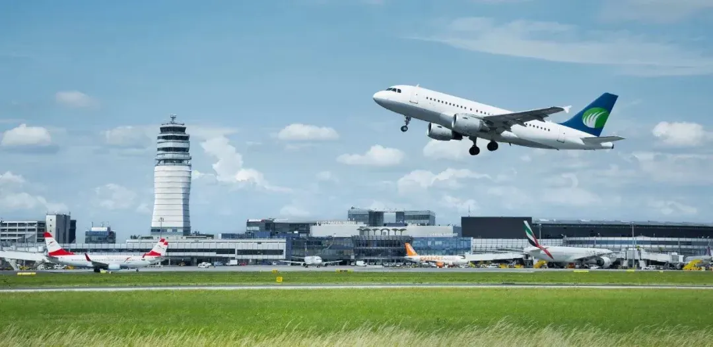

維也納國際機場（Vienna International Airport，機場程式碼 **VIE**）距市中心約 18 公里，是奧地利最大的國際樞紐，也是中歐與東歐之間最重要的中轉點之一。機場到市區只要 16–25 分鐘，但快線、城鐵、大巴和計程車各有取捨；值機與安檢入口又按航站樓和目的地分成好幾組，出發前弄清楚走哪座樓、哪個入口，能省下不少時間。

這份攻略按**航站樓與大堂**、**機場到市區的交通**、**出發流程**、**機場設施與實用資訊**四部分整理，需要的朋友可以先收藏。

## 一、航站樓與大堂

維也納機場目前有三座投入使用的航站樓——**T1、T1A 與 T3**，它們在同一片屋頂下連成一排，樓與樓之間步行即可互通。其中 T3 的 SKYLINK 擴建部分落成於 2012 年，可以停靠空中客車 A380 等大型客機，是國際長途航班的主力樓。

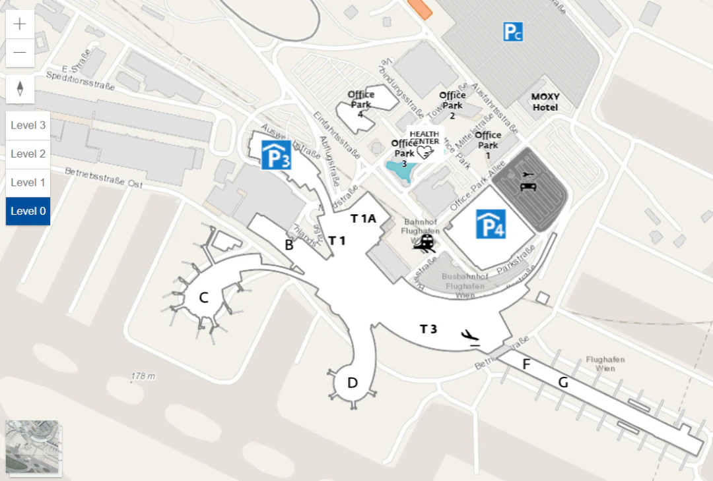

機場由維也納機場股份公司（Flughafen Wien AG）運營，航站樓內的旅客服務、行李處理與地面代理由維也納機場、Swissport、奧地利航空等多家公司分別負責。值機櫃臺按航空公司分佈，值機在 **T1、T1A 或 T3** 辦理，請按登機牌或訂票資訊確認自己的航站樓；機場官方設施表中偶爾還會出現「T2」這一位置名稱，但它已不再辦理值機。

### 五組登機口：B、C、D、F、G

登機口按廊道（大堂）分成五組，它決定了你該走哪個安檢入口、要不要過護照檢查。大堂 D 的前身是大堂 A，也就是俗稱的「東墩」；大堂 C 則是「西墩」。

| 大堂 | 登機口 | 與主樓的連接方式 | 主要航班 |
| --- | --- | --- | --- |
| B（T1 一側） | B22–B43 | 接駁巴士 | 歐洲申根國航班 |
| C（西墩，T1 一側） | C31–C42，其中 C35–C41 為轉乘閘口 | 空橋 | 申根國航班為主，部分國際航班 |
| C（西墩，T1 一側） | C71–C75 | 接駁巴士，需先在 C31 閘口前往 | 僅申根國航班 |
| D（東墩，前稱大堂 A） | D21–D29 | 空橋 | 國際航班 |
| D（東墩，前稱大堂 A） | D31–D37、D61–D70 | 接駁巴士 | 國際航班 |
| F、G（T3） | F、G 登機口 | 空橋 | 申根（F）與非申根（G）航班 |

用空橋登機的閘口可以直接走進飛機；標註為接駁巴士的閘口需要先下一層乘擺渡車，滑行時間要算進候機時間裡。C71–C75 是一組獨立的接駁巴士閘口，必須先經過 C31 閘口才能到達，因此在這幾個閘口登機時，建議多留一些步行與候車時間。

### 國際轉機：經中轉區換乘，不必先入境

如果你只是過境維也納，**國際轉機不需要先入境奧地利**。在大堂 C 抵達的國際轉機旅客，下機後先到地面層的 **Transitzone（中轉區）**，再乘接駁巴士前往大堂 D 換乘國際航班；在大堂 D 抵達、繼續轉乘國際航班的旅客，同樣經 Transitzone 與接駁巴士在大堂 D 內部完成換乘。大堂 D 的中轉區與護照管制區分別設在進出大堂、空橋與接駁巴士閘口，跟著「Transfer」標識走即可。

## 二、從機場到市區

從維也納機場進城大致有五種方式：**CAT 城市機場快線**最快，**機場巴士**覆蓋市中心與西站方向，**S-Bahn 城鐵與 Railjet 列車**價效比最高，**計程車**適合深夜抵達與行李較多的旅客，**租車**適合以維也納為起點的自駕行程。以下線路、時刻與票價為機場及各運營方公佈的資料，出行前請以官網當日資訊為準。

### 1. CAT 城市機場快線（最快）

City Airport Train（CAT）從機場直達市中心的 **Wien Mitte（Landstraße）站**，中途不停站，全程 **16 分鐘**，是目前前往市區最省心的方式——不用管公路上堵不堵車。

- **運營時間**：05:37–23:29（市中心站 → 機場站）；06:09–23:39（機場站 → 市中心站），約每 30 分鐘一班。
- **站點**：機場站 ↔ Wien Mitte 站，出站步行約 **10 分鐘**可達聖斯特凡大教堂（St. Stephan）。
- **票價**：單程 €14.90，往返票另有優惠；維也納市內交通票與維也納城市卡均不含 CAT，需單獨購票。
- **購票**：到達大廳設有獨立的 CAT 櫃檯，可諮詢所有 CAT 服務並現場購票。
- **市內行李託運直達服務**：位於市中心的 CAT 航站樓可以辦理行李託運並領取登機牌，提供人工值機櫃臺與自助值機亭，服務時間為航班起飛前 24 小時至 75 分鐘。

### 2. 機場巴士（覆蓋面最廣）

維也納機場巴士（Vienna Airport Lines／Postbus）連接機場與市區幾處主要交通樞紐，3 條市內線路基本覆蓋所有地鐵線。Wien Westbahnhof 與 Wien Hauptbahnhof 方向**每 30 分鐘**一班；機場 ↔ Morzinplatz／Schwedenplatz 一線**全天 24 小時**執行，行程只要 **20 分鐘**。

- **票價**：單程約 €8，可在車上或櫃檯購票。
- **線路與站點**：見下表。

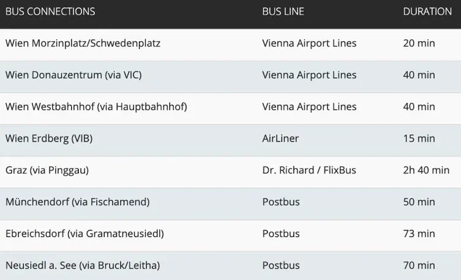

| 目的地站點 | 巴士線路 | 行駛時間 |
| --- | --- | --- |
| Wien Morzinplatz／Schwedenplatz | Vienna Airport Lines | 20 min |
| Wien Donauzentrum（經 VIC） | Vienna Airport Lines | 40 min |
| Wien Westbahnhof（經 Hauptbahnhof） | Vienna Airport Lines | 40 min |
| Wien Erdberg (VIB) | AirLiner | 15 min |
| Graz（經 Pinggau） | Dr. Richard／FlixBus | 2 h 40 min |
| Münchendorf（經 Fischamend） | Postbus | 50 min |
| Ebreichsdorf（經 Gramatneusiedl） | Postbus | 73 min |
| Neusiedl a. See（經 Bruck/Leitha） | Postbus | 70 min |

### 3. 城際巴士（去鄰國首都）

往布拉提斯拉瓦、布達佩斯、布拉格、布林諾等中東歐城市，機場的城際大巴往往比火車更直接，不少線路就在機場站始發，適合把維也納當中轉站、直接繼續上路。

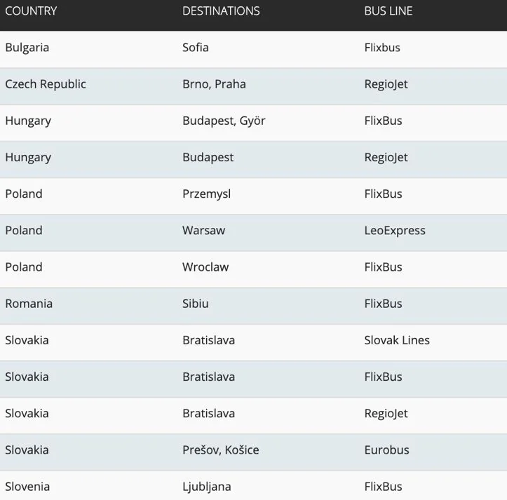

| 國家 | 目的地 | 巴士公司 |
| --- | --- | --- |
| 保加利亞 | Sofia（索菲亞） | Flixbus |
| 捷克 | Brno（布林諾）、Praha（布拉格） | RegioJet |
| 匈牙利 | Budapest（布達佩斯）、Győr（傑爾） | FlixBus |
| 匈牙利 | Budapest（布達佩斯） | RegioJet |
| 波蘭 | Przemyśl | FlixBus |
| 波蘭 | Warsaw（華沙） | LeoExpress |
| 波蘭 | Wrocław（弗羅茨瓦夫） | FlixBus |
| 羅馬尼亞 | Sibiu（錫比烏） | FlixBus |
| 斯洛伐克 | Bratislava（布拉提斯拉瓦） | Slovak Lines／FlixBus／RegioJet |
| 斯洛伐克 | Prešov、Košice | Eurobus |
| 斯洛維尼亞 | Ljubljana（盧布林雅那） | FlixBus |

### 4. 城市快速鐵路 S-Bahn 與 ÖBB 列車（價效比最高）

想用「市內交通的價格」進城，S-Bahn 城鐵 **S7** 是最優解：從機場到 Wien Mitte 約 **25 分鐘**，票價只有快線的三分之一左右，進市區後與地鐵、電車票通用。

ÖBB 的 Railjet 列車則可以把機場直接連到更遠的地方：機場站直達 Wien Hauptbahnhof（15 分鐘）、St. Pölten、Linz、Salzburg、Innsbruck、Graz、Klagenfurt 等奧地利城市，也有開往 Brno（布林諾）、Praha（布拉格）、Győr（傑爾）、Budapest（布達佩斯）的跨境班次。在維也納中央火車站（Wien Hauptbahnhof）還可以換乘前往更多城市。

- **票價**：S7 單程約 €5（維也納交通聯盟 VOR 按區域計價，機場位於維也納核心區之外，持市內交通票的旅客只需補機場段差價）。
- **購票**：ÖBB 售票櫃檯位於機場到達大廳，步行可達；也可以在 ÖBB 售票機或官方 App 上購買。
- **班次**：見下表，實際以 ÖBB 與 VOR 公佈的當日時刻為準。

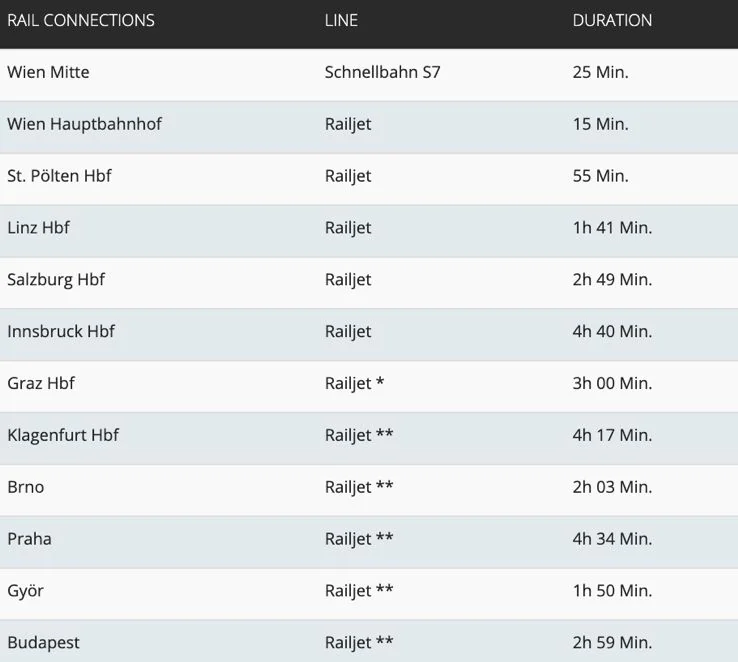

| 目的地車站 | 線路 | 行駛時間 |
| --- | --- | --- |
| Wien Mitte | Schnellbahn S7 | 25 min |
| Wien Hauptbahnhof | Railjet | 15 min |
| St. Pölten Hbf | Railjet | 55 min |
| Linz Hbf | Railjet | 1 h 41 min |
| Salzburg Hbf | Railjet | 2 h 49 min |
| Innsbruck Hbf | Railjet | 4 h 40 min |
| Graz Hbf | Railjet * | 3 h 00 min |
| Klagenfurt Hbf | Railjet ** | 4 h 17 min |
| Brno | Railjet ** | 2 h 03 min |
| Praha | Railjet ** | 4 h 34 min |
| Győr | Railjet ** | 1 h 50 min |
| Budapest | Railjet ** | 2 h 59 min |

帶 \* 與 \*\* 的班次通常需要在維也納中央火車站（Wien Hauptbahnhof）換乘，具體以 ÖBB 公佈的當日班次為準。

### 5. 計程車

需要叫車時，請在到達大廳外的計程車排隊點乘坐正規車輛，或乘坐「City Transfer」櫃檯指定的車輛；也可以提前電話叫車。

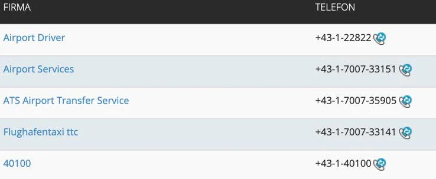

| 計程車公司 | 叫車電話 |
| --- | --- |
| Airport Driver | +43-1-22822 |
| Airport Services | +43-1-7007-33151 |
| ATS Airport Transfer Service | +43-1-7007-35905 |
| Flughafentaxi ttc | +43-1-7007-33141 |
| 40100 | +43-1-40100 |

### 6. 租車

租車櫃檯集中在**多層停車場 P4 的 0 層**，Hertz、Sixt、Europcar、Avis、Budget、Enterprise、Alamo、National 等主流公司都在這裡設有櫃檯，取車後可以直接接上高速路網。

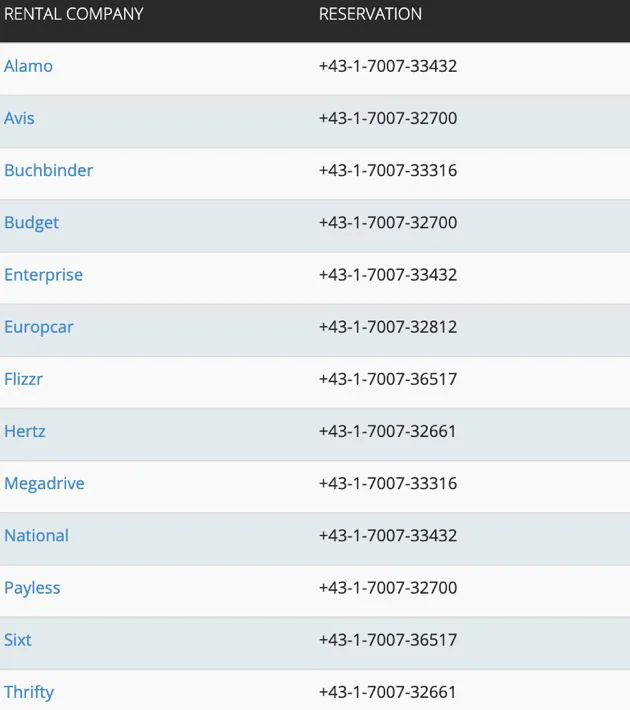

| 租車公司 | 預訂電話 |
| --- | --- |
| Alamo | +43-1-7007-33432 |
| Avis | +43-1-7007-32700 |
| Buchbinder | +43-1-7007-33316 |
| Budget | +43-1-7007-32700 |
| Enterprise | +43-1-7007-33432 |
| Europcar | +43-1-7007-32812 |
| Flizzr | +43-1-7007-36517 |
| Hertz | +43-1-7007-32661 |
| Megadrive | +43-1-7007-33316 |
| National | +43-1-7007-33432 |
| Payless | +43-1-7007-32700 |
| Sixt | +43-1-7007-36517 |
| Thrifty | +43-1-7007-32661 |

## 三、出發流程：值機、託運、安檢

從維也納機場出發的標準流程是**辦理值機 → 託運行李 → 安全檢查 →（非申根航班）護照檢查 → 登機**。申根航班建議提前 2 小時到達機場，非申根與洲際航班建議提前 3 小時，旺季與節假日再多留半小時更穩妥。

### 1. 辦理值機

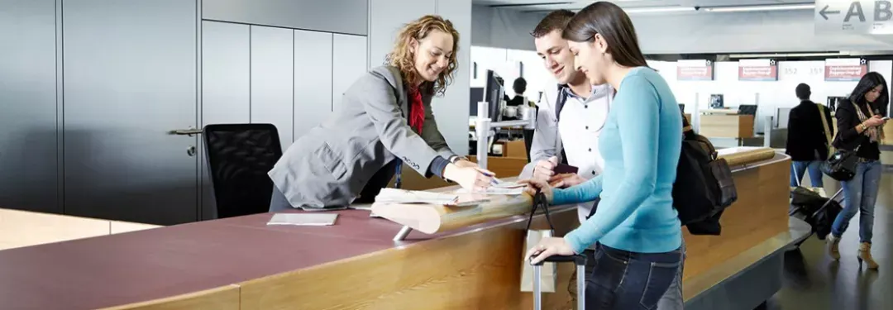

- **自助值機**：可以使用信用卡或 Miles & More 卡、姓名、訂票程式碼，也可以直接掃描護照，在自助值機裝置上換取登機牌。如果有需要託運的行李，裝置會顯示你應該使用哪個託運櫃檯。
- **櫃檯值機**：根據所乘航班，在 1 號、1A 號或 3 號航站樓辦理登機手續並領取登機牌。
- **線上值機**：多數航空公司支援官網或 App 值機，可以省下在機場排隊的時間，到機場後再列印登機牌；如果持有需要託運的行李，請先到相應櫃檯問詢確認。
- **Wien Mitte 值機**：部分航空公司在 Wien Mitte 的 City Airport Train 終端提供值機服務，出示護照即可換取登機牌。最新航空公司名單請訪問 cityairporttrain.com，或致電 +43 1 25250 查詢。

### 2. 自助行李託運（Self Bag Drop）

維也納機場的自助行李託運把行李交運流程壓縮成四步：**掃描登機牌 → 給行李掛上行李條 → 留好行李憑證 → 前往下一步安檢**。

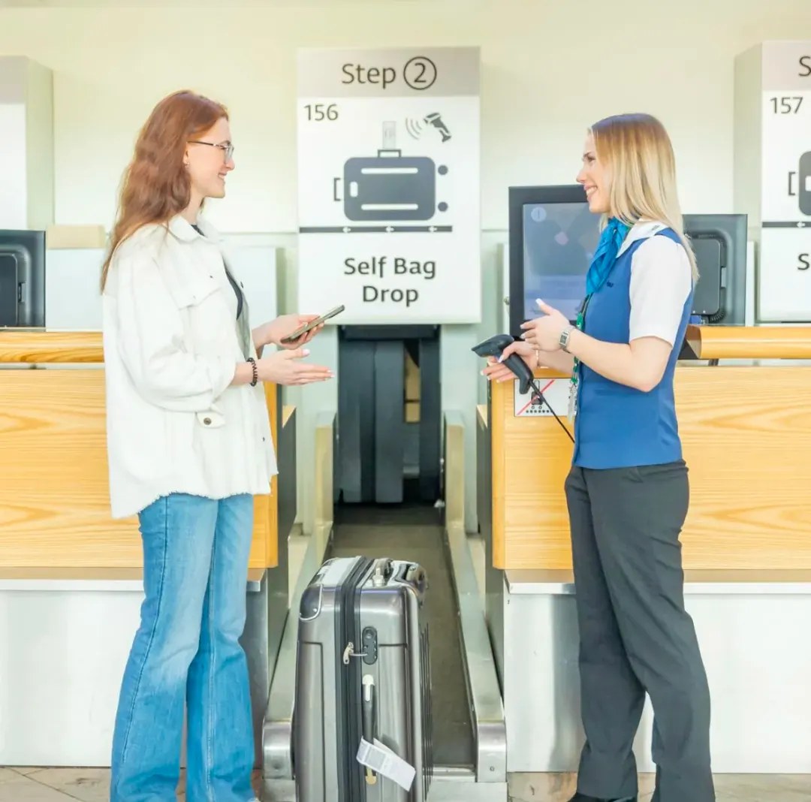

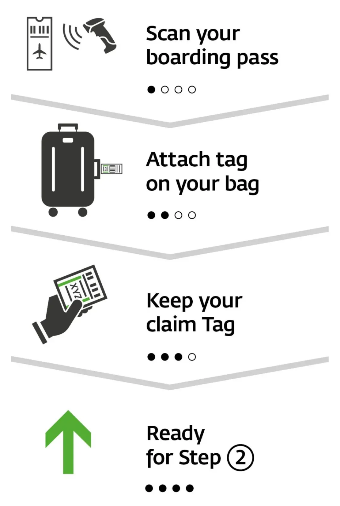

在值機島旁的自助託運櫃檯上，先掃描登機牌確認航班，再把打印出的行李條固定在行李箱把手上，把箱子放上傳送帶，最後收好行李憑證——行李一旦出現問題，它就是唯一的憑據。

### 3. 行李託運注意事項

- 有**超重行李或寵物**時，請到 **T1 或 T3 的超重行李櫃檯**辦理託運。
- 在行李上標記姓名與地址，並撕掉舊的行李標籤——舊條碼會干擾行李識別系統，增加行李被誤運的機率。
- 貴重物品、重要檔案與藥品請隨身攜帶，不要放進託運行李。
- 需要時用打包帶或掛鎖把行李固定好；也可以使用機場的行李打包服務（見下文設施部分）。

### 4. 安全檢查與護照檢查

維也納機場把安檢入口按登機口分成兩組，走錯入口要繞一大圈：

- **2 號安檢入口**：由 B、C、D 登機口出發的旅客。
- **3 號安檢入口**：由 F、G 登機口出發的旅客。

通過安檢後的候機大廳內設有商店與餐廳；送行的親友無法通過安檢進入隔離區。

- 前往**申根協議國家**：走 **B、C、F** 登機口。
- 前往**非申根協議國家**：走 **D、G** 登機口，並且需要先通過**護照檢查**，才能繼續前往登機口。

## 四、機場設施與實用資訊

### 問詢處與行李服務

機場共有 **3 個問詢處**，其中 2 個分別設在 T1 與 T3 航站樓的出發層，另外 1 個設在 T3 到達層大廳，行李與設施方面的問題都可以在這裡問。

**行李服務中心**設於 T1 與 T3 的值機區域，**00:00–24:00** 全天開放，提供以下服務：

| 服務 | 價格 | 說明 |
| --- | --- | --- |
| 行李寄存 | €4／件／天；超大行李 €8／件／天 | 物品最長可寄存 6 個月 |
| 行李打包 | €12／件 | 用安全薄膜包裹行李，防損壞、防潮、防竊，T1 與 T3 行李區均有提供 |
| 行李代託運 | 最低 €15（含 5 件行李），超出部分每件加收 €3 | 提前 72 小時傳送郵件至 service@viennaairport.com 預訂，或直接在機場網上商店預訂 |
| 保險箱 | €6／天 | 可存放檔案、鑰匙等；武器、爆炸性、易燃等危險物品與易腐、有異味的物品不得存放 |
| 衣櫃 | €2／套／天 | 一套衣物含 1 件夾克或外套、鞋、首飾、手套與圍巾 |

### 醫療中心、祈禱室與失物招領

- **醫療中心**：位於 T1 航站樓 1 樓走廊、藥房對面，工作時間 **07:00–19:00**。可接種黃熱病、傷寒、狂犬病、甲型與B型肝炎（兒童同樣適用）、瘧疾、蜱傳腦炎、流感、白喉／小兒麻痺症／破傷風／百日咳聯合疫苗、腦膜炎球菌病、日本乙型腦炎等疫苗，是否有貨請先致電詢問。
- **祈禱室**：航站樓內設有祈禱室，位置可向問詢處查詢。
- **失物招領**：T1 航站樓 0 層的遺失物品收領處，或 T3 到達大廳問詢處。
- **遺失物品郵寄**：可使用 A-2320 Schwechat 的 Mail Boxes Etc. 配送與包裝服務，或任何自選的快遞公司，聯絡郵箱 mbe0045@mbe.at。物品保留超過 8 天會產生保管費，**需要先付清費用才能寄出**：信用卡支付的發票與付款連結會通過郵件傳送；銀行轉賬請在付款原因欄填寫發票號，否則無法識別你的付款。

### 海關與免稅額度

從非歐盟國家／地區進入奧地利時，每位旅客攜帶以下物品的免稅額度受到限制。**一起旅行的旅客不能合併額度**，這一點常被忽略：

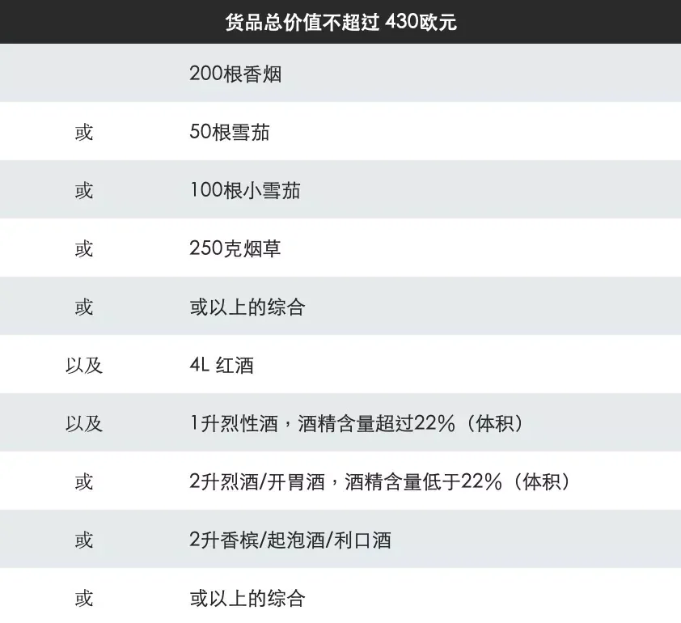

| 類別 | 免稅攜帶量 |
| --- | --- |
| 貨品總價值 | 不超過 **€430**（僅適用於航空旅客；陸路入境旅客為 €300） |
| 香菸 | 200 根 |
| 或 雪茄 | 50 根 |
| 或 小雪茄 | 100 根 |
| 或 菸草 | 250 克 |
| 或 以上綜合 | — |
| 以及 紅酒 | 4 L |
| 以及 烈性酒（酒精含量超過 22%） | 1 L |
| 或 烈酒／開胃酒（酒精含量低於 22%） | 2 L |
| 或 香檳／起泡酒／利口酒 | 2 L |
| 或 以上綜合 | — |

- **年齡限制**：15 歲以下乘客的最高免稅限額為 €150；酒精與菸草的額度適用於 17 歲及以上旅客。
- **現金申報**：進出歐盟時，攜帶現金或其他支付方式（旅行支票、金條、金幣等）總價值超過 **€10,000** 的，需要向海關申報；申報表可在海關櫃檯或海關辦事處索取。
- **出口退稅蓋章**：維也納機場的出口海關位於抵達層 0 層。

### 貨幣兌換與 ATM

機場的貨幣兌換點由 **Interchange** 運營，從登機口、到達大廳到航站樓都有網點，營業時間普遍從清晨 5 點到深夜；ATM 的分佈更廣，從到達大廳到登機口廊道都能找到。

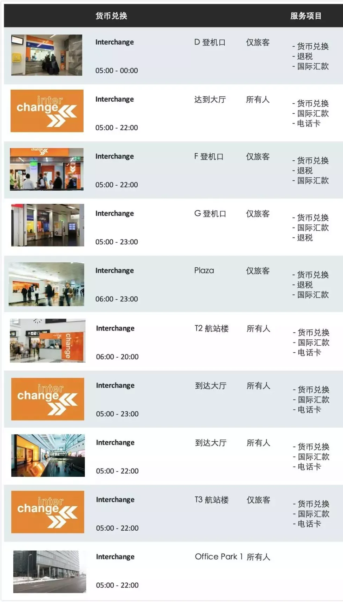

| 位置 | 營業時間 | 面向旅客 |
| --- | --- | --- |
| D 登機口 | 05:00–00:00 | 僅旅客 |
| F 登機口 | 05:00–22:00 | 僅旅客 |
| G 登機口 | 05:00–23:00 | 僅旅客 |
| Plaza | 06:00–23:00 | 僅旅客 |
| T3 航站樓 | 05:00–22:00 | 僅旅客 |
| 到達大廳（3 處網點） | 05:00–22:00，其中 1 處至 23:00 | 所有人 |
| T2 航站樓 | 06:00–20:00 | 所有人 |
| Office Park 1 | 05:00–22:00 | 所有人 |

兌換點的服務專案包括貨幣兌換、退稅與國際匯款；到達大廳、T2 與 T3 的部分網點還可以購買電話卡。

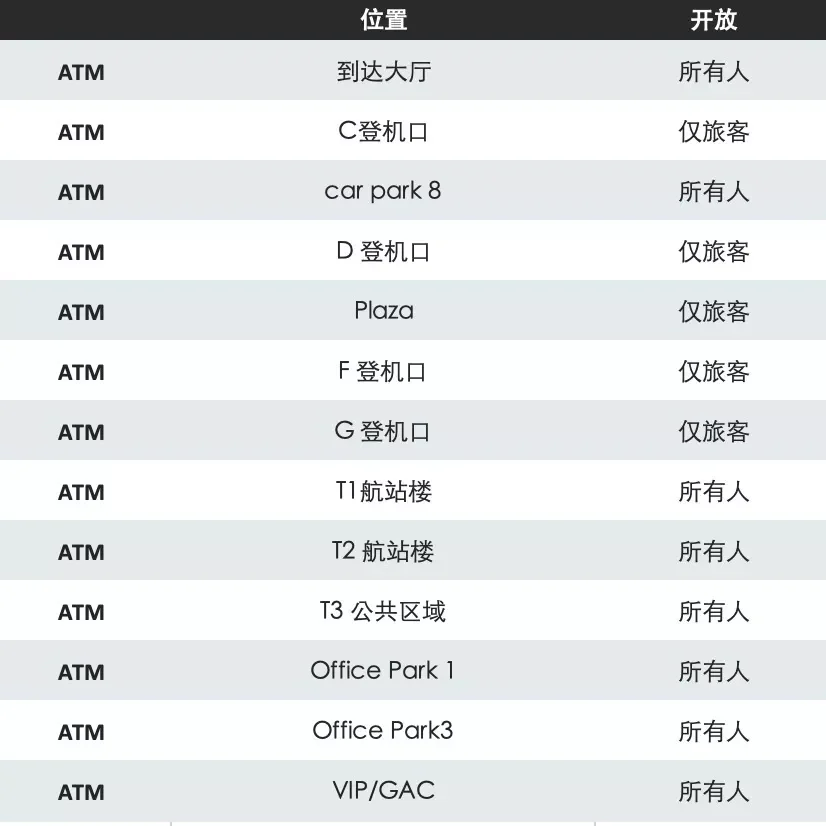

ATM 分佈在到達大廳、C／D／F／G 登機口、Plaza、car park 8 停車場、T1、T2、T3 公共區域、Office Park 1、Office Park 3 與 VIP／GAC 區域。其中到達大廳、停車場、航站樓與辦公區的 ATM 所有人均可使用，登機口與 Plaza 內的 ATM 僅限旅客使用。

### Wi-Fi、充電與手機卡

- **Wi-Fi**：航站樓內 Wi-Fi 全覆蓋，候機時可以隨時查詢航班、聯絡家人。
- **充電與辦公**：F、G 登機口設有專門配備的工作空間，除電源插座外，還可以在這裡使用筆記本辦公。
- **手機卡與維修**：Mr. Mobile 提供手機、平板電腦與筆記型電腦維修，以及備用電話與預付費 SIM 卡。

圖片來源：VIE 維也納機場。文中票價、營業時間與櫃檯位置為機場及各運營方公佈的資料，出行前請以官網當日資訊為準。
