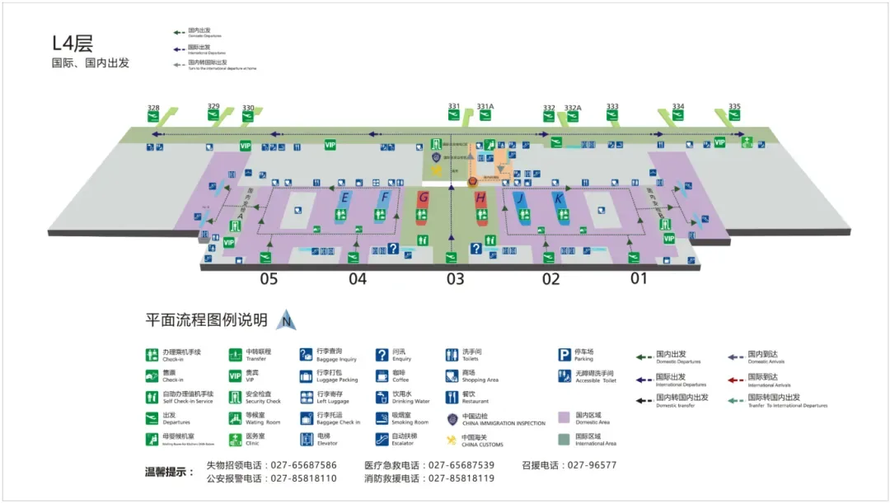

暑期结束、开学与返程客流叠加，武汉天河国际机场迎来出行高峰。这份指南按**国内出发**、**国内到达**、**交通**、**停车**四部分，整理 T2 与 T3 两个航站楼的实用信息，需要的朋友可以先收藏。

天河机场有两个在用航站楼：**T3 航站楼**（四层出发、二层到达）和 **T2 航站楼**（二层出发、一层到达）。出发前先确认所乘航班的航站楼，两个航站楼之间可乘坐**空港 3 路**摆渡。文中航站楼平面图与停车路线图来自武汉天河国际机场官网。

## 一、国内出发

### T3 航站楼

1. **到达航站楼**：提前 2 小时到达航站楼，通过查询乘坐的航空公司，确认需要前往的航站楼。T3 航站楼四层为出发层。
2. **办理乘机手续及行李托运**：在值机岛 E、F、J、K 办理乘机和行李托运手续。航班起飞前 30 分钟截止办理乘机手续，请合理安排出行时间。机场支持现场自助值机和自助行李托运，建议提前在线值机。
3. **安全检查**：准备好登机牌、身份证或护照等有效证件，交给安全检查员查验。
4. **候机与登机**：按机场显示大屏及标识指引牌指示，起飞前 30–40 分钟到相应的登机口候机、登机。

### T2 航站楼

1. **到达航站楼**：提前 2 小时到达航站楼，通过查询乘坐的航空公司，确认需要前往的航站楼。T2 航站楼二层为出发层。
2. **办理乘机手续及行李托运**：在值机岛 A、B 办理乘机和行李托运手续。航班起飞前 30 分钟截止办理乘机手续，请合理安排出行时间。机场支持现场自助值机和自助行李托运，建议提前在线值机。
3. **安全检查**：准备好登机牌、身份证或护照等有效证件，交给安全检查员查验。
4. **候机与登机**：按机场显示大屏及标识指引牌指示，起飞前 30–40 分钟到相应的登机口候机、登机。

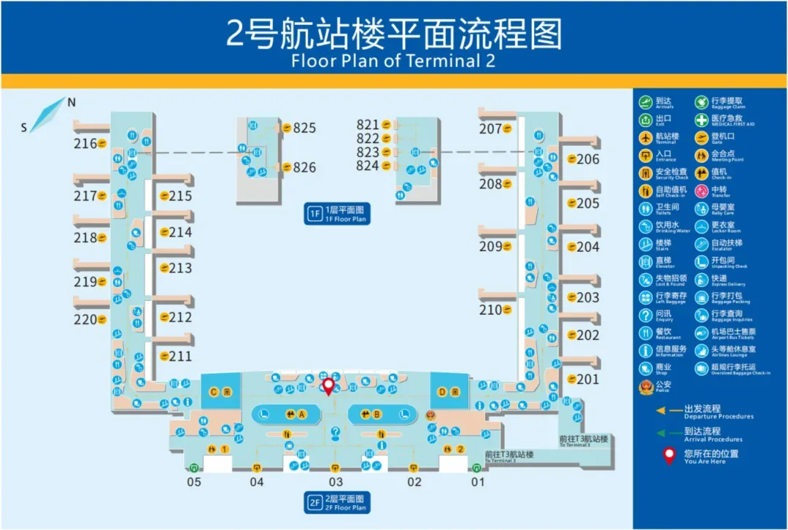

## 二、国内到达

### T3 航站楼

1. **航班到达**：如果有亲友接机，可提前通知他们了解您乘坐的航班即将到达的航站楼。T3 航站楼二层为到达层。
2. **提取行李**：根据所乘航班号在机场大屏寻找托运行李所在的转盘。为防止冒领和错拿，工作人员可能抽检、核对行李牌号与机票上的条形码，请保管好行李票并予以配合。
3. **离开机场**：为了保障个人权益和人身财产安全，在隔离区外请不要接受无机场正式工作证件人员的服务，或搭乘无运营资格、私自揽客的车辆。

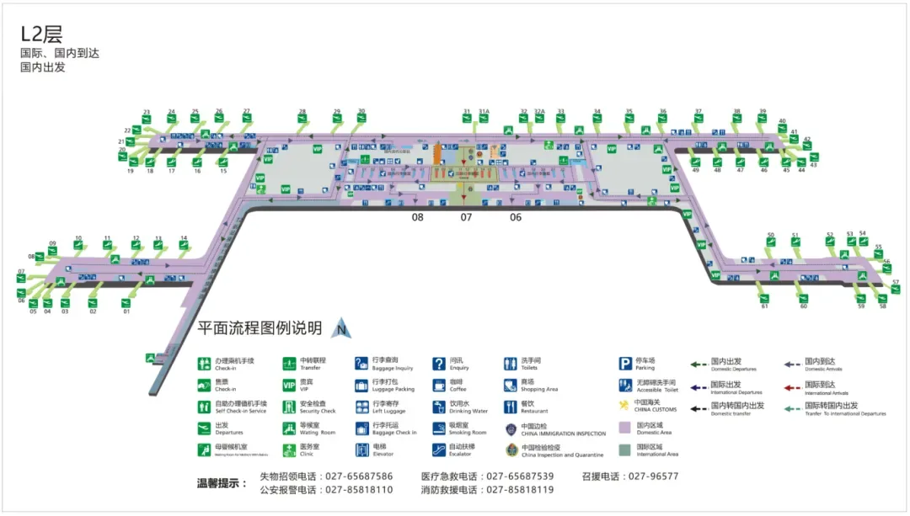

### T2 航站楼

1. **航班到达**：如果有亲友接机，可提前告知他们航班即将到达的航站楼。T2 航站楼一层为到达层。
2. **提取行李**：根据所乘航班号在机场大屏寻找托运行李所在的转盘。同样请配合工作人员的抽检与核对。
3. **离开机场**：同样请在隔离区外拒绝无工作证件人员的服务和无运营资格的揽客车辆。

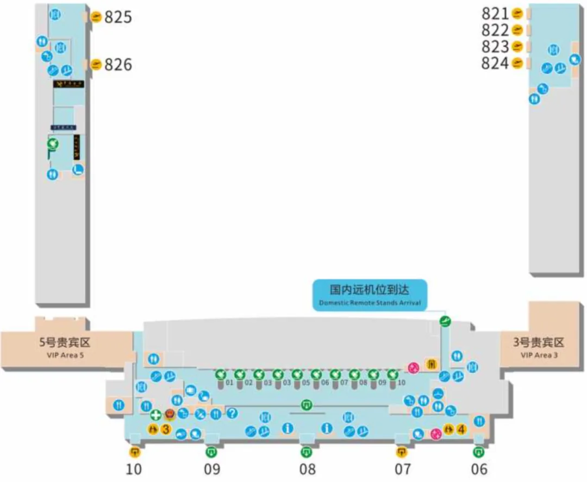

## 三、交通指南

天河机场的地面交通以**机场巴士**、**地铁 2 号线**、**空港 3 路**与**高铁**为主，两个航站楼之间以及航站楼与交通中心之间都有清晰的接驳路径。

### 机场巴士

- **运行时间**：每日 08:30 至航班结束，可通过小程序「天河畅行」线上下单。
- **发班频次**：30 分钟一班，至航班结束。
- **线下购票**：2 号航站楼一层 9 号门到 10 号门购票乘车；3 号航站楼 12 号门内购票乘车。
- **客服热线**：13387631827

| 线路 | 途经站点（票价） |
| --- | --- |
| 一号线 | 3 号／2 号航站楼 → 园博园北（地铁站，10 元）→ 民航小区（10 元）→ 汉口火车站（12 元）→ CBD 财富中心·范湖（12 元）→ 青年路（12 元）→ 古琴台（15 元）→ 首义广场（18 元）→ 武昌火车站（20 元）→ 武商梦时代（20 元，此站点 21:30 开始售票） |
| 二号线 | 3 号／2 号航站楼 → 杨汊湖（10 元）→ 金桥永旺（10 元）→ 黄浦路工农兵路（12 元）→ 徐东销品茂（15 元）→ 岳家嘴（15 元）→ 东亭（18 元）→ 楚河汉街（20 元）→ 洪山广场（20 元）→ 武汉火车站（45 元） |
| 空铁联运 | 武汉天河国际机场 ⇄ 武汉站，全程免费直达（09:25–17:55 暂行），购票与上车地点同机场巴士 |

### 长途班车

具体发车时间及线路请拨打客服电话咨询，以柜台售票为准。线下购票地点与机场巴士相同（2 号航站楼一层 9 号门到 10 号门、3 号航站楼 12 号门内），客服热线 13387631827。

### 地铁 2 号线

- **运营时间**：工作日 06:00–23:00，节假日 06:30–23:00，发车间隔 5–8 分钟。
- 实际以武汉轨道交通官方发布为准。

进出港路径：

- **去 T3 乘机**：地铁 2 号线抵达天河机场站 → B 出入口 → 交通中心 2 层 1、2、3 号连廊 → T3 航站楼四层出发厅。
- **从 T3 离开**：T3 航站楼二层到达厅 → 二层 6、7、8 号门 → 地铁 B 出入口 → 地铁 2 号线。
- **去 T2 乘机**：地铁 2 号线抵达天河机场站 → B 出入口 → 交通中心 2 层 1、2、3 号连廊 → T3 航站楼 12 号门外 → 换乘空港 3 路 → T2 航站楼 7 号门 → 二层出发厅。
- **从 T2 离开**：T2 航站楼一层到达厅 → 一层 10 号门站点 → 换乘空港 3 路 → T3 航站楼 12 号门 → 交通中心 2 层 1、2、3 号连廊 → 地铁 B 出入口 → 地铁 2 号线。

### 空港 3 路（航站楼摆渡）

- **站点**：T3 航站楼 12 号门（上下客点）→ T2 航站楼一层 7 号门（下客站点）→ T2 航站楼一层 10 号门（上客站点）→ T3 航站楼 12 号门（上下客点）。
- **运行频次**：平均 5 分钟一班。
- **运行时间**：06:00–23:00。

### 高铁

天河机场高铁站沿途停靠站点覆盖武汉市汉口站、武昌站及多个省内城市，实际以高铁官方发布为准。

- **去 T3 乘机**：高铁抵达天河机场站 → 高铁站 C 口 → 交通中心 2 层 1、2、3 号连廊 → T3 航站楼四层出发厅。
- **从 T3 离开**：T3 航站楼二层到达厅 → 二层 6、7、8 号门 → 高铁站 C 口 → 高铁天河机场站。
- **去 T2 乘机**：高铁抵达天河机场站 → 地铁 B 出入口 → 交通中心 2 层 1、2、3 号连廊 → T3 航站楼 12 号门外 → 换乘空港 3 路 → T2 航站楼 7 号门 → 二层出发厅。
- **从 T2 离开**：T2 航站楼一层到达厅 → 一层 10 号门站点 → 换乘空港 3 路 → T3 航站楼 12 号门 → 交通中心 2 层 1、2、3 号连廊 → 高铁站 C 口 → 高铁天河机场站。

### 自驾车

**一、市区方向进入机场**

| 目的地 | 行车路线 |
| --- | --- |
| T2 送客 | 沿空港大道直行，靠右侧驶入 2 号航站楼匝道进入 2 号航站楼环线，靠右行驶进入高架桥，抵达 2 号航站楼出发层落客 |
| T2 停车 | 沿空港大道直行，靠右侧驶入 2 号航站楼匝道进入 2 号航站楼环线，靠左行驶进入 P1（2 号航站楼地面停车场）、P2（2 号航站楼地下停车场） |
| T3 送客 | 沿空港大道直行，靠右侧驶入 3 号航站楼上桥匝道，抵达 3 号航站楼出发层落客 |
| T3 停车 | 沿空港大道直行，沿中间车道行驶进入 P7（3 号航站楼地下停车场） |
| 交通中心停车场 | 沿空港大道直行，靠左车道行驶进入 P6（机场交通中心停车场） |
| 旅客服务综合体（皇冠假日酒店、假日酒店） | 沿空港大道直行，靠右侧驶入 2 号航站楼匝道进入 2 号航站楼环线，靠左行驶进入 P2（2 号航站楼地下停车场） |

**二、黄陂方向进入机场**

| 目的地 | 行车路线 |
| --- | --- |
| T2 送客 | 沿空港大道直行，进入空港隧道，出隧道靠右侧驶入匝道调头，进入 3 号航站楼出发层，靠右进入 3 号航站楼与 2 号航站楼连桥，抵达 2 号航站楼出发层落客 |
| T2 停车 | 沿空港大道直行，进入空港隧道，出隧道靠右侧驶入匝道调头，进入 3 号航站楼出发层，靠右进入 3 号航站楼与 2 号航站楼连桥，沿 2 号航站楼环线，靠左行驶进入 P1、P2 |
| T3 送客 | 沿空港大道直行，进入空港隧道，出隧道靠右侧驶入匝道调头进入 3 号航站楼出发层，抵达 3 号航站楼出发层落客 |
| T3 停车 | 沿空港大道直行，进入空港隧道，出隧道靠右侧驶入匝道调头进入空港大道，沿中间车道行驶进入 P7（3 号航站楼地下停车场） |
| 交通中心停车场 | 沿空港大道直行，进入空港隧道，出隧道靠右侧驶入匝道调头进入空港大道，靠左车道行驶进入 P6（机场交通中心停车场） |
| 旅客服务综合体（皇冠假日酒店、假日酒店） | 沿空港大道直行，进入空港隧道，出隧道靠右侧驶入匝道调头，进入 3 号航站楼出发层，靠右进入 3 号航站楼与 2 号航站楼连桥，沿 2 号航站楼环线，靠左行驶进入 P2 |

### 出租车

- 2 号航站楼：一层 7 号门外，在出租车乘车站点排队乘坐。
- 3 号航站楼：一层 12 号门外，在出租车乘车站点排队乘坐。

### 网约车

- **2 号航站楼**：一层到达厅 → 一层 9 号门 → P1（2 号航站楼地面停车场）乘车 → 武汉市区。
- **3 号航站楼**：二层到达厅 → 二层 6、7、8 号门 → 交通中心一层网约车上客点 → 武汉市区。

## 四、停车指南

### T3 航站楼

**① 地下停车场（P7）**

S19／S18 → 空港大道 → T3 地下停车场 → T3 航站楼四层出发厅（步行约 5 分钟）。

共有 549 个车位，位于负一层、负二层，只能停放小型机动车。

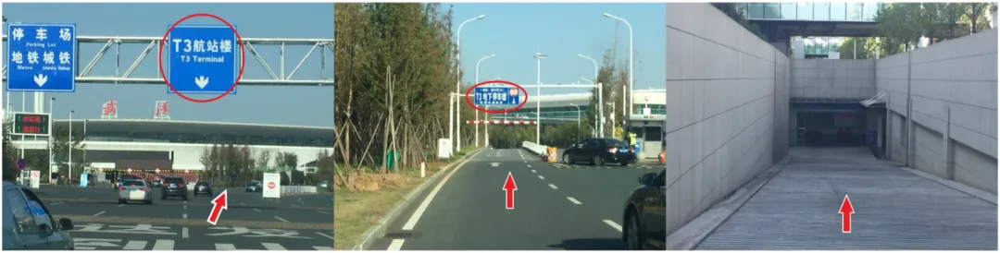

**② 交通中心停车场（P6）**

S19／S18 → 空港大道 → 交通中心停车场 → 交通中心 2 层 1、2、3 号连廊 → T3 航站楼二层 8、7、6 号门 → T3 航站楼四层出发厅（步行约 10 分钟）。

共有 3300 个车位，分布在负一层、地面层和地面二层。

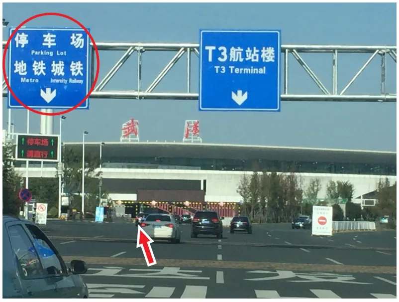

### T2 航站楼

**① 市区方向去往 2 号航站楼停车场**

沿空港大道直行，靠右侧驶入 2 号航站楼匝道进入 2 号航站楼环线。

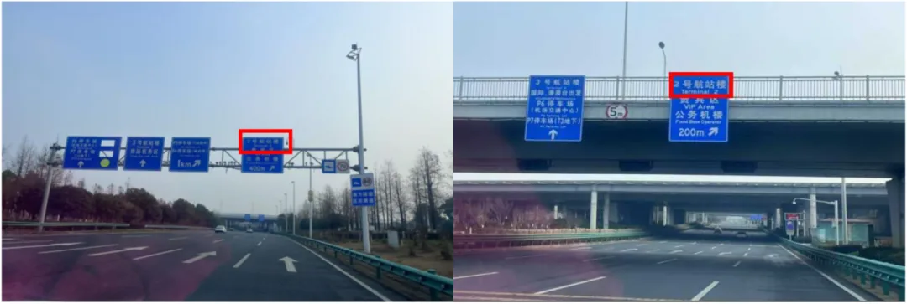

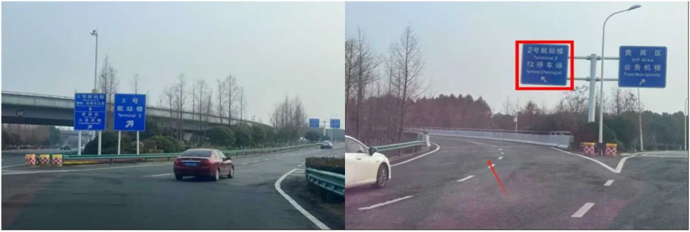

**P1（2 号航站楼地面停车场）行车路线**：2 号航站楼环线靠左行驶进入 P1。

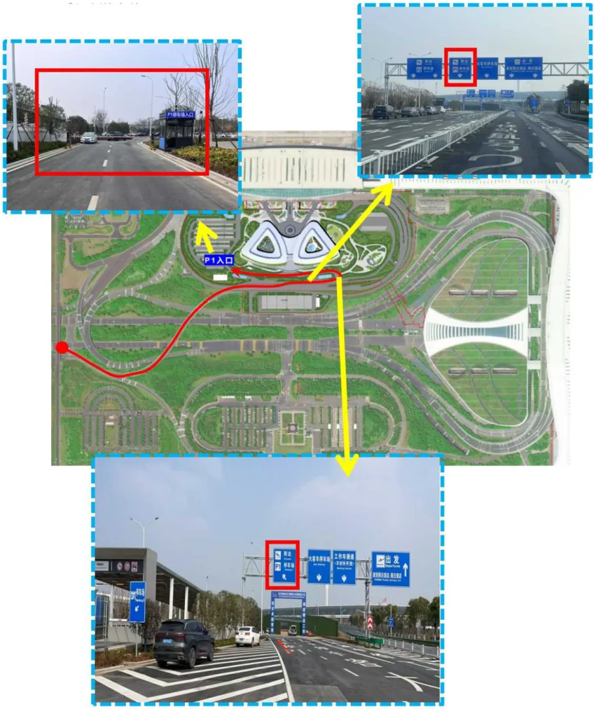

**P2（2 号航站楼地下停车场）行车路线**：2 号航站楼环线靠左行驶进入 P2。

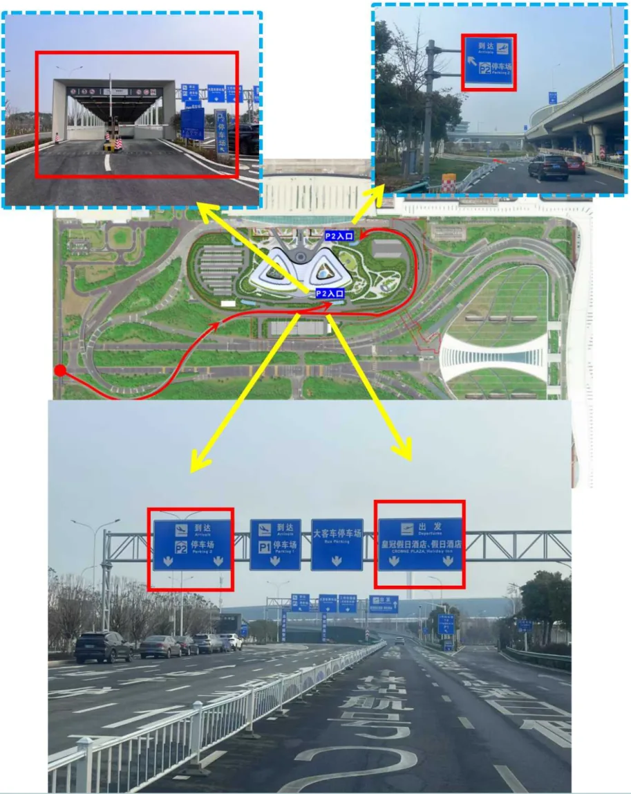

**② 黄陂方向去往 2 号航站楼停车场**

沿空港大道直行，进入空港隧道，出隧道靠右侧驶入匝道掉头，进入 3 号航站楼出发层，靠右进入 3 号航站楼与 2 号航站楼连桥。

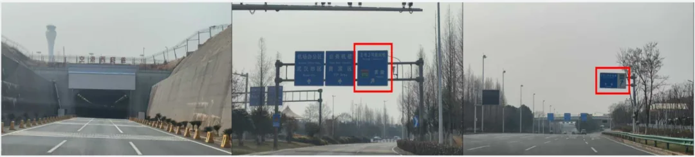

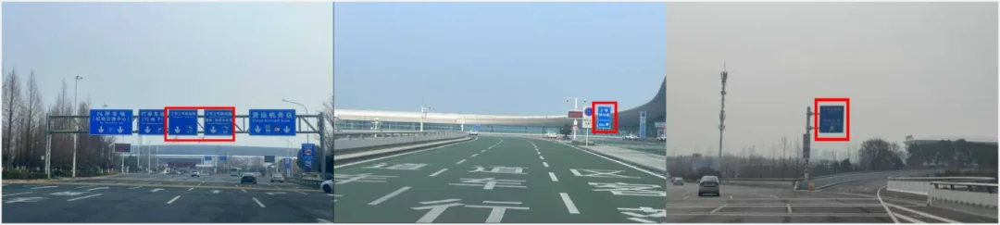

**P1（2 号航站楼地面停车场）行车路线**：沿 2 号航站楼环线，靠左行驶进入 P1。

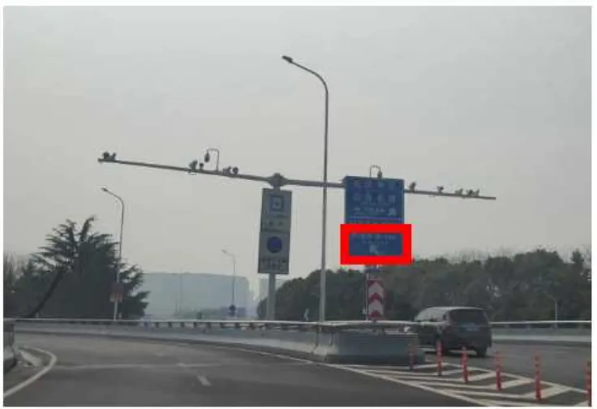

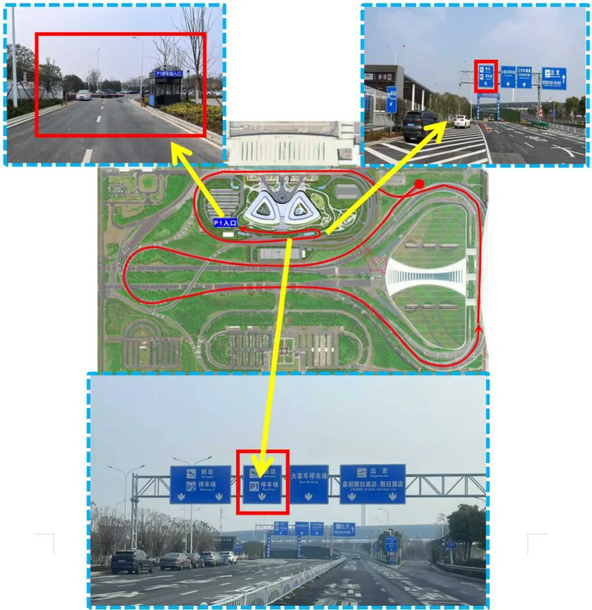

**P2（2 号航站楼地下停车场）行车路线**：沿 2 号航站楼环线，靠左行驶进入 P2。

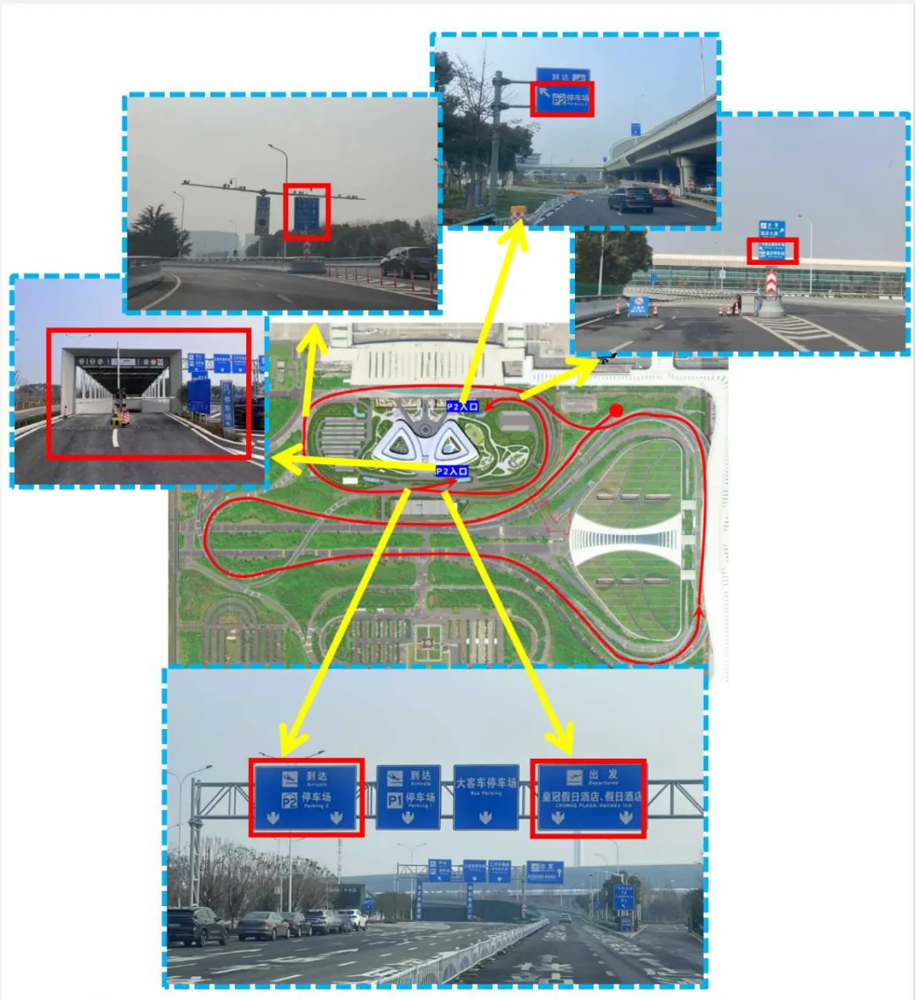

## 相关链接

- **本站页面**：[中国（CN）](/zh/country/CN)
- **维基百科**：[武汉天河国际机场](https://zh.wikipedia.org/wiki/%E6%AD%A6%E6%B1%89%E5%A4%A9%E6%B2%B3%E5%9B%BD%E9%99%85%E6%9C%BA%E5%9C%BA)
- **百度百科**：[武汉天河国际机场](https://baike.baidu.com/item/%E6%AD%A6%E6%B1%89%E5%A4%A9%E6%B2%B3%E5%9B%BD%E9%99%85%E6%9C%BA%E5%9C%BA)
